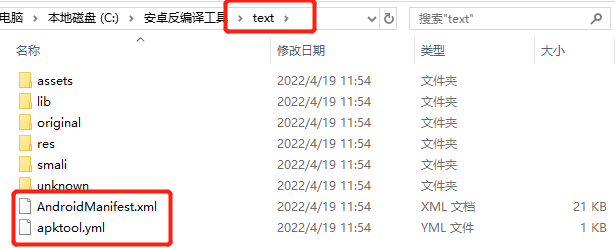
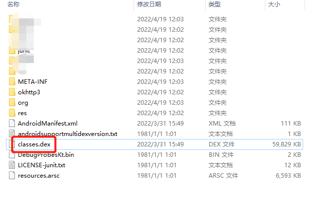
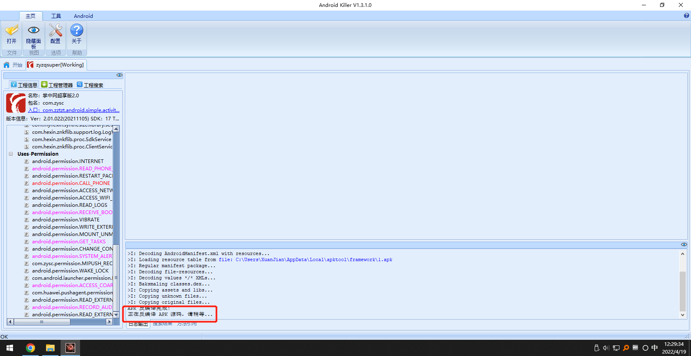

# APP反编译

[2022-04-19]()

做渗透测试项目本来是不搞逆向的，但是组长提供了个信息收集的思路，可以把APP反编译出来查里面的子域名，资产等等，于是开始搞APP反编译。

## 1、在线反编译
很简单方便的一个方法，只要打开网页，把APK放进入，就可以在线反编译了，不过速度比较慢，对于比较大型的APK还是不要用这种方法，容易出错。

网址：[http://www.javadecompilers.com/apk](在线反编译)

## 2、工具反编译

### 2.1、工具准备
 - APK TOOL：这是谷歌提供的的编译工具，下载地址：[https://ibotpeaches.github.io/Apktool/install/](https://ibotpeaches.github.io/Apktool/install/ "下载地址")
 - dex2jar：将apk反编译成java源码（classes.dex转化成jar文件） 下载地址：[http://sourceforge.net/projects/dex2jar/files/](http://sourceforge.net/projects/dex2jar/files/ "下载地址")
 - jd-gui:用来查看 jar 包里面的代码的一种工具。官网下载地址：[http://jd.benow.ca/](http://jd.benow.ca/)

### 2.2 APTtool
#### 2.2.1、下载apktool.jar

#### 2.2.2、生成apktool.bat
下载好apktool.jar之后，新建一个文件夹将apktool.jar放进去，然后在此文件夹下新建一个文本文档，将以下代码输入进去

	@echo off
	if "%PATH_BASE%" == "" set PATH_BASE=%PATH%
	set PATH=%CD%;%PATH_BASE%;
	java -jar -Duser.language=en "%~dp0\apktool.jar" %1 %2 %3 %4 %5 %6 %7 %8 %9

**注意：代码中的apktool.jar的名字需要与刚才下载的apktool.jar名称一致。**

然后我们保存一下，重命名为apktool.bat

#### 2.2.3、进行反编译
将需要进行反编译的文件与APKTOOL放在一起

然后，打开命令行界面，定位到apktool文件夹，输入以下命令：

	apktool.bat d -f  xxx.apk  -o text

**注意：（命令中xxx.apk指的是要反编译的APK文件全名， text为反编译后资源文件存放的目录名称，即为：apktool.bat   d  -f    [apk文件 ]  -o  [输出文件夹]）**

如果出现报错，参考以下内容：

	> 1.Input file  was not found or was not readable.
	> 2.Destination directory (C:\Users\user\a) already exists. Use -f switch if you wan t to overwrite it.
	> 3.Exception in thread "main" brut.androlib.AndrolibException: Could not decode ars c fil..........

解决方案：

- 1和2是因为apktool升级到2.0以上时,使用方式已经替换,格式为：`apktool d [-s] -f <apkPath> -o <folderPath>`,参数具体的意思可以直接打apktool回车(windows)查看帮助
- 3是因为apktool版本过低导致,请升级到最新版本,地址: [https://bitbucket.org/iBotPeaches/apktool/downloads](https://bitbucket.org/iBotPeaches/apktool/downloads)

如果编译成功，会出现以下信息，并输出一个text文件夹。

text文件夹里就是反编译出来的内容。

在这里就能查看XML文件和yml文件。

### 2.3 反编译得到Java源代码
将要反编译的APK后缀名改为.rar或.zip，并解压，会得到classes.dex文件。

这个classes.dex文件就是java文件编译再通过dx工具打包而成的。

然后我们找到之前准备好的dex2jar文件夹，在文件夹中打开命令行，输入命令

	d2j-dex2jar.bat classes.dex

**注意classes.dex文件的路径，我这里是把classes.dex放入了dex2jar文件夹中。**
看到如下回显说明反编译成功了，并在dex2jar文件夹中生成了一个classes-dex2jar.jar文件。

然后拿出提前准备好的工具jd-gui，打开后长这个样子

把刚才生成的classes-dex2jar.jar直接拖进去。

然后就可以之间看到apk的Java源代码了。

### 3、AndroidKiller
最后再介绍一个一键反编译的工具：AndroidKiller。

	下载链接：https://pan.baidu.com/s/14JONrBQkxV6JI7M2DgwhwA?pwd=mu2x
	提取码：mu2x

下载好之后，打开AndroidKiller.exe文件。
### 错误信息
#### 0x01 若弹窗未检测到SDK环境，说明工具未检测到系统的jdk环境，进去后手动输入即可。

点配置，选择Java，然后手动选择jdk的路径。

配置好之后直接将待反编译的APK文件拖进Android Killer工具中。

#### 0x02 若出现乱码或编译失败问题，考虑是否是jdk版本太高或太低,我这里用的是jdk1.8。
#### 0x03 若出现`APK反编译失败，无法继续下一步源码反编译!`,原因是apktool版本太低，更新apktool即可。
下载地址：[https://connortumbleson.com/apktool/](https://connortumbleson.com/apktool/)，尽量下载最新版本。
下载好之后，打开 AndroidKiller，依次点击 Android -> APKTOOL管理器 -> 添加，得到下图弹窗；

点击路径，找到刚才下载的最新的apktool.jar，选好路径后输入apktool参数：`–only-main-classes`

**报错中提示是由于非法 dex，这是因为 apk 里有加密过后的 dex 文件，比如有些 apk 的 assets 目录下有加密后的 dex 文件，添加 –only-main-classes 参数即可,注意：这一步是关键，一定不能省略！**

然后在 APKTOOL 管理器 弹窗尾部，重新选择默认的 Apktool 版本为 apktool_2.4.1.jar；

然后重启Android Killer即可。

#### 0x04 如果一直卡在：正在反编译APK代码，请稍等…… ,

可以尝试关闭工具重新打开，打开后直接双击刚才的工程。

然后，可看到直接分析完成。

我们在此处按`Ctrl+F`，在搜索框中输入`http`或`https`或其他内容，即可看到APK文件中的子域名或其他资产。

## 4、总结

此次学习Android反编译收获还是蛮多的，以后再做渗透测试这个也算信息收集的一条思路了。