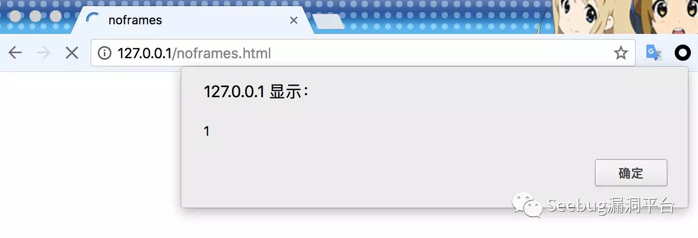
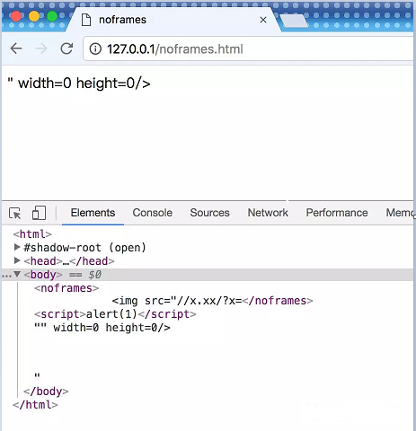

# HTML中优先闭合的标签

[2020-04-04]()

### [](#前言 "前言")前言

学习HTML时发现有个有趣的现象，就是有的标签会优先闭合。  
  
先看一段 HTML：

```
<html>
    <head><title>noframes</title></head>
    <body>
        <noframes>
            <script>alert(1)</script>" width=0 height=0/>
        </noframes>
    </body>
</html>
```

HTML正常读大概就是展示一张图片。  
那么用浏览器打开看看。



并没有按照想象中的展示图片而是弹了个窗。

看看浏览器处理的源码  


原来，**img** 标签 **src** 属性里的 **\\\</noframes>**，跳过了 **\\\** 标签和 **src** 属性，把外层的 **\\\<noframes>** 给闭合了，导致 **src** 后半部分的 **script** 标签被解析成了 HTML，从而触发了弹框。

这可奇怪了。**\\\</noframes>** 明明在双引号里面，怎么就跨越了 **src** 属性跨越了 **\\\** 标签，漂洋过海地把外层的 **noframes** 标签给闭合了？有一种可能就是，它的闭合优先级，高于双引号的完整性优先级，高于嵌套在内层的标签的闭合优先级。

研究发现，还有一些标签是闭合优先级高于双引号完整性优先级的特殊标签。

* \\\<\!–
* \\\<iframe>
* \\\<noframes>
* \\\<noscript>
* \\\<script>
* \\\<style>
* \\\<textarea>
* \\\<title>
* \\\<xmp>

* * *

## [](#攻击场景 "攻击场景")攻击场景

这个特性出现的原因，可能是源于浏览器对 DOM 树的特殊处理。而在某些 XSS 攻击的场景下，这一特性可能导致意想不到的结果。

特别是，像邮箱或论坛等支持富文本的应用，出于防御 XSS 的考虑，一定会对用户的输入进行语法分析和检查。但是，如果语法分析的结果和浏览器的识别结果不一致的话，就会形成 XSS 的攻击点。

比如文章开头的那段 noframes 语句，如果防 XSS 引擎将 src 里的内容统一理解为 img 的 src 属性，就可能形成 XSS 攻击的入口点。