# Linux下使用代理上网
[2022-04-11]()

做渗透Kali用的比较多，有时候需要科学上网，这里就分享一下Linux下使用Qv2Ray挂代理科学上网的方法。

### 1、安装环境
我这里用的是Kali 2016，理论上只要是Linux系统都是可以的。
### 2、文件准备

	https://github.com/Qv2ray/Qv2ray/releases
	https://github.com/v2fly/v2ray-core/tags

这里根据自己的需要下载对应版本，我就下载`Qv2ray-v2.7.0-linux-x64.AppImage`

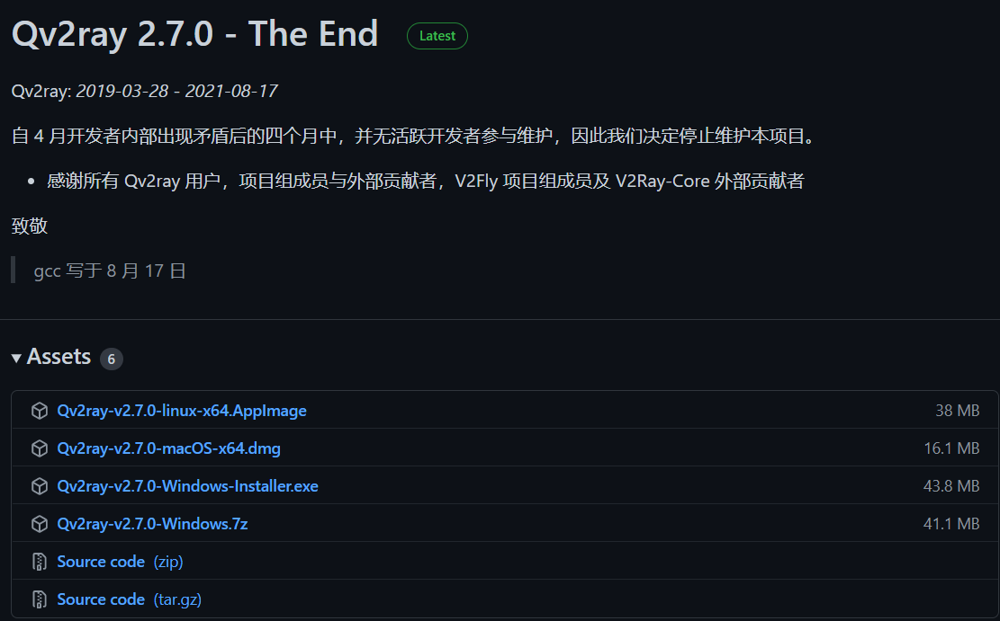

v2ray-core选择最新的即可，我这里最新的是v5.0.3

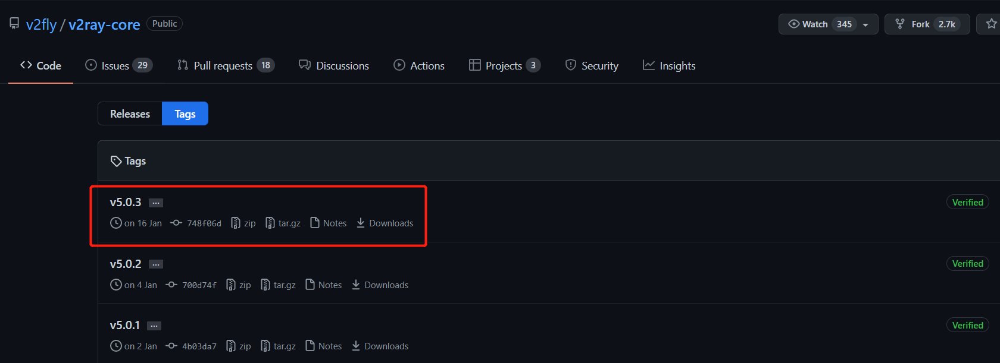

然后选择自己对应的系统

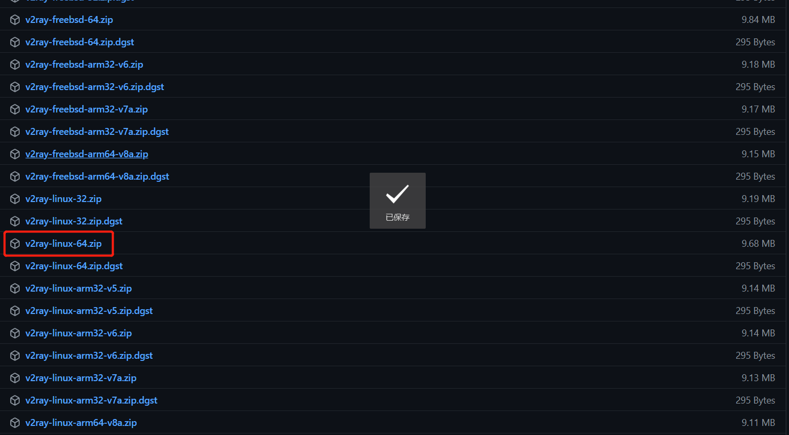

下载好之后放到Kali中。

### 3、开始配置
#### 3.1、配置核心文件
首先在Kali下创建目录v2ray，然后把刚才下载的两个文件放到v2ray文件中。

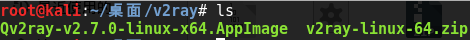

然后将v2ray-linux-64.zip解压缩并给Qv2ray未见赋予权限。

	unzip v2ray-linux-64.zip
	chmod +x Qv2ray.v2.7.0.linux-x64.AppImage

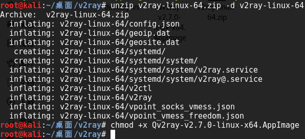

然后运行Qv2ray文件。

	./Qv2ray.v2.7.0.linux-x64.AppImage

首页是这样的

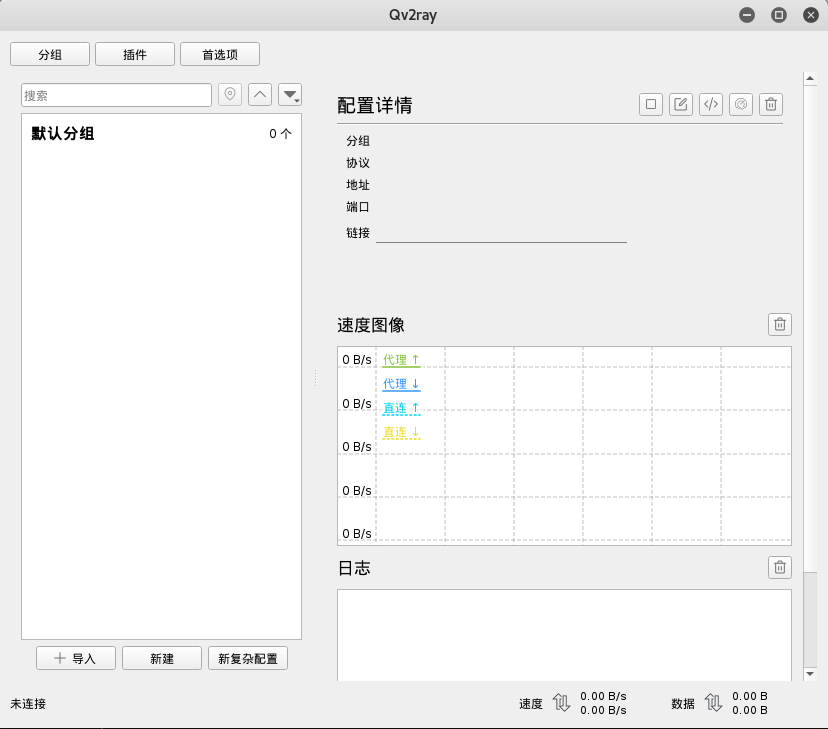

然后点首选项，再点内核设置，将路径修改为自己放的文件的路径，比如我这里是
	/root/桌面/v2ray/v2ray-linux-64/v2ray
	/root/桌面/v2ray/v2ray-linux-64

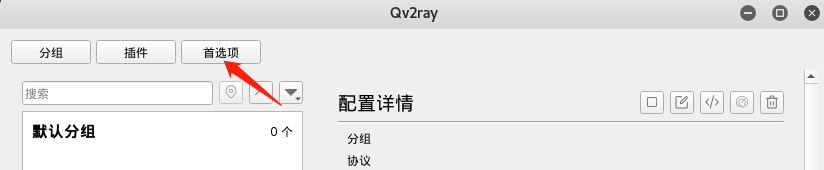

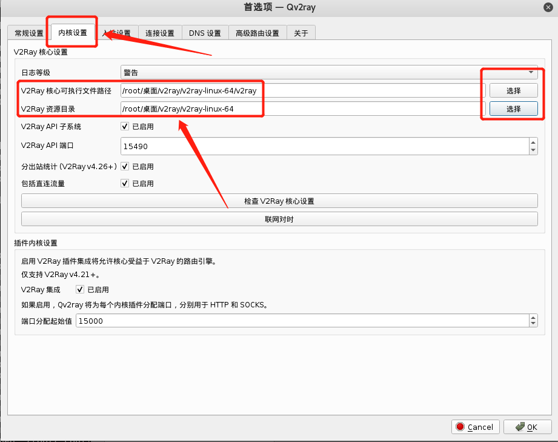

**这里一定要弄正确，否则是无法使用的**
如果出现以下内容，说明内核路径不正确，需要修改为正确的。

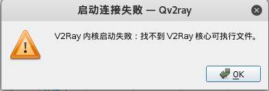

然后依次点击`检查V2Ray核心设置`和`联网对时`

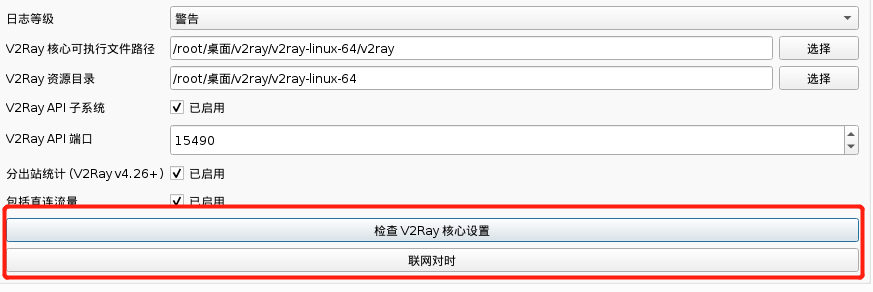

出现如下内容说明没有问题

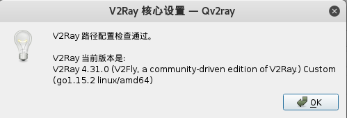

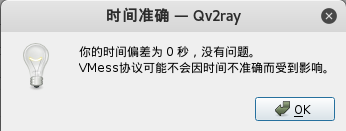

#### 3.2 设置订阅地址
点击分组，然后点下边的小加号，然后在分组名称处输入名称。

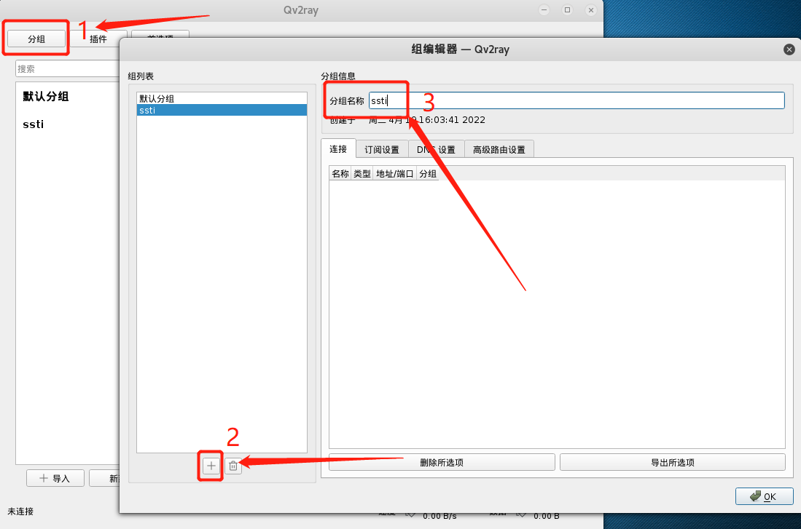

然后依次点击订阅设置，在此分组是一个订阅处打勾，然后输入订阅地址（订阅地址大家自己找吧，这里就不分享了），**记得把订阅类型改成Basic Base64（不改会订阅失败）**，最后点击更新订阅。

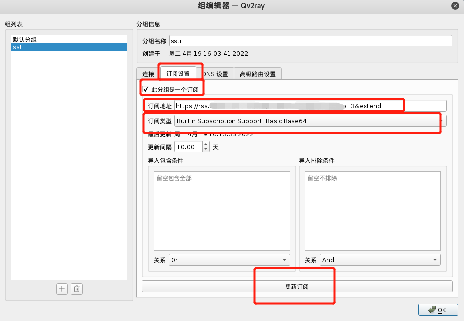

订阅成功后回到主页面发现已经获取到了很多节点。

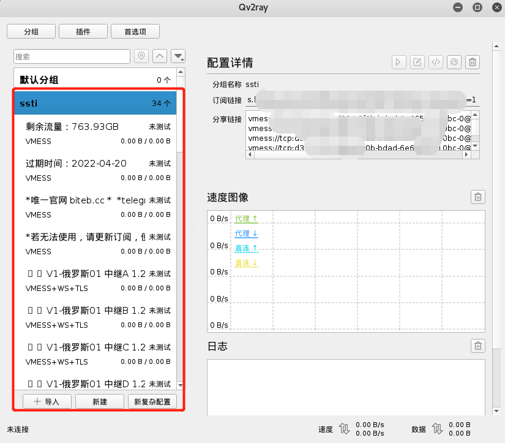

#### 3.3、测试连接
我们任选一个进行连接，连接后会显示系统代理已设置，且节点前出现一个黑点。

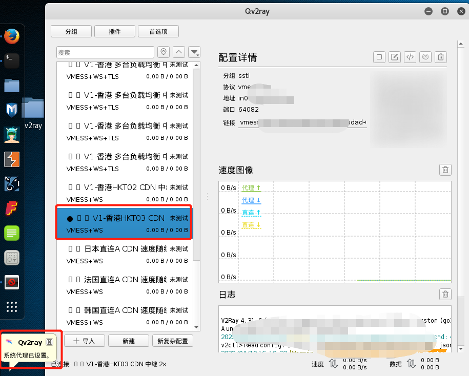

然后已经可以科学上网。

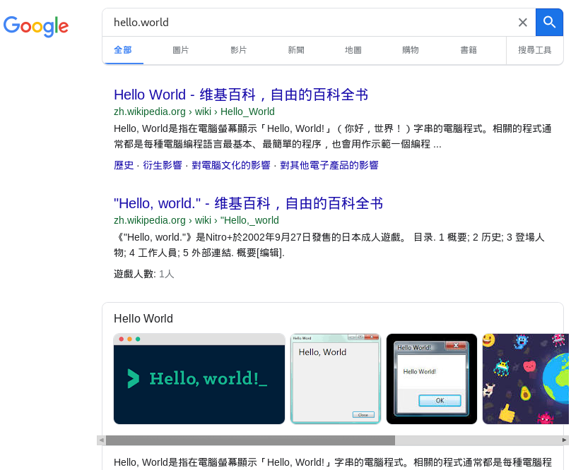

### 4、写在最后
其实这块内容是后边更新的，配置代理的时候没有想过这个问题，后边遇到了才去深究，这里记录一下。

连上v2ray之后，浏览器已经可以通过代理科学上网了。

但是后来发现终端并没有通过代理上网。

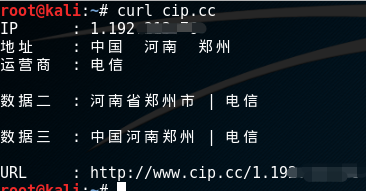

当然这里也好设置，在终端输入命令：

	export http_proxy=http://127.0.0.1:8889
然后终端就可以走代理了，出口IP也已经变成了我们设置的代理地址。

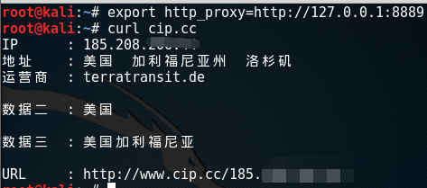

但是此时其实ping谷歌还是ping不通的

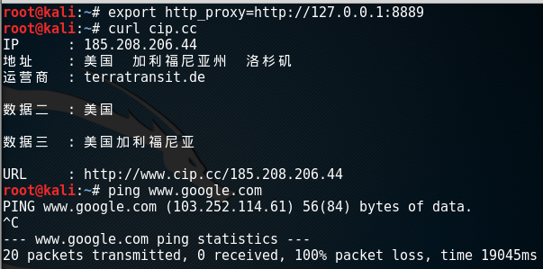

刚开始一直不明白，后来吃饭的时候突然想明白了，这里并不是我们的代理没设置好，也不是终端没走代理，而是因为ping协议是基于ICMP协议，是网络层协议，而我们走的代理无论是http协议还是socks5代理（一个是应用层协议，一个是传输层协议）都是高于网络层的，低层协议不使用高层协议，所以ping协议是不使用http协议或者socks5协议的，所以ping谷歌还是ping不通，但是我们可以通过两种方法来验证我们的终端已经走了代理：

- curl www.google.com
- curl cip.cc

第一种：我们对谷歌使用curl命令，发现是返回了源码的，说明我们是通了外网的。

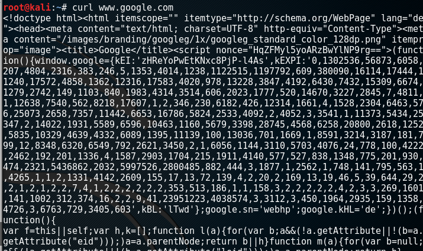

第二种：`curl cip.cc`命令，会返回你的公网IP地址，也可以证明你的终端是否走了代理。

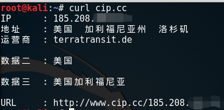

**其实这个问题不仅是Linux下，Windows下也是一样的。**
最后，如果你非要使用ping命令，可以试试httping，它是基于http协议的，可以通过代理上网。