# Linux进程之查看进程详情

[2020-04-29]()

## [](#1-PS是什么 "1. PS是什么")1\. PS是什么

要对进程进行监测和控制，首先必须要了解当前进程的情况,也就是需要查看当前进程，ps命令就是最基本进程查看命令。使用该命令可以确定有哪些进程正在运行和运行的状态、进程是否结束、进程有没有僵尸、哪些进程占用了过多的资源等等.总之大部分信息都是可以通过执行该命令得到。  

**ps是显示瞬间进程的状态，并不动态连续；**如果想对进程进行实时监控应该用top命令。

**基本参数：**

* \-A：所有的进程均显示出来，与 -e 具有同样的效用；
* \-a：显示现行终端机下的所有进程，包括其他用户的进程；
* \-u：以用户为主的进程状态；
* x：通常与 a 这个参数一起使用，可列出较完整信息。

**输出格式规划：**

* l：较长、较详细的将该PID的信息列出；
* j：工作的格式\(jobs format\)
* \-f：做一个更为完整的输出

## [](#2-不加参数执行ps命令会输出什么 "2. 不加参数执行ps命令会输出什么")2\. 不加参数执行ps命令会输出什么

这是一个基本的 ps 使用，我们来看看控制台中执行这个命令并查看结果。

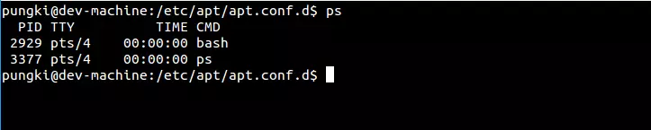

结果默认会显示4列信息：

* PID: 运行着的命令\(CMD\)的进程编号
* TTY: 命令所运行的位置（终端）
* TIME: 运行着的该命令所占用的CPU处理时间
* CMD: 该进程所运行的命令

这些信息在显示时未排序。

## [](#3-如何显示所有当前进程 "3. 如何显示所有当前进程")3\. 如何显示所有当前进程

使用-a参数，-a代表all。同时加上x参数会显示没有控制终端的进程。

```
$ ps -ax

# 这个命令的结果或许会很长。为了便于查看，可以结合less命令和管道来使用。

$ ps -ax | less
```

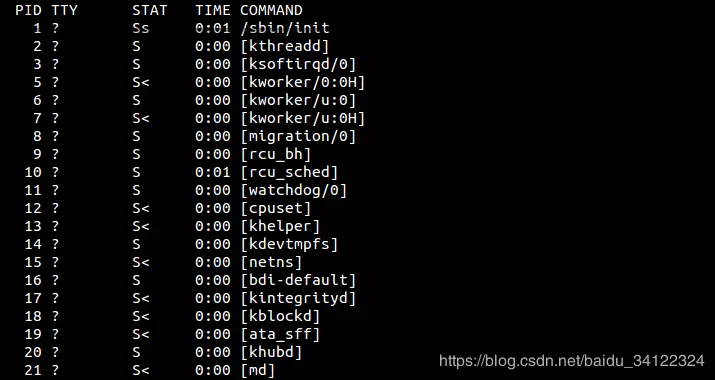

## [](#4-如何根据进程的用户进行信息过滤 "4. 如何根据进程的用户进行信息过滤")4\. 如何根据进程的用户进行信息过滤

在需要查看特定用户进程的情况下，我们可以使用 \-u 参数。比如我们要查看用户’pungki’的进程，可以通过下面的命令：

```
$ ps -u pungki
```

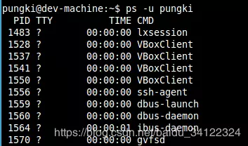

## [](#5-如何通过cpu和内存的使用程度来过滤进程 "5. 如何通过cpu和内存的使用程度来过滤进程")5\. 如何通过cpu和内存的使用程度来过滤进程

也许你希望把结果按照 CPU 或者内存用量来筛选，这样你就找到哪个进程占用了你的资源。要做到这一点，我们可以使用 aux 参数，来显示全面的信息:

```
$ ps -aux | less
```

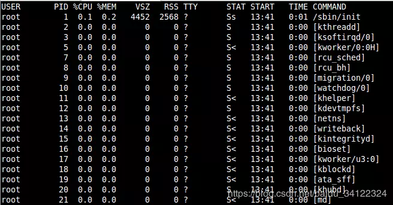

当结果很长时，我们可以使用管道和less命令来筛选。

默认的结果集是未排好序的。可以通过 –sort命令来排序。

### [](#5-1-根据CPU使用率来升序排序 "5.1 根据CPU使用率来升序排序")5.1 根据CPU使用率来升序排序

```
$ ps -aux --sort -pcpu | less
```

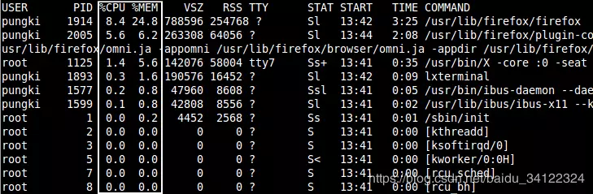

### [](#5-2-根据内存使用率来升序排序 "5.2 根据内存使用率来升序排序")5.2 根据内存使用率来升序排序

```
$ ps -aux --sort -pmem | less
```

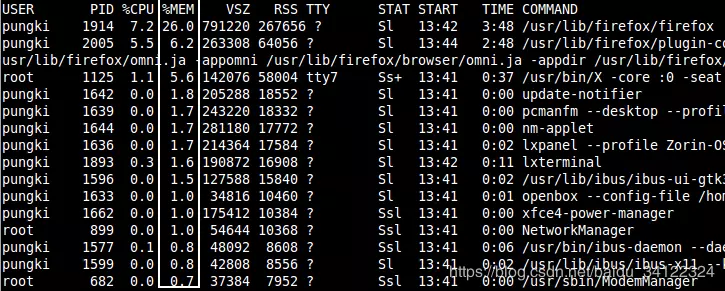

### [](#5-3-我们也可以将它们合并到一个命令，并通过管道显示前10个结果 "5.3 我们也可以将它们合并到一个命令，并通过管道显示前10个结果")5.3 我们也可以将它们合并到一个命令，并通过管道显示前10个结果

```
$ ps -aux --sort -pcpu,+pmem | head -n 10
```

## [](#6-如何通过进程名和PID进行过滤呢？ "6. 如何通过进程名和PID进行过滤呢？")6\. 如何通过进程名和PID进行过滤呢？

使用 \-C 参数，后面跟你要找的进程的名字。比如想显示一个名为getty的进程的信息，就可以使用下面的命令：

```
$ ps -C getty
```

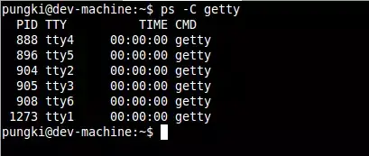

如果想要看到更多的细节，我们可以使用-f参数来查看格式化的信息列表：

```
$ ps -f -C getty
```

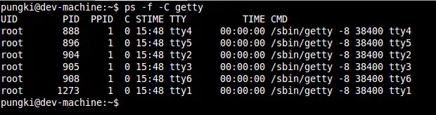

## [](#7-如何根据线程来过滤进程呢？ "7. 如何根据线程来过滤进程呢？")7\. 如何根据线程来过滤进程呢？

如果我们想知道特定进程的线程，可以使用 \-L 参数，后面加上特定的PID。

```
$ ps -L 1213
```

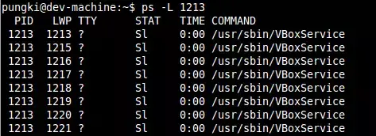

## [](#8-如何树形的显示进程？ "8. 如何树形的显示进程？")8\. 如何树形的显示进程？

有时候我们希望以树形结构显示进程，可以使用 \-axjf 参数。

```
$ ps -axjf
```

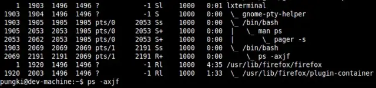

或者可以使用另一个命令：  
\$ pstree

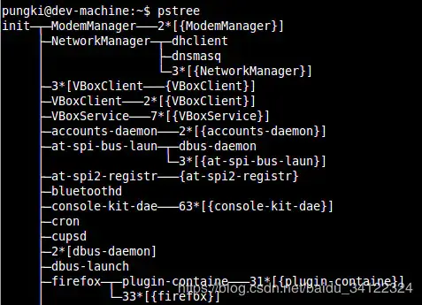

## [](#9-如何显示安全信息 "9. 如何显示安全信息")9\. 如何显示安全信息

如果想要查看现在有谁登入了你的服务器。可以使用ps命令加上相关参数:

```
$ ps -eo pid,user,args
```

参数 \-e 显示所有进程信息，-o 参数控制输出。Pid,User 和 Args参数显示PID，运行应用的用户和该应用。  
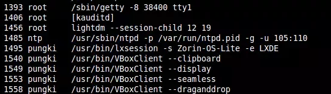

能够与 \-e 参数 一起使用的关键字是args, cmd, comm, command, fname, ucmd, ucomm, lstart, bsdstart 和 start。

## [](#10-如何格式化输出root用户（真实的或有效的UID）创建的进程 "10. 如何格式化输出root用户（真实的或有效的UID）创建的进程")10\. 如何格式化输出root用户（真实的或有效的UID）创建的进程

系统管理员想要查看由root用户运行的进程和这个进程的其他相关信息时，可以通过下面的命令:

```
$ ps -U root -u root u
```

\-U 参数按真实用户ID\(RUID\)筛选进程，它会从用户列表中选择真实用户名或 ID。真实用户即实际创建该进程的用户。

\-u 参数用来筛选有效用户ID（EUID）。

最后的 u 参数用来决定以针对用户的格式输出，由User, PID, \%CPU, \%MEM, VSZ, RSS, TTY, STAT, START, TIME 和 COMMAND这几列组成。

这里有上面的命令的输出结果：  
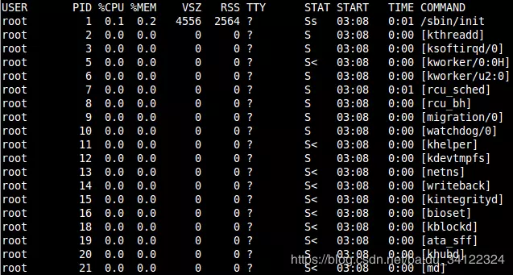

## [](#11-如何使用PS实时监控进程状态？ "11. 如何使用PS实时监控进程状态？")11\. 如何使用PS实时监控进程状态？

ps 命令会显示你系统当前的进程状态，但是这个结果是静态的。

当有一种情况，我们需要像上面第四点中提到的通过CPU和内存的使用率来筛选进程，并且我们希望结果能够每秒刷新一次。为此，我们可以将ps命令和watch命令结合起来。

```
$ watch -n 1 ‘ps -aux --sort -pmem, -pcpu’
```

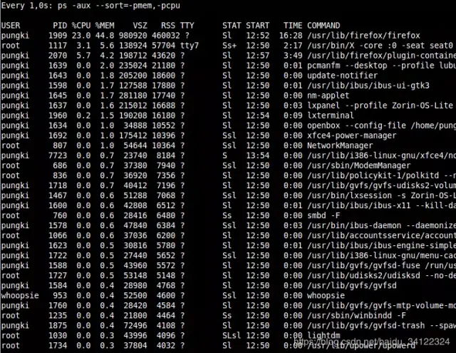

如果输出太长，我们也可以限制它，比如前20条，我们可以使用 head 命令来做到。

```
$ watch -n 1 ‘ps -aux --sort -pmem, -pcpu | head 20’
```


这里的动态查看并不像top或者htop命令一样。但是使用ps的好处是你能够定义显示的字段，你能够选择你想查看的字段。

举个例子，如果你只需要看名为’pungki’用户的信息，你可以使用下面的命令：

```
$ watch -n 1 ‘ps -aux -U pungki u --sort -pmem, -pcpu | head 20’
```

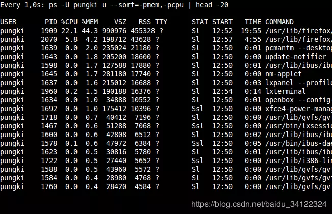

## [](#12-最后 "12. 最后")12\. 最后

你也许每天都会使用ps命令来监控你的Linux系统。但是事实上，你可以通过ps命令的参数来生成各种你需要的报表。

ps命令的另一个优势是ps是各种 Linux系统都默认安装的，因此你只要用就行了。不要忘了通过 man ps来查看更多的参数。