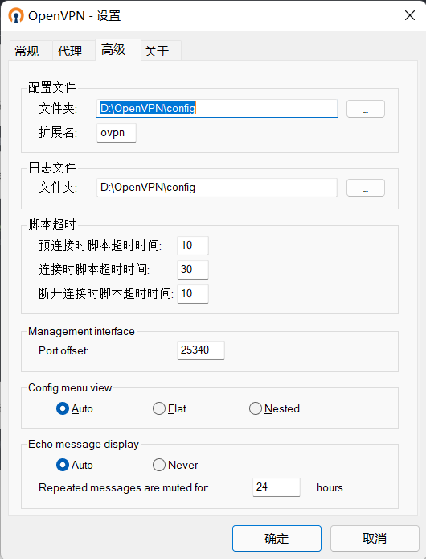

# OpenVPN搭建

#### 应公司要求需要在一台远程服务器上搭建一个OpenVPN服务端，在公司本地服务器上搭建一个OpenVPN客户端，实现公司内网可以访问远程服务器的内网资产。

#### 客户端与服务端环境介绍

- 服务器：
	- 外网：111.6.XXX.XXX

	- 内网：172.XX.XX.23/25

	- 系统：CentOS 7

- 客户端：
	- 外网：1.192.XX.XX
	- 内网：10.10.XX.XX
	- CentOS 7

#### 开始搭建：

##### 1、准备OpenVPN证书、密钥等文件

##### 1.1、从github上下载easy-rsa并传到服务器上。

链接：[https://github.com/OpenVPN/easy-rsa](https://github.com/OpenVPN/easy-rsa)

然后解压并进入该文件目录。
##### 1.2、安装easy-rsa和openvpn，执行如下命令：

	yum install easy-rsa openvpn -y
##### 1.3、下载好的easy-rsa文件里面内容如下：

刚下载好的是没有vars文件的，我们复制一下并重命名

	cp vars.example vars

然后编辑vars文件，找到如下位置并修改为你自己对应的信息。

然后使文件生效

	source vars
	./clean-all

##### 1.4、生成根证书和根密钥
执行命令
	./easyrsa build-ca

##### 1.5、生成server证书和server密钥
执行命令
	./easyrsa build-server-full server

随后会生成3个文件：server.crt、server.req、server.key。
生成server.key的时候会要求输入密码，该密码用于启动openvpn服务时的认证（如果不填写即启动服务时不需要输入密码）

##### 1.6、生成client的根证书和根密钥
类似服务端，客户端也要生成证书和密钥。client.key文件的密码，用于客户端的密码认证。执行命令：

	./easyrsa build-client-full client

##### 1.7、生成密钥交换文件dh.pem
执行命令：

	./easyrsa gen-dh

执行完毕后，文件生成在/usr/share/easy-rsa/pki/dh.pem

##### 1.8、最后整理生成的证书和密钥

把服务端的证书和密钥放入`/etc/openvpn/server/`下，把客户端的证书和密钥放入`/etc/open/client/`下。

	cp ca.crt /etc/openvpn/server/
	cp dh.pem /etc/openvpn/server/
	cp server.crt /etc/openvpn/server/
	cp server.key /etc/openvpn/server/

	cp ca.crt /etc/openvpn/client/
	cp client.crt /etc/openvpn/client/
	cp client.key /etc/openvpn/client/

#### 2、修改服务器配置文件
执行命令

	cp /usr/share/doc/openvpn/sample/sample-config-files/server.conf /etc/openvpn

将server.conf文件复制到openvpn的配置目录下，这里可能每个人的目录都不一样，但是肯定是在doc目录下有一个openvpn的目录
编辑server.conf文件，找到如下位置并修改：

注意：这里不能有错误，有一个错误都会导致服务启动不起来

1. 端口可以自己设定，但设定后要与待会客户端的保持一致
2. 使用tcp或者udp协议，自己根据情况考虑
3. 四个证书的位置，根据自己的路径设置好
4. server那一行，是服务端给客户端分配的IP地址默认是10.8.0.0段
5. 第一个push，与自己上面的配置对应起来
6. 第二个push，与自己服务器的内网IP对应起来，注意子网掩码不要错
7. 修改加密方式为AES-256-GCM
8. 最后保存文件

#### 3、启动OpenVPN服务
到此就可以启动OpenVPN服务了，执行命令

	openvpn --daemon --config server.conf

最后查看端口是否开启：
	netstat -lntup | grep 1194

这里端口根据自己的配置输入

#### 4、启动路由转发
最后为服务器开启路由转发，这样客户端才可以访问服务器内网中的其他服务器。输入如下命令：
	echo "net.ipv4.ip_forward = 1" >> /etc/sysctl.conf
	iptables -t nat -A POSTROUTING -s 10.8.0.0/24 -j MASQUERADE

#### 5、客户端配置
##### 5.1、证书及配置文件
先在服务端上找到client.conf，复制到openvpn目录下：
	cp /usr/share/doc/openvpn/sample/sample-config-files/client.conf /etc/openvpn/client/
然后编辑client.conf文件
	cipher AES-256-CBC
改为
	cipher AES-256-GCM
找到
	remote my-server-1 1194
改为
	remote 111.XX.XX.86 1194

此处IP为OpenVPN服务端的外网IP
最后将/etc/openvpn/client文件传输到客户端上
	
##### 5.2、安装OPenVPN，根据自己的情况在Windows或Linux下安装。
- Windows下直接去下载安装包：[https://openvpn.net/community-downloads/](https://openvpn.net/community-downloads/)
- Linux下输入命令：`yum -y install openvpn`

#### 5.3、连接服务端

##### 5.3.1、Windows
Windows下找到你的OpenVPN的安装目录，打开config文件，将服务端的/etc/openvpn/client目录下的文件放到客户端的config目录下，
把client.conf重命名为client.ovpn

最后，打开OpenVPN的设置，选高级，查看路径是否为你OpenVPN的正确路径。

确认无误后直接连接即可。

可以看到成功连接并获取到了服务端分配的IP。

#####5.3.2 Linux
Linux下把服务端的/etc/openvpn/client目录传输到客户端上

然后在客户端上运行client.conf

	openvpn client.conf

可以看到连接成功

查看IP地址

可以看到客户端成功获取到服务端的分配的地址。

#### 6、验证网络连通性

在客户端分别ping服务端地址，服务端内网其他地址。

	ping 10.8.0.1
	ping 111.6.xx.xx
	ping 172.xx.xx.23
	ping 172.xx.xx.60
可以看到网络全部都是连通的。

#### 7、总结
至此已经完成了OpenVPN客户端与服务端的搭建，客户端也能成功与服务端内网进行通信，整个过程比较复杂，可以自己多配几遍，多理解一下，切记配置文件中的内容不能有一点错误，否则就会导致客户端连不上。