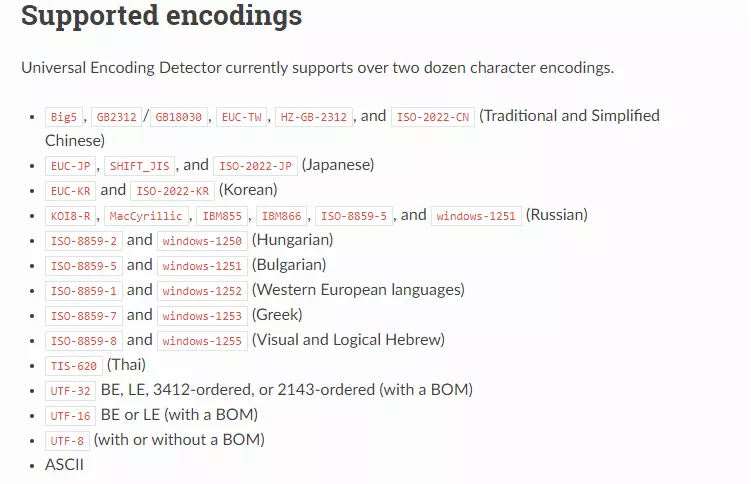
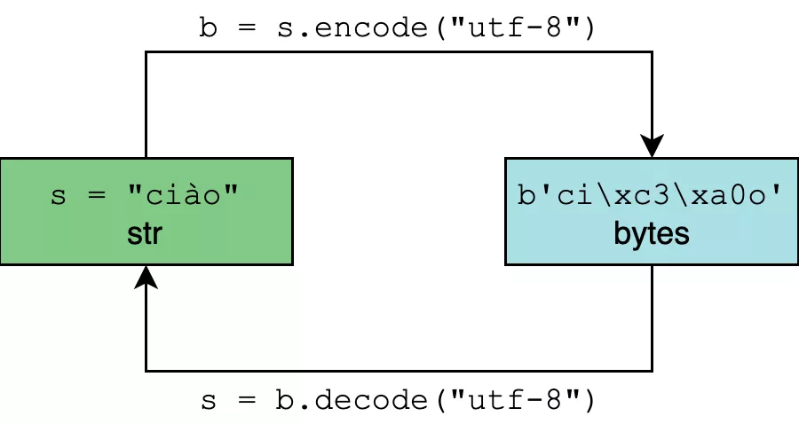

# Python中的编码问题（文章转载）

[2020-04-24]()

## [](#前言 "前言")前言

Python 中编码问题，一直让很多 Python 开发者头疼，今天就把 Python 上会遇到的一些编码问题都讲清楚了。  

### [](#1-Python3中str与bytes "1. Python3中str与bytes")1\. Python3中str与bytes

在 Python3中，字符串有两种类型 ，str 和 bytes。

今天就来说一说这二者的区别：

* unicode string（str 类型）：以 Unicode code points 形式存储，人类认识的形式

* byte string（bytes 类型）：以 byte 形式存储，机器认识的形式

在 Python 3 中你定义的所有字符串，都是 unicode string类型，使用 type 和 isinstance 可以判别

```
# python3

>>> str_obj = "你好"
>>> 
>>> type(str_obj)
<class 'str'>
>>> 
>>> isinstance("你好", str)
True
>>> 
>>> isinstance("你好", bytes)
False
>>> 
```

而 bytes 是一个二进制序列对象，你只要你在定义字符串时前面加一个 b，就表示你要定义一个 bytes 类型的字符串对象。

```
# python3
>>> byte_obj = b"Hello World!"
>>> type(byte_obj)
<class 'bytes'>
>>> 
>>> isinstance(byte_obj, str)
False
>>> 
>>> isinstance(byte_obj, bytes)
True
>>>
```

但是在定义中文字符串时，你就不能直接在前面加 b 了，而应该使用 encode 转一下。

```
>>> byte_obj=b"你好"
  File "<stdin>", line 1
SyntaxError: bytes can only contain ASCII literal characters.
>>> 
>>> str_obj="你好"
>>> 
>>> str_obj.encode("utf-8")
b'\xe4\xbd\xa0\xe5\xa5\xbd'
>>> 
```

## [](#2-Python2中str与unicode "2. Python2中str与unicode")2\. Python2中str与unicode

而在 Python2 中，字符串的类型又与 Python3 不一样，需要仔细区分。

在 Python2 里，字符串也只有两种类型，unicode 和 str 。

只有 unicode object 和 非unicode object（其实应该叫 str object） 的区别：

* unicode string（unicode类型）：以 Unicode code points 形式存储，人类认识的形式

* byte string（str 类型）：以 byte 形式存储，机器认识的形式

当我们直接使用双引号或单引号包含字符的方式来定义字符串时，就是 str 字符串对象，比如这样

```
# python2

>>> str_obj="你好"
>>>
>>> type(str_obj)
<type 'str'>
>>>
>>> isinstance(str_obj, bytes)
True
>>> isinstance(str_obj, str)
True
>>>
```

而当我们在双引号或单引号前面加个 u，就表明我们定义的是 unicode 字符串对象，比如这样

```
# python2

>>> str_obj="你好"
>>>
>>> type(str_obj)
<type 'str'>
>>>
>>> isinstance(str_obj, bytes)
True
>>> isinstance(str_obj, str)
True
>>>
```

而当我们在双引号或单引号前面加个 u，就表明我们定义的是 unicode 字符串对象，比如这样

```
# python2

>>> unicode_obj = u"你好"
>>>
>>> type(unicode_obj)
<type 'unicode'>
>>>
>>> isinstance(unicode_obj, bytes)
False
>>> isinstance(unicode_obj, str)
False
>>>
```

## [](#3-如何检测对象的编码 "3. 如何检测对象的编码")3\. 如何检测对象的编码

所有的字符，在 unicode 字符集中都有对应的编码值（英文叫做：code point）

而把这些编码值按照一定的规则保存成二进制字节码，就是我们说的编码方式，常见的有：UTF-8，GB2312 等。

也就是说，当我们要将内存中的字符串持久化到硬盘中的时候，都要指定编码方法，而反过来，读取的时候，也要指定正确的编码方法（这个过程叫解码），不然会出现乱码。

那问题就来了，当我们知道了其对应的编码方法，我们就可以正常解码，但并不是所有时候我们都能知道应该用什么编码方式去解码？

这时候就要介绍到一个 python 的库 – `chardet` ，使用它之前 需要先安装

```
python3 -m pip install chardet
```

chardet 有一个 detect 方法，可以 预测其其编码格式

```
>>> import chardet
>>> chardet.detect('微信公众号：Python编程时光'.encode('gbk'))
{'encoding': 'GB2312', 'confidence': 0.99, 'language': 'Chinese'}
```

为什么说是预测呢，通过上面的输出来看，你会看到有一个 confidence 字段，其表示预测的可信度，或者说成功率。

但是使用它时，若你的字符数较少，就有可能 “误诊”，比如只有 中文 两个字，就像下面这样，我们是 使用 gbk 编码的，使用 chardet 却识别成 KOI8-R 编码。

```
>>> str_obj = "中文"
>>> byte_obj = bytes(a, encoding='gbk')  # 先得到一个 gbk 编码的 bytes
>>>
>>> chardet.detect(byte_obj)
{'encoding': 'KOI8-R', 'confidence': 0.682639754276994, 'language': 'Russian'}
>>> 
>>> str_obj2 = str(byte_obj, encoding='KOI8-R')
>>> str_obj2
'жпнд'
```

所以为了编码诊断的准确，要尽量使用足够多的字符。

chardet 支持多国的语言，从官方文档中可以看到支持如下这些语言\(<https://chardet.readthedocs.io/en/latest/supported-encodings.html>\)  


## [](#4-编码与解码的区别 "4. 编码与解码的区别")4\. 编码与解码的区别

编码和解码，其实就是 str 与 bytes 的相互转化的过程（Python 2 已经远去，这里以及后面都只用 Python 3 举例）

* 编码：encode 方法，把字符串对象转化为二进制字节序列
* 解码：decode 方法，把二进制字节序列转化为字符串对象



那么假如我们真知道了其编码格式，如何来转成 unicode 呢？

有两种方法

### [](#1-直接使用decode "1) 直接使用decode")1\) 直接使用decode

```
>>> byte_obj.decode('gbk')
'中文'
>>> 
```

### [](#2-使用str转换 "2) 使用str转换")2\) 使用str转换

```
>>> str_obj = str(byte_obj, encoding='gbk')
>>> str_obj
'中文'
>>> 
```

## [](#5-如何设置文件编码 "5. 如何设置文件编码")5\. 如何设置文件编码

在 Python 2 中，默认使用的是 ASCII 编码来读取的，因此，我们在使用 Python 2 的时候，如果你的 python 文件里有中文，运行是会报错的。

```
SyntaxError: Non-ASCII character '\xe4' in file demo.py
原因就是 ASCII 编码表太小，无法解释中文。
```

而在 Python 3 中，默认使用的是 uft-8 来读取，所以省了不少的事。

对于这个问题，通常解决方法有两种：

### [](#1-python2-中，可以使用在头部指定 "1) python2 中，可以使用在头部指定")1\) python2 中，可以使用在头部指定

可以这样写，虽然很好看

```
# -*- coding: utf-8 -*- 
```

但这样写太麻烦了，我通常使用下面两种写法

```
# coding:utf-8
# coding=utf-8 
```

### [](#2 "2)")2\)

```
import sys 

reload(sys) 
sys.setdefaultencoding('utf-8') 
```

这里在调用sys.setdefaultencoding\(‘utf-8’\) 设置默认的解码方式之前，执行了reload\(sys\)，这是必须的，因为python在加载完sys之后，会删除 sys.setdefaultencoding 这个方法，我们需要重新载入sys，才能调用 sys.setdefaultencoding 这个方法。
