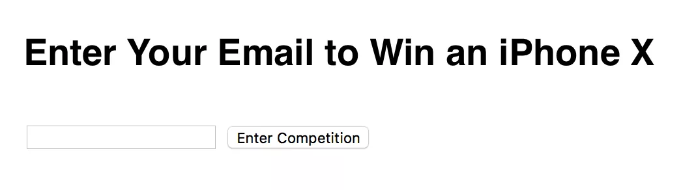
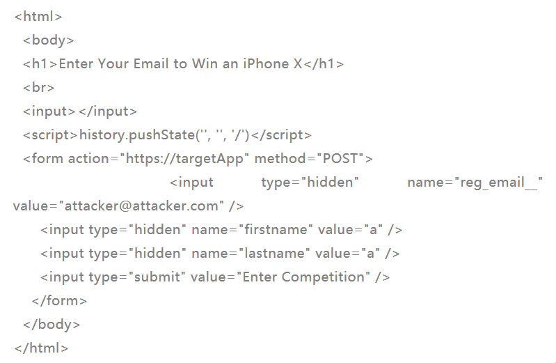
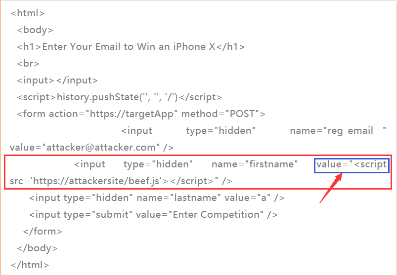

# WEB漏洞-CSRF

[2020-04-02]()

### [](#前言 "前言")前言

CSRF曾在2007年、2010年、2013年三次入围OWASP TOP10。因为越来越多的框架提供了secure by default的设定和一些形式的保护，这也就是说CSRF不再是一个问题。这也就是2017版的CSRF不再出现在OWASP TOP10的原因。  

研究人员发现，可以利用CSRF来传播大量的payload到终端用户。攻击者常用的CSRF传播的payload是：

* Persistent Cross Site Scripting \(XSS\)
* CSV Injection \(CSVi\)
* CSV Injection to Reflected Cross Site Scripting \(XSS\)

* * *

### [](#定义 "定义")定义

**一个跨站请求伪造攻击迫使登录用户的浏览器将伪造的HTTP请求，包括该用户的会话cookie和其他认证信息，发送一个存在漏洞的web应用程序。这即允许攻击者迫使用户浏览器向存在漏洞的应用程序发送请求，并且这些请求会被应用程序认为是用户的合法请求。**

### [](#CSRF-Payload传播 "CSRF Payload传播")CSRF Payload传播

研究人员发现可以通过一个简单的CSRF PoC来传播所有类型的payload，因为大多数社会工程场景中的CSRF是一样的。  
下面是一个登入的win form:  


页面前端代码如下：  


为了解释请求，第一部分的H1和input并没有什么用处，真实的payload是隐藏在input表单中。这也是CSRF发生的地方，攻击者可以让这些值有意义。攻击者可以利用这些payload的传播来设定payload的值。在XSS设定的例子中，会在域名内弹出一个告警框。

但是这个值可以是任何值，在更加恶意的环境中，攻击者可以利用浏览器或利用框架来hook受害者的浏览器。这样的恶意表单示例如下：  


把**value**的值改成如下代码  
value=”“ />

Payload被注入到firstname域中，表单会通过请求提交的方式传递到攻击者的服务器，然后受害者的服务器就会用JS脚本钩住用于下一步的利用。根据应用的功能，攻击者payload会传递持久型和反射型的XSS脚本。

* * *

## [](#POC "POC")POC

### [](#CSV注入payload "CSV注入payload")CSV注入payload

* Python

\`

```
def escape(payload):
    if payload[0] in ('@','+','-', '=', '|', '%'):
     payload = payload.replace("|", "\|")
     payload = "'" + payload + "'"
     return payload
```

* PHP

\`

```
public static function escape_csv( $payload ) {
    $triggers = array( '=', '+', '-', '@', '|', '%');
    if ( in_array( mb_substr( $payload, 0, 1 ), $triggers, true ) ) {
    $payload = "'" . $payload . "'";
        }
return $payload;
    }
```