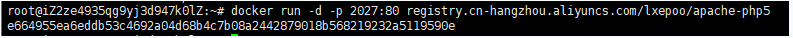

# docker心得

[2018-10-05]()

最近学校要搞一个安全比赛，需要搭建一个比赛平台，老师要求要用docker，偶不会用docker肿么办，只能学习了，这里做个笔记  

Docker 要求 Ubuntu 系统的内核版本高于 3.10 ，查看本页面的前提条件来验证你的 Ubuntu 版本是否支持 Docker。

通过 uname \-r 命令查看你当前的内核版本

然后开始安装docker，安装步骤：

1.  `sudo apt-get install -y docker.io`
2.  然后查看docker是否安装成功，`docker version`
3.  启动docker服务 `service docker start`\(停止服务是`service docker stop`\)
4.  docker安装好了之后就可以使用了，我们先下载镜像，由于我搭建的是web网站，所以这里直接下载一个包含apache和php的镜像 `docker pull registry.cn-hangzhou.aliyuncs.com/lxepoo/apache-php5`
5.  下载好了之后我们运行并把端口映射出来：`docker run -d -p 8080:80 registry.cn-hangzhou.aliyuncs.com/lxepoo/apache-php5` 此时会返回一个值，表示该docker的id，以后运行这个容器都要通过这个值  
    
6.  然后就可以访问`127.0.0.1:8080`看看是否部署好了
7.  接下来就是配置我们的网站了，把准备好的网页源代码复制到docker中去：`docker cp ./test e664955e:/var/www/`
8.  这样就可以访问我们的docker网站了  
    那么做好了之后如何保存呢：可以使用这个命令：`docker commit id repository`这样就保存下来了 下次再使用可以直接`docker run -d -p 8080:80 id`

然后如何控制docekr呢，可以用这条命令获得一个shell:`docker exec \-it e664955e bash`  
如何查看本机正在运行的docker有哪些：输入`docker ps`  
如何查看本机保存的docker镜像：`docker images`  
如何删除不需要的docker镜像：需要先停止该镜像的docker服务：`docker stop id` 然后删除`docker rmi id`  
强制删除容器 `docker rmi \-f id`

如何将docker容器导出成tar包：  
docker save \-o test.tar 镜像名  
docker save > test.tar 镜像名  
如何使用tar包  
docker load \-i test.tar  
docker load \< test.tar
