# kali中的信息收集工具

[2018-12-06]()

## [](#前言 "前言")前言

信息收集的方式可以分为两种：

* 主动和被动。主动的信息收集方式：通过直接访问、扫描网站，这种将流量流经网站的行为。
* 被动的信息收集方式：利用第三方的服务对目标进行访问了解，比例：Google搜索。

信息收集要收集什么呢：

* 域名的信息
* DNS
* IP
* 使用的技术和配置，文件，联系方式等等。

## [](#注意 "注意")注意

没有一种方式是最完美的，每个方式都有自己的优势。

* 主动方式，你能获取更多的信息，但是目标主机可能会记录你的操作记录。
* 被动方式，你收集的信息会先对少，但是你的行动并不会被目标主机发现。一般在一个渗透项目下，你需要有多次的信息收集，同时也要运用不同的收集方式，才能保证信息收集的完整性。

## [](#工具介绍 "工具介绍")工具介绍

### [](#whois "whois")whois

关于Whois的介绍请访问: <https://www.ietf.org/rfc/rfc3912.txt‍>

```
#whois baidu.com
```

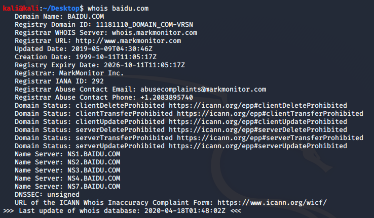

我们可以获取关于百度的DNS服务器信息，域名注册基本信息。这些信息在以后的测试阶段中有可能会发挥重大的作用。

除了使用whois命令，也有一些网站提供在线whois信息查询：

<http://whois.chinaz.com/>

<http://www.internic.net/whois.html>  
收集完域名信息之后，我们将开始收集关于DNS服务器的详细信息。

### [](#DNS分析工具-host "DNS分析工具-host")DNS分析工具-host

使用DNS分析工具的目的在于收集有关DNS服务器和测试目标的相应记录信息。

以下是几种常见的DNS记录类型：  
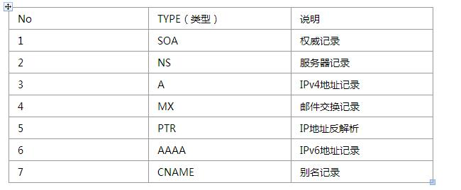

在获取DNS服务器信息之后，下一步就是借助DNS服务器找出目标主机IP地址。我们可以使用下面的命令行工具来借助一个DNS服务器查找目标主机的IP地址：

```
host www.baidu.com
```

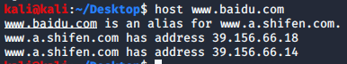

我们可以看到 有两个IP地址？？

一般情况下，host查找的是A，AAAA，和MX的记录。

查询详细的记录只需要添加 \-a

```
#host -a baidu.com 8.8.8.8
```

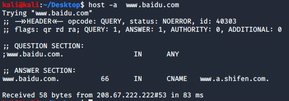

### [](#dig "dig")dig

除了host命令，你也可以使用dig命令对DNS服务器进行挖掘。相对于host命令，dig命令更具有灵活和清晰的显示信息。

```
#dig baidu.com
```

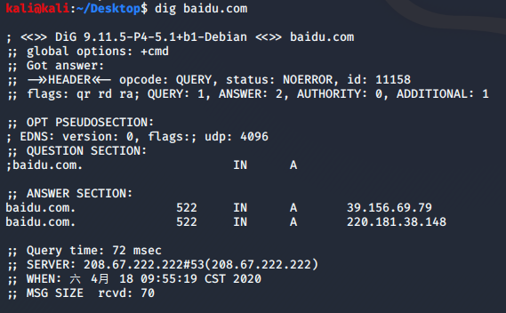

不使用选项的dig命令，只返回一个记录。如果要返回全部的记录，只需要在命令添加给出的类型：

```
#dig baidu.com any
```

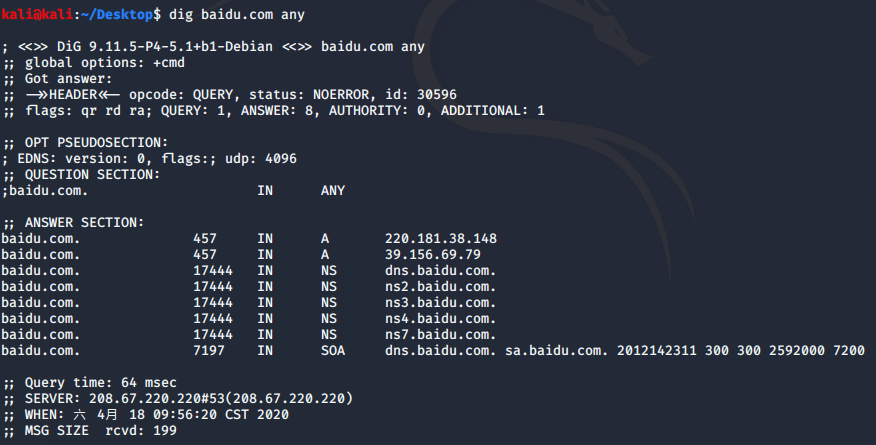

### [](#dnsenum "dnsenum")dnsenum

我们可以利用dnsenum从DNS服务器上获取以下信息：

```
1. 主机IP地址
2. 该域名的DNS服务器
3. 该域名的MX记录
```

除了被用来获取DNS信息，dnsenum还具有以下特点：

```
1. 使用谷歌浏览器获取子域名
2. 暴力破解
3. C级网络扫描
4. 反向查找网络
```

命令：

```
#dnsnum baidu.com
```

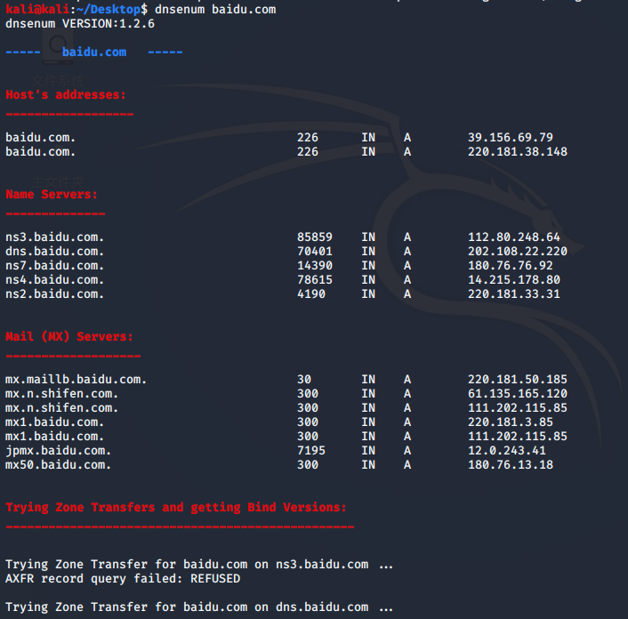

### [](#fierce "fierce")fierce

fierce 是使用多种技术来扫描目标主机IP地址和主机名的一个DNS服务器枚举工具。运用递归的方式来工作。它的工作原理是先通过查询本地DNS服务器来查找目标DNS服务器，然后使用目标DNS服务器来查找子域名。fierce的主要特点就是可以用来地位独立IP空间对应域名和主机名。

启动fierce使用的命令：

```
#fierce -h
```

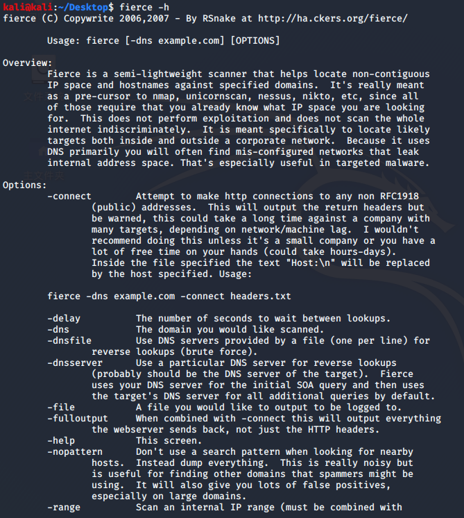

举例：

```
#fierce  -dns baidu.com -threads 3
```

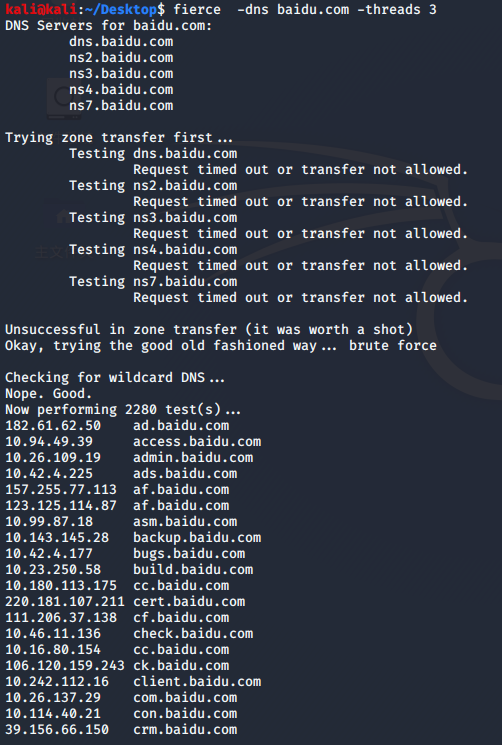

### [](#DMitry "DMitry")DMitry

DMitry（Deepmagic Information Gathering Tool）是一个一体化的信息收集工具。它可以用来收集以下信息：

```
1. 端口扫描
2. whois主机IP和域名信息
3. 从Netcraft.com获取主机信息
4. 子域名
5. 域名中包含的邮件地址
```

尽管这些信息可以在Kali中通过多种工具获取，但是使用DMitry可以将收集的信息保存在一个文件中，方便查看。

举例：

```
#dmitry -winse baidu.com
```


再一个例子，通过dmitry 来扫描网站端口

```
#dmitry -p baidu.com -f -b
```

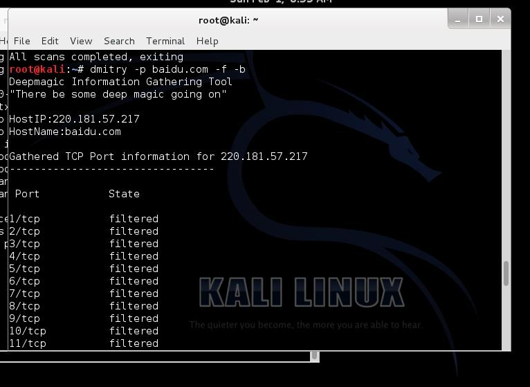

### [](#Maltego "Maltego")Maltego

Maltego是一个开源的取证工具。它可以挖掘和收集信息。

Maltego是一个图形界面。

Maltego的基础网络特点：

```
1. 域名
2. DNS
3. Whois
4. IP地址
5. 网络块
```

也可以被用于收集相关人员的信息：

```
1. 公司、组织
2. 电子邮件
3. 社交网络关系
4. 电话号码
```

### [](#theharvester "theharvester")theharvester

theharvester是一个电子邮件，用户名和主机名/子域名信息收集工具。它收集来自各种公开的信息来源。最新版本支持的信息来源包括：

```
1. Google
2. Google profiles
3. Bing
4. PGP
5. LinkedIn
6. Yandex
7. People123
8. Jigsaw
```

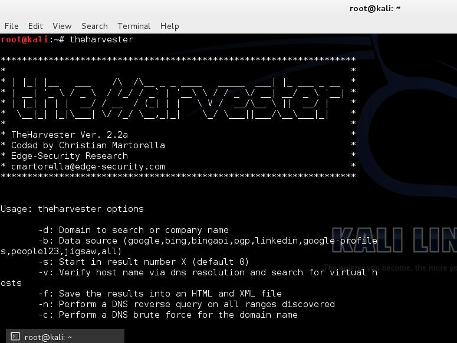

通过bing来收集

```
#theharvester -d baidu.com -l 100 -b bing
```

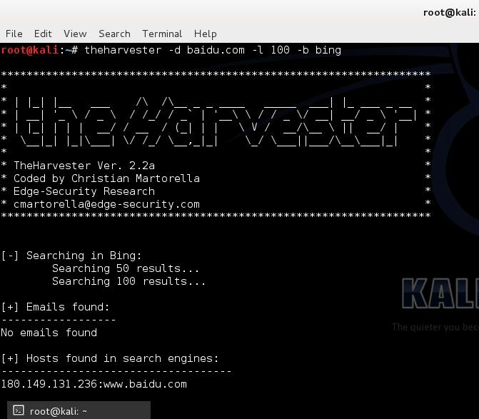

如果我们想收集目标用户名，我们可以通过LinkedIn.com查找。命令如下：

```
#theharvester -d baidu.com -l 100 -b  linkedin
```

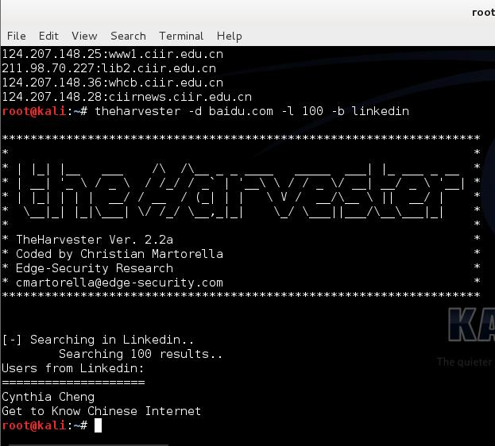

### [](#Metagoofil "Metagoofil")Metagoofil

Metagoofil是一款利用Google收集信息的工具，目前支持的类型如下：

```
1. word
2. ppt
3. Excel
4. PDF
```

命令：

```
#metagoofil -d baidu.com -l 20 -t doc,pdf -n 5  -f test.html -o test
```

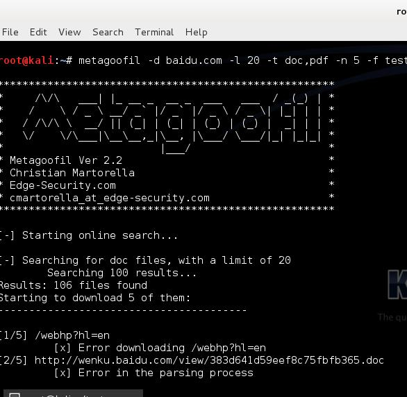

通过这个工具我们可以看到收集到的资料非常多，如，用户名，路径信息。我们可以通过这些用户名进行暴力破解。

通过生成的HTML版的报告，我们可以非常清晰的看到我们收集的信息种类：

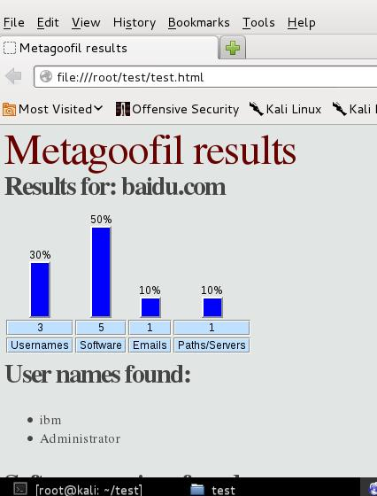

至此，我们的信息收集工具介绍已经完成。
