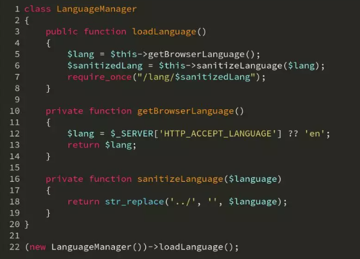

# str\_replace函数导致文件包含漏洞

[2018-11-30]()

遇到一个代码审计的题，源码如下：  
  

代码审计发现考察的是str\_replace函数过滤不当造成的任意文件包含漏洞。

仔细观察18行的代码：  
return str\_replace\(‘../‘, ‘’, \$language\);

程序仅仅只是将 ../ 字符替换成空，这并不能阻止攻击者进行攻击。  
例如攻击者使用payload：`....//` 或者 `..././` ，在经过程序的 `str_replace` 函数处理后，都会变成 `../` ，所以上图程序中的 `str_replace` 函数过滤是有问题的。
