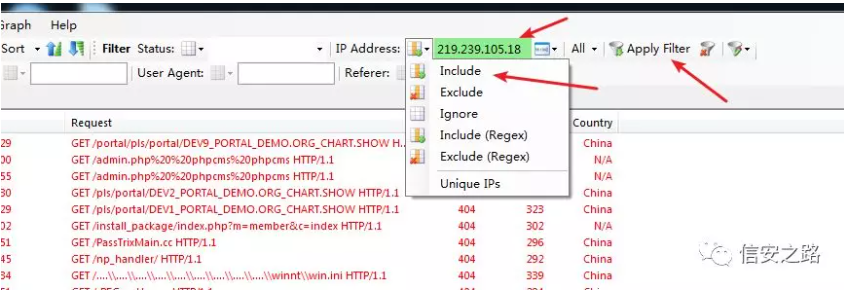
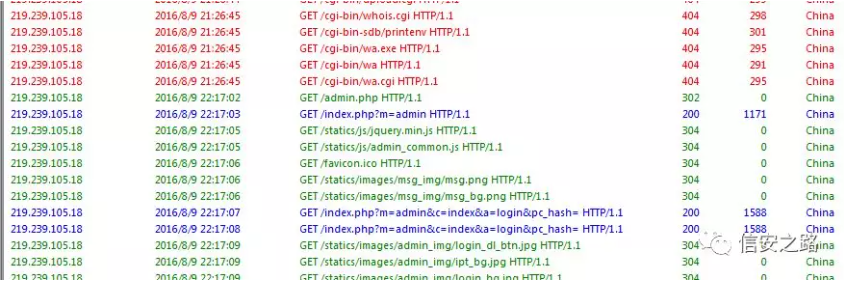

# 分析web日志

[2020-04-09]()

## [](#前言 "前言")前言

之前打铁人三项数据赛经常交给我来，总结了一些分析web日志的干货。  

相关资料：  


```
【链接: https://pan.baidu.com/s/1o7FcHui 密码: jpdn】
```

## [](#1-工具 "1. 工具")1\. 工具

我做日志分析经常用到的工具就是

1.  ApacheLogsViewer
2.  SubLime或者Notepad++
3.  BeyondCompare

## [](#2-日志格式学习 "2. 日志格式学习")2\. 日志格式学习

一条访问信息记录如下：

```
218.19.140.242 - - [10/Dec/2010:09:31:17 +0800] "GET /query/trendxml/district/todayreturn/month/2009-12-14/2010-12-09/haizhu_tianhe.xml HTTP/1.1" 200 1933 "-" "Mozilla/5.0 (Windows; U; Windows NT 5.1; zh-CN; rv:1.9.2.8) Gecko/20100722 Firefox/3.6.8 (.NET CLR 3.5.30729)"
```

从这条信息可以获取到九条信息：

1.  218.19.140.242  
    这是一个请求到 apache 服务器的客户端 ip, 默认的情况下,第一项信息只是远程主机的 ip 地址,但我们如果需要apache 查出主机的名字,可以将 HostnameLookups 设置为 on, 但这种做法是不推荐使用,因为它大大的减缓了服务器。另外这里的 ip 地址不一定就是客户主机的 ip 地址，如果 客户端使用了代理服务器,那么这里的 ip 就是代理服务器的地址,而不是原机.

2.  \-  
    输出中的“连字符”表示请求的信息不可用。在这种情况下，不可用的信息是由客户机上的identid确定的客户机的RFC 1413标识。这种信息是高度不可靠的，几乎不应该使用，除非在严格控制的内部网络。除非IdentityCheck设置为On，否则Apache httpd甚至不会尝试确定此信息

3.  \-  
    这一项又是为空白,不过这项是用户记录用户 HTTP 的身份验证,如果某些网站要求用户进行身份验证,那么这一项就是记录用户的身份信息

4.  \[10/Dec/2010:09:31:17 +0800\]

第四项是记录请求的时间,格式为 `[day/month/year:hour:minute:second zone]`, 最后的 `+0800` 表示服务器所处的时区为东八区

5.  “GET /query/trendxml/district/todayreturn/month/2009-12-14/2010-12-09/haizhu\_tianhe.xml HTTP/1.1”

这一项整个记录中最有用的信息,首先,它告诉我们的服务器收到的是一个 GET 请求,其次,是客户端请求的资源路径,第三,客户端使用的协议是 HTTP/1.1, 整个格式为 “\%m \%U\%q \%H” ,即”请求方法/访问路径/协议”

5.  200  
    这是一个状态码,由服务器端发送回客户端,它告诉我们客户端的请求是否成功,或者是重定向,或者是碰到了什么样的错误,这项值为 200，表示服务器已经成功的响应了客户端的请求,一般来说,这项值以 2 开头的表示请求成功,以 3 开头的表示重定向,以 4 开头的标示客户端存在某些的错误,以 5 开头的标示服务器端存在某些错误。本人博客有一篇文章专门讲了状态码

6.  1933  
    这项表示服务器向客户端发送了多少的字节,在日志分析统计的时侯,把这些字节加起来就可以得知服务器在某点时间内总的发送数据量是多少。

7.  * HTTP Referer：告诉服务器我是从哪个页面链接过来的,没有值时可能是直接打开网页的原因。
8.  “Mozilla/5.0 \(Windows; U; Windows NT 5.1; zh-CN; rv:1.9.2.8\) Gecko/20100722 Firefox/3.6.8 \(.NET CLR 3.5.30729\)”

User-Agent 这项主要记录客户端的浏览器信息

## [](#3-黑客入侵日志分析 "3. 黑客入侵日志分析")3\. 黑客入侵日志分析

客户的网站被大黑阔入侵了，你现在需要做的是:

> 1、找到入侵的 IP 地址  
>   
> 2、入侵者如何找到网站后台的？  
>   
> 3、入侵者如何进入后台？  
>   
> 4、入侵者修改了什么文件来写一句话？  
>   
> 5、入侵者通过一句话后门做了什么？  

开始做，下载日志分析

* `【access.log】`
* `【error.log】`

先看`access.log`  


利用**sublime**和**notepadd++**都可以看，如果想看的方便一下可以用**ApacheLogsViewer**  


### [](#1-找到入侵的-IP-地址 "(1)找到入侵的 IP 地址")\(1\)找到入侵的 IP 地址

因为一般来说，如果不能一下子找到后台的话，就需要用一些目录爆破工具，而爆破的过程中，因为请求了很多不存在的目录，就会出现很多 404 状态的日志。

我们可以看一下报错状态的记录，点击【status】，就能发现了有几个 IP 的请求出现了404。  
  
再往下拉，可以发现很明显的带有 payload 的恶意请求，它们都来自 IP【219.239.105.18】，说明这个 IP 地址就是大黑阔的地址。  


### [](#2-入侵者如何找到后台的 "(2)入侵者如何找到后台的")\(2\)入侵者如何找到后台的

  
放到过滤器里，使用包括【include】的方式，然后应用该过滤【Apply Filter】  


过滤出来的数据，点击【Date】按递增时间排序，就可以看到第一条记录是【2016/8/9 2:54:12】，即是入侵者第一次访问时间。

  
往下看，可以看到出现大量 404 的访问记录，说明是在爆目录。


到了【2016/8/9 22:17:02】之后明显没有 404 访问记录，说明已经停止了爆目录，并且可以看到入侵者开始访问后台了。



### [](#3-入侵者如何进入后台 "(3) 入侵者如何进入后台")\(3\) 入侵者如何进入后台

从【2016/8/9 22:37:30】开始可以看到大量的 POST 请求，几秒之内就有多个请求，说明这是在进行爆破。


而在【2016/8/9 23:02:28】从`【http://192.168.0.104/phpcms/index.php?m=admin&c=index&a=public_current_pos&menuid=10】`这一条开始，请求的内容都是后台界面才有的，可见入侵者成功爆破出密码并登录后台。


### [](#4-入侵者动了哪个文件 "(4) 入侵者动了哪个文件")\(4\) 入侵者动了哪个文件

我们可以看到最后这一句

```
GET /index.php?%20%20m=search&c=index&a=public_get_suggest_keyword&url=asdf&q=../../phpsso_server/caches/configs/database.php HTTP/1.1
```

通过搜索相关资料<http://blog.csdn.net/god_7z1/article/details/7816389>  
可以知道该漏洞的利用方法如下：


这一部分即是入侵者在修改的时候发起的请求：


### [](#5-入侵者做了什么 "(5) 入侵者做了什么")\(5\) 入侵者做了什么

可以看到读取了数据库的帐号密码和系统的帐号密码。


## [](#4-SQL注入日志分析 "4. SQL注入日志分析")4\. SQL注入日志分析

客户的网站又被入侵了，而且还是 sql 注入的形式，你现在需要做的是

> 1、入侵者使用的方法属于 sql 注入中的什么方法\?  
>   
> 2、入侵者从什么时候开始用脚本跑数据的？  
>   
> 3、入侵者的 payload 格式是怎样的，解译一下。  
>   
> 4、入侵者拿到了什么数据？数据内容是什么？  

下载日志文件之后，发现是都是类似的请求  


### [](#1-入侵者使用的是sql注入中的哪种注入 "(1) 入侵者使用的是sql注入中的哪种注入")\(1\) 入侵者使用的是sql注入中的哪种注入

```
GET /?id=1%27%20and%20ascii(substr((select%20database()),1,1))%3E104%23 HTTP/1.1
```

很明显是通过盲注的形式跑数据的。使用盲注的脚本可以参考：

<https://github.com/yuesecurity/sqli-exploit/blob/master/sqliblind/sqlibaseblind.py>

### [](#2-入侵者用脚本跑数据的时间 "(2) 入侵者用脚本跑数据的时间")\(2\) 入侵者用脚本跑数据的时间

从【2017/9/2 12:20:42】开始短时间内发起大量请求。


### [](#3-入侵者的payload是什么 "(3) 入侵者的payload是什么")\(3\) 入侵者的payload是什么

```
/?id=1%27%20and%20ascii(substr((select%20database()),1,1))=114%23】
```

其中读取 database\(\)，然后 substr 选择。  
  
选择出来的数据用 ascii 编码，与后面的数字 114 比较。

### [](#4-入侵者得到了什么 "(4) 入侵者得到了什么")\(4\) 入侵者得到了什么

拿到 database\(\) 和 user\(\)。

  
仔细观察，可以发现是后面的 1 去比较这个 database\(\) 的 1 到 15 位。然后再用 2 去比较 1 到 15 位。

而判断是否匹配的方法是看返回的包的大小：

【654】包的数量比【665】的多很多，【665】的包是盲注匹配成功时候返回的包。  
  
于是把【665】的包里的数值一个个写到表格里，用 <http://evilcos.me/lab/xssor/> 转成对应的字符。当然我比较懒，这里没有填完。


还是用脚本跑一下比较爽：


可以看到 database 是【security】，user 是【flag0isfjisas8hh\@loc】。
