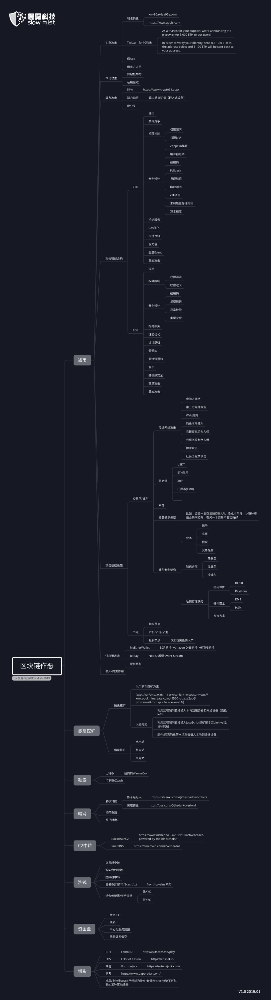
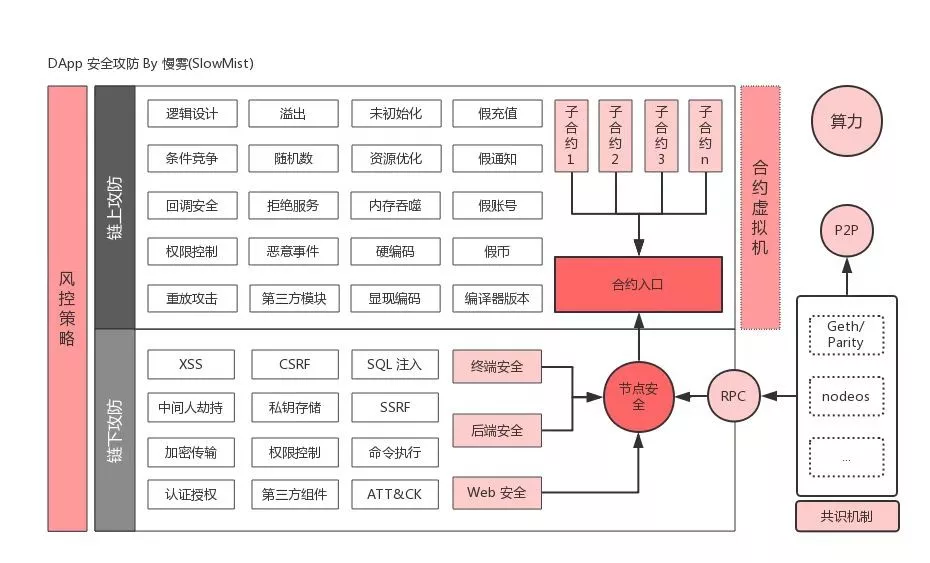
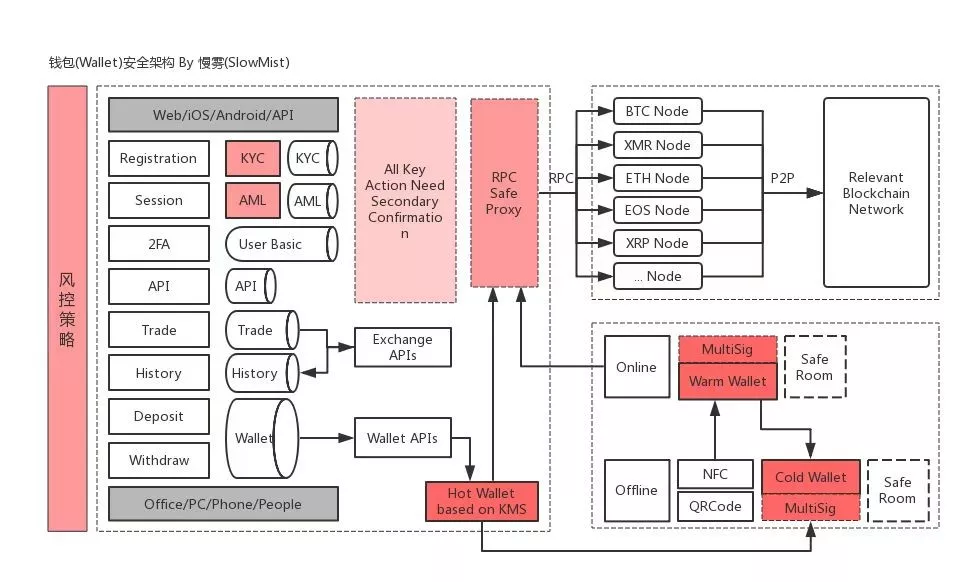

# 区块链基础

[2018-05-20]()

## 0x00 前言

介绍几本入门区块链的书：

* 《Mastering Bitcoin》
* 《Mastering Ethereum》
* 《Mastering Monero》

## 0x01 先放一张区块链攻击的思维导图

这张图其实包含两部分：

1.  攻击与区块链相关的地方
2.  利用区块链进行攻击

## 0x02 主要内容

1.  盗币
2.  恶意挖矿
3.  勒索
4.  暗网
5.  C2中转
6.  洗钱
7.  资金盘
8.  菠菜

## 0x03 攻击方式

### 1\. 算力攻击

算力攻击里的 51\% 攻击，这个攻击方法很有意思，简单来说就是你如果拥有超过一半以上的算力，你就可以决定一个区块链的走向（最长链原则），你可以导致如“双花攻击”（一笔钱花了两次）。而且有意思的是：这种算力攻击不是什么 DDoS 非法的，他是这个世界合法的…

**这个网站，可以预估针对各种区块链发起 51\% 的攻击成本：<https://www.crypto51.app/>**

### 2\. 恶意挖矿

可能大家，绝大多数都遇到到“蠕虫挖矿”，一些服务器，比如 Redis 未授权访问被植入挖矿木马。但绝大多数应该是没遇到过矿场里的恶意挖矿。

我们在偏远山区布局了矿场业务，曾经买入一批知名的矿机，其中有几台在供应链环节（运输过程）固件被刷入挖矿病毒，当接入矿场局域网时，几分钟，整个矿场全感染了。这些病毒/蠕虫做的事主要是劫持挖矿算力达到间接盗币。

## 0x03 区块链安全攻防出发点

区块链安全攻防主要分两大块内容：链上攻防和链下攻防。

### 1\. 链下攻防

从图上可以看出链下攻防就是经典的传统网络安全攻防：常见的web漏洞等等。链下攻防有一个不一样的地方在于图的右边：节点安全。这块不同的区块链就有不同的节点，就可能有不同的安全问题。

攻击细节：

1.  全球扫描 8545 端口（HTTP JSON RPC API）、8546 端口（WebSocket JSON RPC API）等开放的以太坊节点，发送 eth\_getBlockByNumber、eth\_accounts、eth\_getBalance 遍历区块高度、钱包地址及余额
2.  不断重复调用 eth\_sendTransaction 尝试将余额转账到攻击者的钱包
3.  当正好碰上节点用户对自己的钱包执行 unlockAccount 时，在 duration 期间内无需再次输入密码为交易签名，此时攻击者的 eth\_sendTransaction 调用将被正确执行，余额就进入攻击者的钱包里了

    ### 2\. 链上攻防

    关于链上的安全，切入点大体是：

* 静态代码检查
* P2P 安全
* RPC 安全
* 加密签名安全
* 账户与交易模型安全
* 系统合约安全
* 共识安全
* 代码合规

## 0x04 数字货币交易所安全攻防出发点

图里的冷、温、热：其实是按照钱包的触网程度+流动程度+金额程度来划分的

冷：触网程度低（或零）、流动程度小、金额程度大  
热：触网程度高、流动程度高、金额程度小；  
温：介于冷、热之间。

相比之下，冷钱包会更安全，热钱包会更危险。
