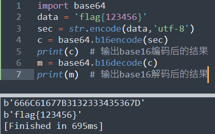
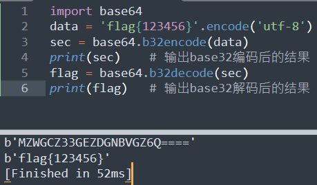
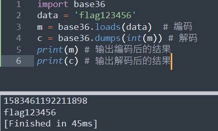
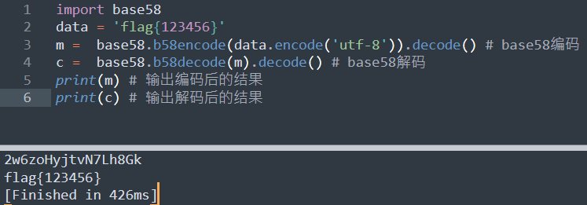
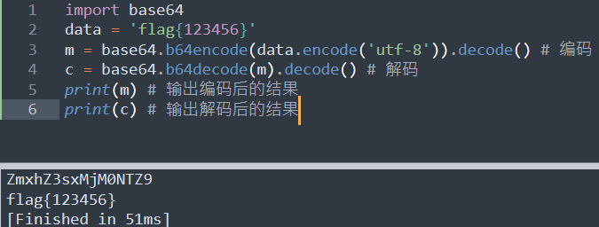
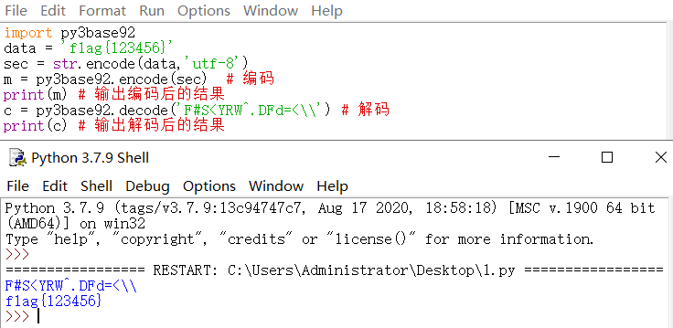
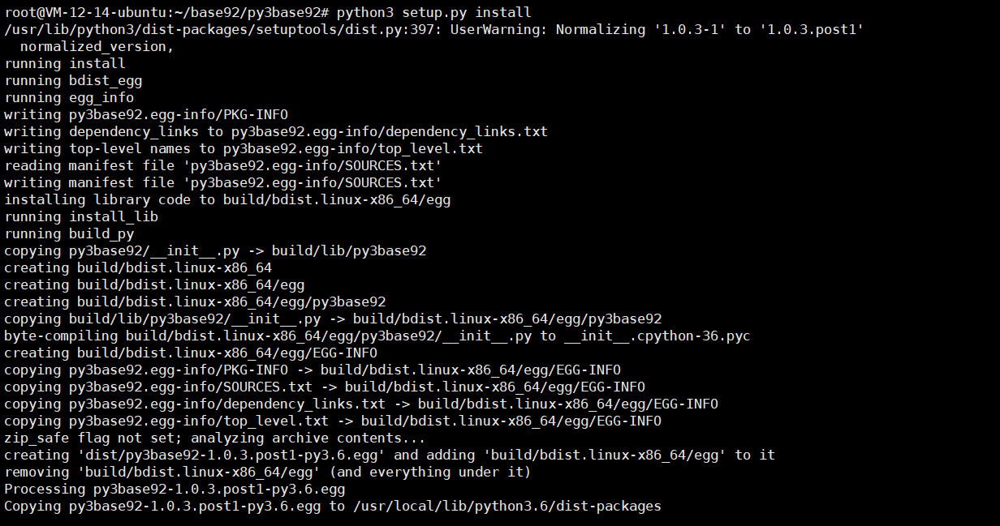
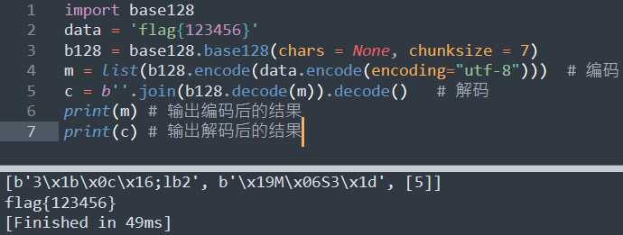

# 前言
前段时间参加了一个CTF竞赛，虽然是线上赛，但是不允许连接互联网，结果签到题是个base32的解码。这要放在平时那肯定不是事呀，直接搜一个在线解码网站简直是手到擒来，但是这时候毕竟不能连网，后来想到了可以用python写一个解码脚本，算是把这题做出来了。
赛后想到如果以后遇到了其他的base编码怎么办，所以这里就把base全家桶的python解码脚本总结在一起发出来，我这些代码都是基于python3的。
另外，这里只给出每种编码方式的代码，就不对每一种编码方式进行一一介绍了如果想了解每种编码方式的原理的，可以移步这里：[https://www.cnblogs.com/0yst3r-2046/p/11962942.html](https://www.cnblogs.com/0yst3r-2046/p/11962942.html "Base系列编码浅析")

# 函数介绍
```
base64.b16encode  # 对字符串进行base16编码
base64.b16decode  # 对字符串进行base16解码
base64.b32encode  # 对字符串进行base32编码
base64.b32decode  # 对字符串进行base32解码
base58.b58encode  # 对字符串进行base58解码
base58.b58decode  # 对字符串进行base58解码
base64.b64encode  # 对字符串进行base64解码
base64.b64decode  # 对字符串进行base64解码
base64.a85encode  # 对字符串进行base85编码
base64.a85decode  # 对字符串进行base85解码
base91.encode     # 对字符串进行base91编码
base91.decode     # 对字符串进行base91解码
py3base92.encode  # 对字符串进行base92编码
py3base92.decode  # 对字符串进行base92解码
b128.encode       # 对字符串进行base128编码
b128.decode       # 对字符串进行base128解码
```
# 1、base16

	import base64
	data = 'flag{123456}'
	sec = str.encode(data,'utf-8')
	c = base64.b16encode(sec)
	print(c)  # 输出base16编码后的结果
	m = base64.b16decode(c)
	print(m)  # 输出base16解码后的结果



# 2、base32

	import base64
	data = 'flag{123456}'.encode('utf-8')
	sec = base64.b32encode(data)  
	print(sec)    # 输出base32编码后的结果
	flag = base64.b32decode(sec) 
	print(flag)   # 输出base32解码后的结果



# 3、base36

	import base36
	data = 'flag123456'
	m = base36.loads(data)  # 编码
	c = base36.dumps(int(m)) # 解码
	print(m) # 输出编码后的结果
	print(c) # 输出解码后的结果

由于base36库不是python的内置库，所以也需要自己安装。

	pip install base36


# 4、base58

	import base58
	data = 'flag{123456}'
	m =  base58.b58encode(data.encode('utf-8')).decode() # base58编码
	c =  base58.b58decode(m).decode() # base58解码
	print(m) # 输出编码后的结果
	print(c) # 输出解码后的结果


由于base58库不是python的内置库，需要安装这个库。

	pip install base58


# 5、base64

	import base64
	data = 'flag{123456}'
	m = base64.b64encode(data.encode('utf-8')).decode() # 编码
	c = base64.b64decode(m).decode() # 解码
	print(m) # 输出编码后的结果
	print(c) # 输出解码后的结果



# 6、base85

	import base64
	data = 'flag{123456}'
	m = base64.a85encode(data.encode('utf-8')).decode() # 编码
	c = base64.a85decode(m).decode() # 解码
	print(m) # 输出编码后的结果
	print(c) # 输出解码后的结果


# 7、base91

	import base91
	data = 'flag{123456}'
	m = base91.encode(data.encode('utf-8')) # 编码
	c = base91.decode(m).decode()       # 解码
	print(m) # 输出编码后的结果
	print(c) # 输出解码后的结果


base91也不是python的内置库，需要安装。

	pip install base91


# 8、base92

	import py3base92
	data = 'flag{123456}'
	sec = str.encode(data,'utf-8')
	m = py3base92.encode(sec)  # 编码
	print(m) # 输出编码后的结果
	c = py3base92.decode('F#S<YRW^.DFd=<\\') # 解码
	print(c) # 输出解码后的结果



这里不知道是什么原因，如果直接对m进行解码，解出来的结果不对，猜到了可能是反斜杠的问题，所以选择直接写入密文，这样解出来的结果没有问题。


旧的base92库已经不支持了，需要用py3base92库，这个库也不是python的内置库，需要把库下载下来手动安装。

	https://github.com/Gu-f/py3base92/releases/tag/1.0.3-1

- Windows下载下来后解压，直接双击`install.bat`即可安装成功。
- Linux直接运行命令：`python3 setup.py install`



# 9、base128

	import base128
	data = 'flag{123456}'
	b128 = base128.base128(chars = None, chunksize = 7)
	m = list(b128.encode(data.encode(encoding="utf-8")))  # 编码
	c = b''.join(b128.decode(m)).decode()   # 解码
	print(m) # 输出编码后的结果
	print(c) # 输出解码后的结果

由于base128不是python的内置库，因此需要安装。

	pip install base18


# 写在最后
其实说是离线状态下也不全是，毕竟很多库还是需要安装的，但是看了这篇文章之后你是不是就可以先在自己电脑上把需要的库装好，以后哪天真遇到了就能保证离线状态下使用了。
