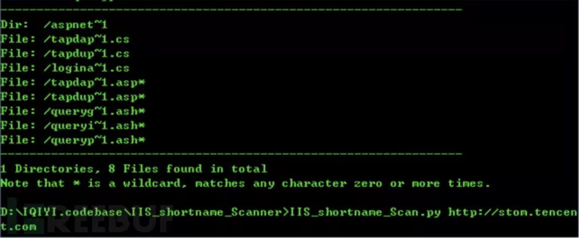
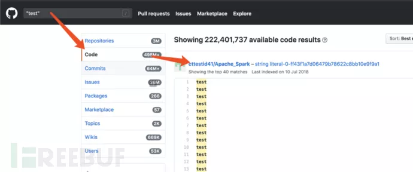
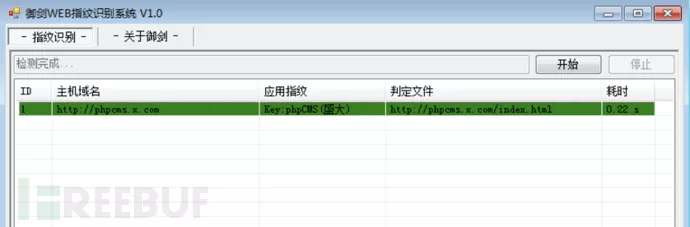
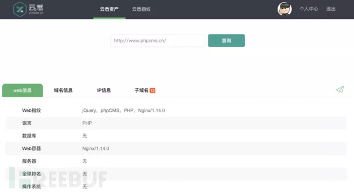
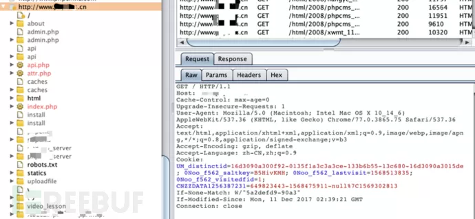
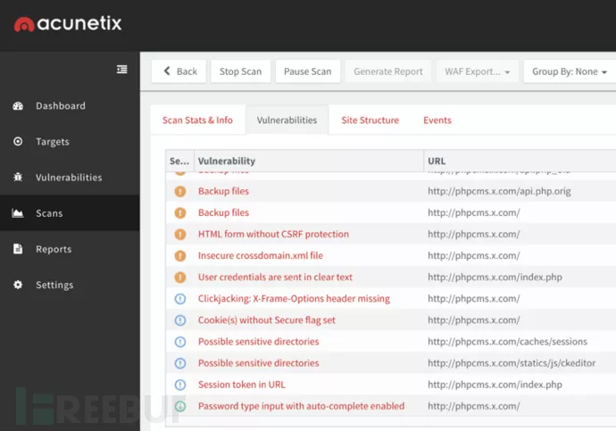
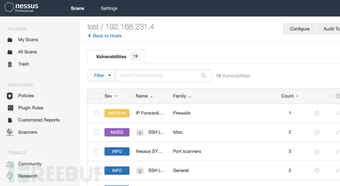

# 渗透测试-信息收集

[2018-05-15]()

## 前言

信息收集是渗透测试中的前曲，也是重中之重，今天就详细总结一下相关的内容。

* * *

### 0x01 网站备案号

**1\. 何为网站备案号以及为什么收集它？**

备案号是网站是否合法注册经营的标志，一个网站的域名是需要去备案的。上一期我们教大家如何用搜索引擎收集网站的子域名，思路是从主域名下手，延伸下去获取尽可能多的子域名。而一家企业的网站资产中，远远不止有一个主域名，有很多隐藏的主域名我们未能发现，通过查询备案号能够得到更多的信息。

**2\. 去哪里收集备案号？**  
查备案号的地址有很多，比如收集百度备案号的地址：

1.  <http://www.beianbeian.com/search/baidu.com>
2.  <http://www.sojson.com/api/beian/baidu.com>
3.  <http://icp.chinaz.com/info?q=baidu.com>

查到备案号之后可以再进行反查。

### 0x02 子域名收集

1.  子域名枚举/在线子域名枚举扫描：主要是通过工具中的字典，对字典中的二级域名进行轮询查询，从而得出结果，收集到的数据准确性高，但是疏漏洞率也相对较高。
2.  域传送漏洞：对目标所在的DNS服务器进行漏洞利用，能获取目标所在DNS服务器中的记录，属于很老的漏洞，对于特定的目标几乎很难能找到该漏洞的存在。
3.  DNS数据集平台：基于全网信息持续收集的平台，根据其收录的信息，以快速查找到需要的数据。
    * DNSdumpster：<https://dnsdumpster.com/>
    * VirusTotal：<https://www.virustotal.com/#/home/search>

另外还有，站长工作和搜索引擎所收录到信息进行查找

### 0x03 端口服务收集

Nmap是安全相关专业人员使用广泛的安全扫描使用之一，它可以检测目标主机是否在线、端口开放情况、侦测运行的服务类型及版本信息、侦测操作系统与设备类型等信息，甚至还能对主机进行漏洞扫描。

Nmap的端口服务识别的原理是，通过网络发送请求包到服务器中，利用网络的通信请求建立的握手过程\(多种方式\)进行服务的状态进行判断，服务版本识别主要是通过发送特定的数据包到目标的端口服务中，通过返回的信息进行识别，例如3306\(mysql服务\)，nmap通过mysql的网络协议通信过程，与mysql建立连接，mysql返回Handshake packet数据包，其中该包中包含mysql版本号信息，nmap从中获取mysql的具体版本信息。

Nmap教程网上多的是，想学的小伙伴可以自己搜一下

### 0x04 C段IP信息收集

这里的C段指的并非是网络中的C类地址，而是C类地址中子网掩码为255.255.255.0/24中的IP地址段，共254个。对于某些中大型厂商有可能使用的是自建的托管机房，他们的业务通常部署在同一个C类地址子网中，这就给了我们可以利用的空间了。

就好像家里的路由器一样，当我破解了一个邻居的wifi密码后，接收他的网络，这个时候我就能使用监听工具，对他所发出/接收的数据进行拦截监听，从中获取到相关的账号、密码及信息，当然也有其它的方法和思路可以获取目标服务器的数据或权限。例如：C段中的业务系统与目标服务器的业务系统有关联，使用的是同一个数据库，那么就有可能直接获取到目标服务器的信息了。

能够查询C段的工具有很多，我最常用的还是nmap。假如我们能够查询到目标网络的C段IP都是开放的。这时候我们就得找一此比较薄弱的IP来重新进行信息收集工作了。

### 0x05 旁站信息收集

旁站指的是，不同的web站点部署在同一台服务器中，在渗透测试的时候，如果目标服务器难以寻找突破点，我们也可以通过旁站入手，寻找弱点，然后再想办法对目标服务器进行跨攻击。例如：通过系统提限、跨目录权限、mysql权限，对目标服务器实施攻击。

旁站查询主要是通过各大站长平台，基于对以前的收录信息，通过IP进行分组划分，查找其目标的IP来查询相同IP的解释记录而得出的结果，主要的工具有：

1.  <http://dns.aizhan.com>
2.  <http://s.tool.chinaz.com/same>
3.  <http://i.links.cn/sameip/>
4.  <http://www.ip2hosts.com/>

### 0x06 敏感目录/文件收集

该信息收集方法利用的是基本广大的安全行业从业者对常见web的敏感危险目录/文件形成一个汇总字典，当然也可以结合自己的经验，将文件加入到字典中，增加字典的范围，然后利用该字典向目标web服务器发出请求，显示返回的状态码，然后我们根据状态码进行人工进行判断分析有没有敏感文件可以进行利用。

响应码判断：

* 200代表请求成功
* 403|401代表无权限，但文件/目录是存在的
* 500代表服务器出错
* 其它的响应有状态码请同学们到搜索引擎进行搜索相关知识。

收集敏感目录/文件的主要工具有：

* DirBuster
* 御剑后台

### 0x07 IIS短文件名枚举

此漏洞利用了windows为了对16位MS-DOS程序兼容处理功能来收集信息的。windows为文件名较长的文件（和文件夹）生成了对应的windows 8.3 短文件名，导致攻击者可利用xxx\~1字符实施获取长文件名/目录名的信息。当对方的服务器为IIS，不妨可以尝试一下这个漏洞。

案例：文件名为xxx\_login.php的时候，xxx为有特定含义的字符，由于我们所使用的敏感目录/文件收集工具中没有该文件名的字典，所以未能找出该登录后台的地址。此时我们就可以使用IIS短文件名枚举漏洞进行信息收集，得出的结果为xxx\_lo\~1.php，此时我们就能猜测到这很可能是一个登录页面了。  

### 0x08 GitHub信息收集

GitHub是通过Git进行版本控制的软件源代码托管服务平台，当一个项目需要进行协同开发时，就得使用`svn`或`github`对代码进行托管及版本控制了。

GitHub不仅仅是商用的平台，也可以通过该平台对代码进行公开分享并且能获得Star来证明此代码是优秀的。由于此功能的存在，就有可能有部分开发工程师，或者由于公司对代码的管理制度不严谨，造成内部代码公开处理，令攻击者有机可乘。

案例：某某网站，有部分项目的源代码在github上进行了公开处理，其中，代码中包含敏感的xxx信息，造成重要的信息泄露。

GitHub信息收集工具：<https://github.com/MiSecurity/x-patrol>  

### 0x09 网站资产信息探测

资产信息，这里指的是服务器用的是什么操作系统、中间件、脚本语言、数据库、CMS等等的信息。那么收集到这些信息之后有什么作用呢？比如说目标服务器用的是php语言开发的网站，那么我们就得利用php的一些漏洞去进行渗透了，比如说php的弱类型漏洞等等。如果目标服务器用的是某个cms的源码开发的网站，那么我们就得去查找该cms曾经暴出来的漏洞去进行利用了。

在这里主要介绍一下CMS指纹识别的原理：是通过请求检查特定的URL或文件是否存在，这个就像sfz的开头的省市都是有特定意义的，每个CMS系统中都存在与众不同的文件或其它信息，这些信息也是由大量前辈汇总而成的，有一些工具只能检测到部分的CMS，因为他们收集的识别信息太少了，CMS指纹识别就是通过这种方式进行检测的。

以下是我日常中使用到的工具及收集方法：

1.  <http://www.yunsee.cn/info.html>
2.  查看数据包响应头
3.  CMS指纹识别：<http://whatweb.bugscaner.com/look/>

案例：在某次的渗透测试工作中，先是对网站进行资产信息探测试，发现目标网站使用了某个开源的CMS系统，然后通过默认的CMS后台管理地址和默认密码进入后台，再利用该CMS的后台高危漏洞，成功上传一句话木马，成功getshell。  

### 0x10 shodan、fofa、钟馗之眼信息收集

shodan、fofa、钟馗之眼，他们所提供的功能同样都类似于搜索引擎，都是通过特定的语法去进行信息收集，但与搜索不同的是，web、可见的页面信息进行爬取收录，而他们则是对全网的在线网络设备进行搜索加入其数据库中，例如：各类服务器，数据库，某个系统的端口信息，并提供POC等信息。

那么我们应该如何使用上述这几个工具呢？对于无指定目标的渗透测试，我们可以将他们当成是一个高级漏洞扫描器来使用，利用他们来获取大量有已知漏洞的主机来进行渗透测试。对于指定目标的渗透测试，我们也可以利用他来做信息收集，此时也需要一定的运气成分，因为他们都是基于全网的搜索，并不一定能够保证收集到网络上的所有机器。

### 0x11 寻找真实IP

为什么要寻找真实IP\?，当某个企业使用了CDN/云防线/反向代理等方式对服务进行架构设计时，我们通过ping命令等并不能直接将请求传递到真实的服务器上，而是经过一层设置对该请求进行转向，导致到我们不能获取到真实服务器的开放端口等信息进行收集。

那么，当我们遇到上述的情况时，我们应该如何才能获取到目标的真实IP呢？下面由我来简述一些比较有趣的方法：

从子域名入手，一个企业的业务种类繁多，可能只有部分主营业务，访问压力大的域名才使用了CDN，子域名的业务有可能部署在同一台服务器中，或部署在同一个C段中，所以我们就有可能从中找到真实的IP地址。

历史的DNS平台：<https://dnsdb.io/zh-cn/|> <https://x.threatbook.cn/> 通过平台以前收集到的ip与域名绑定历史记录进行查询。

邮件原文：通过网站提供的邮件发送功能，如注册时的邮箱验证等，将邮件发送至自己的邮箱中，再查看其邮件原文内容，邮件原文中存在的IP地址有可能就是其真实的IP。

其它方法在此不一一介绍，有兴趣的同学到搜索引擎去搜索相关的资料吧。

HTTPS证书查询：工具<https://censys.io/，该工具也是能过全网收集站点的https证书及ip地址，也可以利用该工具进行查找。>

### 0x12 搜索引擎语法

主要是利用搜索引擎所收录的数据，通过特定的语法进行搜索，可以达到迅速发现目标弱点的效果。

利用该方法需要一定的经验积累，以下是针定特定目标的信息收集思路。例如：对于不同的业务系统，得想出不同的联想词，例如商城系统，联想词可以为商家系统，对于大型的企业，OA登录、CRM等等的联想词。

* 后台：site:xxx.xxx admin|login|system|管理|登录|内部|系统
* 钓鱼：site:xxx.xxx 邮件|email
* 社工：site:xxx.xxx qq|群|微信|腾讯
* 越权：site:xxx.xxx inurl:uid=1|userid=1
* 包含：site:xxx.xxx inurl:php\?include=

还有其它很多很多的方法，在此不在一一列举，有兴趣的同学请找相关的资料来学习。总结一下，对于特定的目标利用该方法去做信息收集，效果并不会特别理想，但对于无指定目标的渗透，将会给我们的渗透工作带来极大的便利，能辅助我们快速找到目标的弱点，进行渗透。

### 0x13 爬虫分析

爬虫分析，是要把整个网站的网页及目录信息结构爬取出来，通过爬取出来的结果去猜测开发工程师的开发思维及逻辑，从中得到某些信息进而利用。

案例1：通过某个后台，此时已通过某个漏洞进入后台，此时使用爬虫整个后台进行爬虫，其中发现ad/add.php\(广告增加\)|ad/edit.php\(广告编辑\)|user/add.php\(增加用户\)|user/list\(会员列表\)等等。从中得知开发工程师使用的是有规律、有规范的页面链接命名，那么根据经验，有可能存在admin/add.php等等的页面，有可能存在越权操作漏洞，进而利用。

案例2：通过爬虫发现，在使用敏感目录/文件进行信息收集时，未发现有危险和可利用的重要信息，但通过爬虫发现了某个重要的后台链接地址，一般来说，开发工程师对于后台的防护较为薄弱，像此类信息也有可能在渗透测试中利用，也需要记录下来。

### 0x14 AWVS web弱点扫描

Acunetix Web Vulnerability Scanner（简称AWVS）是一款知名的网络漏洞扫描工具，它通过网络爬虫测试你的网站安全，检测流行安全漏洞，如交叉站点脚本,sql 注入等。在被黑客攻击前扫描购物车，表格、安全区域和其他Web应用程序。75\% 的互联网攻击目标是基于Web的应用程序。因为他们时常接触机密数据并且被放置在防火墙之前。

AWVS如上述所示，主要是通过爬虫来测试你的网站安全，来进行安全漏洞检测，操作及使用方法也相对简单，在此不详细介绍。

AWVS能检测出的漏洞种类繁多，当然也有可能出现误报的现象，这时就需要我们根据AWVS检测来做难，才能确定漏洞是否存在了。

AWVS能检测出的漏洞确实很多，我们在短期内也很难完全各种漏洞及原理。不过AWVS官网有一个所有漏洞的列表。同学们可以根据列表的内容去学习自己想要知道的漏洞原理。漏洞列表链接为：  
<https://www.acunetix.com/vulnerabilities/>

### 0x15 Nessus 主机弱点扫描

Nessus 是目前全世界最多人使用的系统漏洞扫描与分析软件。总共有超过75,000个机构使用Nessus 作为扫描该机构电脑系统的软件。，

Nessus，系统扫描与分析软件，主要针对的是操作系统及操作系统所安装的软件进行漏洞分析，当然也有很多其它附带的功能，例如:web漏洞安全漏洞检测、简单的信息收集。正所谓，专业的人做专业的事，Nessus针对的是操作系统及操作系统所安装的软件进行漏洞分析，因此我们主要的关注点应该在主机漏洞的严重|高|中级别的漏洞，当然Nessus也有误报的情况，这时也需要我们根据其漏洞的编号、信息去进行难。  

### 0x16 whois信息收集、员工信息、公司名、社工库、云盘搜索

为什么要将上述几种需要收集的信息放在一起呢？主要是因为以前几种方法针对的通过社工的方法去对目标进行渗透测试。特别需要强调的是云盘搜索，云盘搜索利用原理的是由于企业的管理不善，可能上传了部分的敏感信息资料到云盘中以方便其他员工对需要的资料进行下载，因此我们有可能在这部分的资料中找到一些敏感的信息，从而进行攻击。

* * *

## 总结

在渗透测试中，信息收集是比较枯燥乏味的一项工作任务，但也是一项很重要的工作，所收集的信息能直接影响到下一步的渗透思路及效果，所以一定要有耐心和准备好持续长期地完成这一项工作任务。

在这个时代中，信息收集的工具种类繁多，各式各样，咱们要不断尝试新的软件跟以前使用过的软件作对比，找到最适合自己的最顺手的工具来使用。
