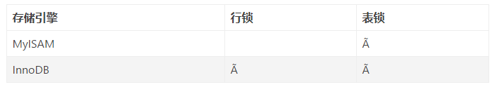
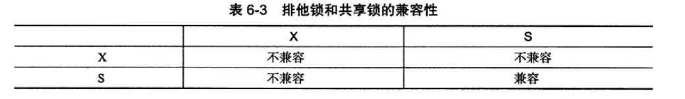
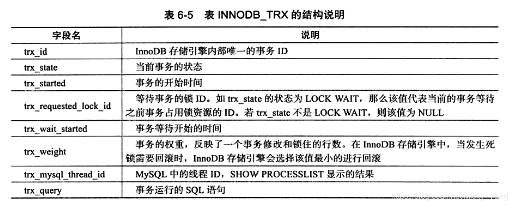
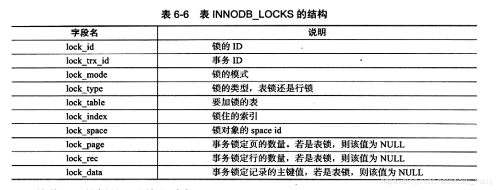
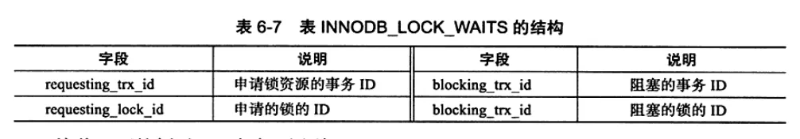
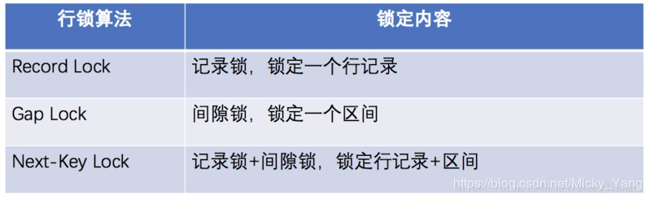

# 详解Mysql的锁机制

[2020-04-22]()

## [](#一、-MySQL为什么要加锁 "一、 MySQL为什么要加锁")一、 MySQL为什么要加锁

锁机制用于管理对共享资源的并发访问，是对数据库的一种保护机制，也是数据库在事务操作中保证事务数据一致性和完整性的一种机制。当有多个用户并发的去存取数据时，在数据库中就可能会产生多个事务同时去操作一行数据的情况，如果我们不对此类并发操作不加以控制的话，就可能会读取和存储不正确的数据，最终破坏了数据的一致性；下面请看一种典型的并发更新数据所产生的数据丢失更新问题：  

```
| 事务A |事务B  |
|--|--|
| begin A |  |
||begin B|
|select salary form tb where id=1(查询结果为1000)||
||select salary form tb where id=1(查询结果为1000)|
|update tb set salary=1100 where id=1||
||update tb set salary=1200 where id=1|
|commit A||
||commit B|
```

异常结果：表中salary字段id为1员工的工资更新为了1200，但是实际上针对该员工的工资进行了两次的修改操作，由于事务B在事务A之后提交，所以首先提交的事务A的更新操作被丢失了，所以我们就需要锁机制来保证这种情况不会发生，保证事务中数据的一致性。

## [](#二、-锁类型 "二、 锁类型")二、 锁类型


表锁：开销小，加锁快；不会出现死锁；锁定粒度大，发生锁冲突概率高，并发度最低；

行锁：开销大，加锁慢；会出现死锁；锁定粒度小；发生锁冲突的概率低，并发度高；

## [](#三、-MyISAM存储引擎 "三、 MyISAM存储引擎")三、 MyISAM存储引擎

**表级锁的锁模式**：表级锁有两种模式：表共享读锁（Table Read Lock）和表独占写锁（Table Write Lock）；对于MyISAM表的读操作，不会阻塞其他用户对同一个表的读请求，但是会阻塞对同一个表的写请求；对MyISAM表的写操作，则会阻塞其他用户对同一个表的读和写操作；MyISAM表的读操作与写操作之间，以及写操作与写操作之间时串行的。

**并发插入（Concurrent Inserts）**：MyISAM表的读和写是串行的，但这是就总体而言的，在一定的条件下，MyISAM表也可以支持查询和插入操作的并发进行；MyISAM存储引擎有一个系统变量concurrent\_insert，专门用以控制其并发插入的行为，其值分为可以为0、1/2。当concurrent\_insert设置为0时，则不允许并发插入；当concurrent\_insert设置为1时，如果MyISAM表中没有空洞（即表的中间没有被删除的行），MyISAM允许在一个进程读表的同时，另一个进程从表尾插入记录，这也是MySQL的默认设置；当concurrent\_insert设置为2时，无论MyISAM表中有没有空洞，都允许在表尾并发插入记录。可以利用MyISAM存储引擎此并发插入特性，来解决应用中对同一个表查询和插入的锁争用。例如：将concurrent\_insert变量的值设为2，总是允许并发插入操作，同时通过定期在系统空闲时段执行OPTIMIZE TABLE语句来整理空间碎片，回收因删除记录而产生的中间空洞。

**MyISAM引擎的锁调度**：MyISAM存储引擎的读锁和写锁是互斥的，读写操作时串行的。一个进程请求某个MyISAM表的读锁，同时另一个进程也请求同一个表的写锁，写的优先级比读的优先级更高，所以写进程会先获得锁，即使读请求先到锁的等待队列中，写请求后到锁的等待队列中，写锁页回插入到读锁请求之前执行；我们可以通过一些设置来调节MyISAM的调度行为，通过指定启动参数low-priority-updates，使MyISAM引擎默认给予读请求以优先的权利；通过执行命令SET LOW\_PRIORITY\_UPDATE=1，使该连接发出的更新请求优先级降低；通过指定INSERT、UPDATE、DELETE语句的LOW\_PRIORITY属性，降低该语句的优先级。另外，MySQL也提供了一种折中的办法来调节读写冲突，即给系统参数max\_write\_lock\_count设置一个合适的值，当一个表的读锁达到这个值后，MySQL就暂时将写请求的优先级降低，给读进程一定的获得锁的机会。

## [](#四、-InnoDB存储引擎 "四、 InnoDB存储引擎")四、 InnoDB存储引擎

  
乐观锁与悲观锁是两种并发控制的思想，可用于解决丢失更新的问题：　　　　乐观锁会”乐观的”假定大概率不会发生并发更新冲突，访问、处理数据过程中不加锁，只在更新数据时再根据版本号或时间戳判断是否有冲突，有则处理，无则提交事务；悲观锁会”悲观的”假定大概率会发生并发更新冲突，访问、处理数据前就加排他锁，在整个数据处理过程中锁定数据，事务提交或回滚后才释放锁；

**InnoDB存储引擎标准的行级锁**：共享锁\(S Lock\)：读锁，允许事务读一行数据；排他锁\(X Lock\)：写锁，允许事务删除或更新一行数据；  



## [](#事务1 "事务1")事务1

MariaDB \[test\]> show variables like “autocommit”;  
+—————+——-+  
| Variable\_name | Value |  
+—————+——-+  
| autocommit | OFF |  
+—————+——-+  
1 row in set \(0.00 sec\)

MariaDB \[test\]> begin;  
Query OK, 0 rows affected \(0.00 sec\)

MariaDB \[test\]> update tb1 set name=”aaa” where id=1;  
Query OK, 1 row affected \(0.00 sec\)  
Rows matched: 1 Changed: 1 Warnings: 0

MariaDB \[test\]> commit;  
Query OK, 0 rows affected \(0.00 sec\)

```
## 事务2：
MariaDB [test]> show variables like "autocommit";
+---------------+-------+
| Variable_name | Value |
+---------------+-------+
| autocommit    | OFF   |
+---------------+-------+
1 row in set (0.00 sec)

MariaDB [test]> begin;
Query OK, 0 rows affected (0.00 sec)

MariaDB [test]> update tb1  set  name="haha"  where id=1;
Query OK, 1 row affected (12.89 sec)
Rows matched: 1  Changed: 1  Warnings: 0

MariaDB [test]> rollback;
Query OK, 0 rows affected (0.00 sec)

MariaDB [test]> select *   from     tb1 where id=1;
+----+------+
| id | name |
+----+------+
|  1 | aaa  |
+----+------+
1 row in set (0.00 sec)
```

**InnoDB行锁的实现方式：**InnoDB行锁是通过给索引上的索引项加锁的，InnoDB这种行锁实现特点意味着：只有通过索引条件检索数据，InnoDB才使用行级锁，否则InnoDB将使用表锁。在不通过索引条件查询的时候，InnoDB确实是使用表锁而不是行锁；由于MySQL的行锁是针对索引加的锁，不是针对记录加的锁，所以虽然是访问不同行的记录，但是如果是使用相同的索引键，是会出现锁冲突的；当表有多个索引的时候，不同的事务可以使用不同的索引锁定不同的行，另外，无论是使用主键索引、唯一索引或普通索引，InnoDB都会使用行锁来对数据加锁；即便是在条件中使用了索引字段，但是否使用索引来检索数据是由MySQL通过判断不同执行计划的代价来决定的，如果MySQL认为全表扫描效率更高，比如对一些很小的表，它就不会使用索引，这种情况下InnoDB将使用表锁而不是行锁。

意向共享锁\(IS Lock\)：事务想要获得一张表中某几行的共享锁；  
意向排他锁\(IX Lock\)：事务想要获得一张表中某几行的排它锁；  
　  
　　  
MariaDB \[test\]> show engine innodb status\\G;  
MariaDB \[test\]> show full processlist;  
MariaDB \[test\]> select _from information\_schema.innodb\_trx\\G;  
************\*\*************_ 1. row ************\*\*\*************  
trx\_id: 1266629  
trx\_state: RUNNING  
trx\_started: 2020-01-08 16:24:50  
trx\_requested\_lock\_id: NULL  
trx\_wait\_started: NULL  
trx\_weight: 0  
trx\_mysql\_thread\_id: 36696  
trx\_query: select \* from information\_schema.innodb\_trx  
trx\_operation\_state: NULL  
trx\_tables\_in\_use: 0  
trx\_tables\_locked: 0  
trx\_lock\_structs: 0  
trx\_lock\_memory\_bytes: 376  
trx\_rows\_locked: 0  
trx\_rows\_modified: 0  
trx\_concurrency\_tickets: 0  
trx\_isolation\_level: REPEATABLE READ  
trx\_unique\_checks: 1  
trx\_foreign\_key\_checks: 1  
trx\_last\_foreign\_key\_error: NULL  
trx\_adaptive\_hash\_latched: 0  
trx\_adaptive\_hash\_timeout: 10000  
1 row in set \(0.00 sec\)



```
MariaDB [test]> select * from information_schema.innodb_locks\G;
Empty set (0.00 sec)
```



```
MariaDB [test]> select * from information_schema.innodb_lock_waits\G;
Empty set (0.00 sec)
```



**一致性的非锁定读\(Consistent Nonlocking Read\)**：是指InnoDB存储引擎通过很多个版本控制\(multi versioning\)的方式来读取当前执行时间数据库中的行的数据。如果读取的行正在执行DELETE或UPDATE操作，这时读取操作不会因此去等待行上的锁的释放；相反，InnoDB存储引擎会去读取行的一个快照数据，快照数据是指该行的之前的版本的数据，该实现是通过undo段来完成的。而undo用来事务中国回滚数据，因此快照数据本身是没有额外的开销。此外，读取快照数据是不需要上锁的，因为没有事务需要对历史数据进行修改操作。然而在不同的事务隔离级别下，对于快照数据，非一致性读总是读取被锁定行的最新一份快照数据，而在REPEATABLE READ事务隔离级别下，对于快照数据，非一致性读总是读取事务开始时的行数据版本。


**一致性的锁定读：**显示地对数据库读取操作进行加锁以保证数据逻辑的一致性；　　SELECT … FOR UPDATE：对读取的行记录加一个X锁，其他事务不能对已锁定的行加任何的锁；　　SELECT … LOCK IN SHARE MODE：对读取的行记录加一个S锁，其他事务可以向被锁定的行加S锁，但是如果加X锁，则会被阻塞；

```
## 事务1
MariaDB [test]> begin;
Query OK, 0 rows affected (0.00 sec)

MariaDB [test]> select  * from   tb1 where id=1 for update;
+----+------+
| id | name |
+----+------+
|  1 | aaa  |
+----+------+
1 row in set (0.00 sec)

MariaDB [test]> rollback;
Query OK, 0 rows affected (0.00 sec)


## 事务2
MariaDB [test]> begin;
Query OK, 0 rows affected (0.00 sec)

MariaDB [test]> select * from tb1 where id=1 lock in share mode;
+----+------+
| id | name |
+----+------+
|  1 | aaa  |
+----+------+
1 row in set (11.55 sec)

MariaDB [test]> rollback;
Query OK, 0 rows affected (0.00 sec)
```



## [](#五、死锁 "五、死锁")五、死锁

死锁是指两个或两个以上的事务在执行过程中，因争夺资源而造成的一种互相等待的现象；MyISAM表锁是Deadlock Free的，这时因为MyISAM总是一次获得所需的全部锁，要么全部满足，要么等待，因此不会出现死锁。但在InnoDB中，除单个SQL组成的事务外，锁是逐步获得的，这就决定了在InnoDB中发生死锁是可能的。发生死锁后，InnoDB一般都能自动检测到，并使一个事务释放锁并回退，另外一个事务获得锁，继续完成事务。但在涉及外部锁，或涉及表锁的情况下，InnoDB并不能完全自动检测到死锁，这需要通过设置锁等待超时参数innodb\_lock\_wait\_timeout来解决，需要说明的是，这个参数并不是用来解决死锁问题，在并发访问比较高的情况下，如果大量事务因无法立即获得所需的锁而挂起，会占用大量计算机资源，造成严重性能问题，甚至拖垮数据库。我们通过设置合适的锁等待超时阈值，可以避免这种情况的发生。

```
## 事务1
MariaDB [test]> begin;
Query OK, 0 rows affected (0.00 sec)

MariaDB [test]> update tb1  set   name="jyy"  where id=1;
Query OK, 1 row affected (0.00 sec)
Rows matched: 1  Changed: 1  Warnings: 0

MariaDB [test]> update tb1  set   name="xixi"  where id=2;
Query OK, 1 row affected (8.25 sec)
Rows matched: 1  Changed: 1  Warnings: 0

MariaDB [test]> commit;
Query OK, 0 rows affected (0.00 sec)

MariaDB [test]> select * from    tb1  where id in(1,2);
+----+------+
| id | name |
+----+------+
|  1 | jyy  |
|  2 | xixi |
+----+------+
2 rows in set (0.00 sec)


## 事务2
MariaDB [test]> begin;
Query OK, 0 rows affected (0.00 sec)

MariaDB [test]> update tb1  set  name="haha"  where id=2;
Query OK, 1 row affected (0.00 sec)
Rows matched: 1  Changed: 1  Warnings: 0

MariaDB [test]> update tb1  set  name="heihei"  where id=1;
ERROR 1213 (40001): Deadlock found when trying to get lock; try restarting transaction
```

避免死锁的常用方法：

1.  在应用中，如果不同的程序会并发存取多个表，应该尽量约定以相同的顺序来访问表，这样可以大大降低产生死锁的机会。在上面的例子中，由于两个session访问表的顺序不同，发生死锁的机会就非常高，但是如果以相同的顺序来访问，死锁就可以避免；　　

2.  在程序以批量方式处理数据的时候，如果事先对数据排序，保证每个线程按固定的顺序来处理记录，也可以大大降低出现死锁的可能；　　

3.  在事务中，如果要更新记录，应该直接申请足够级别的锁，即排他锁，而不应该先申请共享锁，从而造成锁冲突，甚至死锁；　　

4.  在REPEATABLE-READ隔离级别下，如果两个线程同时对相同条件记录用SELECT…FOR UPDATE加排他锁，在没有符合该条件记录情况下，两个线程都会加锁成功。程序发现记录尚不存在，就试图插入一条记录，如果两个线程都这么做，就会出现死锁，这种情况下，将隔离级别READ COMMITTED就可以避免问题；　　

5.  当隔离级别为READ COMMITTED时，如果两个线程都先执行SELECT…FOR UPDATE，判断是否存在符合条件的记录，如果没有，就插入记录。此时，只有一个线程能插入成功，另外一个线程就会出现锁等待，当第一个线程提交后，第二个线程会因为主键冲突出错，但虽然这个线程出错了，却会获得一个排他锁，这时如果有第三个线程又来申请排它锁，也会出现死锁。

6）如果出现了死锁，可以使用上面的检查锁信息的SQL命令来确定最后一个死锁产生的原因。返回结果中国包括死锁相关的事务的详细信息，如引发死锁的SQL语句，事务已经获得的锁，正在等待什么锁，以及被回滚的事务等。据此可以分析死锁产生的原因和改进措施。